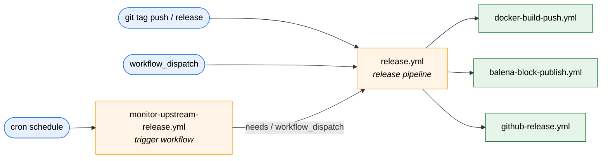

# Workflow templates (starter workflows)

Thin starter workflows that consumer repositories can copy verbatim to wire
themselves up to the reusable workflows in this repo.

> **Note on discovery.** GitHub's "Suggested workflows" UI only auto-populates
> from `<org>/.github/workflow-templates/`. These templates live in
> `blackoutsecure/platform-automation` (next to the reusable workflows they
> call) so they stay in sync with the workflow contracts they target — at the
> cost of no longer appearing in the org-wide picker. Copy the desired file
> into a consumer repo's `.github/workflows/` and commit it.
>
> If you want the picker UX back, mirror these files into
> `blackoutsecure/.github/workflow-templates/` (e.g. via a sync workflow).

## Available templates

| File | Purpose | Reusable workflow it calls |
|------|---------|----------------------------|
| [docker-build-push.yml](docker-build-push.yml) | Multi-arch Docker build, push to Docker Hub, sync description. | `.github/workflows/docker-build-push.yml` |
| [balena-block-publish.yml](balena-block-publish.yml) | Resolve a block version, optionally sync `balena.yml`, publish to balenaCloud. | `.github/workflows/balena-block-publish.yml` |
| [monitor-upstream-release.yml](monitor-upstream-release.yml) | Poll an upstream repo's `latest` release on a schedule and dispatch downstream workflows. | `.github/workflows/monitor-upstream-release.yml` |
| [release.yml](release.yml) | Tag-driven end-to-end release: Docker → Balena → GitHub Release. | `.github/workflows/release.yml` (**release pipeline**) |
| [release-from-upstream.yml](release-from-upstream.yml) | Schedule-driven "follow upstream" loop: monitor an upstream repo and run the full release pipeline against each new version. | `.github/workflows/monitor-upstream-release.yml` + `.github/workflows/release.yml` |

The `release.yml` template is intentionally tiny — the actual orchestration
lives in the [release pipeline](../workflows/release.yml), so adding,
removing, or reordering stages is a single change in one place.

## Topology

The reusable workflows split cleanly into **trigger**, **orchestrator**, and
**stage** layers. Consumer repos pick a trigger template and let it drive the
release pipeline; the pipeline fans out to the per-task stage workflows.

* **Trigger templates** (`monitor-upstream-release.yml`, the `on:` block of
  `release.yml`) decide *when* to release.
* **`release.yml`** is the orchestrator / "guider" — it composes the stages,
  resolves the version, and threads inputs/outputs between them.
* **Stage workflows** are single-purpose and reusable on their own (e.g. a
  consumer repo can call `docker-build-push.yml` directly without the rest
  of the pipeline).

`release-from-upstream.yml` is a convenience template that wires the trigger
and orchestrator layers into a single file via job-level `needs:`, so a
consumer following an upstream project doesn't need to maintain two separate
workflow files.

## How to use a template

1. Copy the desired `*.yml` into the consumer repo at `.github/workflows/`.
2. Replace the `$default-branch` placeholder if your editor hasn't already
   (GitHub does this automatically when starter workflows are picked from the
   UI; manual copies need a manual edit).
3. Set the required `vars` and `secrets` listed in the template header.
4. Commit and push.

## `*.properties.json` sidecars

Each template ships with a sibling `<name>.properties.json` describing the
title, description, icon, categories, and file-pattern hints. These are read
by GitHub's starter-workflow picker. They are kept here for parity with the
templates themselves so any future move back into `<org>/.github/` is a
straight copy.
