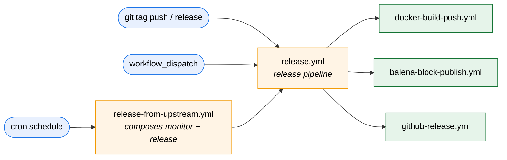

# platform-automation

> Maintained by [Blackout Secure](https://blackoutsecure.app)

Two things live in this repo:

1. **Reusable GitHub Actions workflows and composite actions** under
   [`.github/`](.github/), shared across **blackoutsecure** repositories
   (Docker build/push, Balena block publish, Cloudflare Pages deploy,
   GitHub release rendering, upstream-release monitoring, …).
2. **OS administration scripts** under [`linux/`](linux/) and
   [`macos/`](macos/) — idempotent, MDM-friendly install/configure
   scripts for managed Ubuntu, OpenWrt/GL.iNet, and macOS endpoints.

This repo is public so any repository (including forks) can call these
workflows directly without needing a token, and any host can fetch the
scripts directly with `wget`/`curl`.

### Configuration model

- **`secrets:`** — things that grant access (Docker Hub token, Balena
  API token).
- **`vars:`** — things that identify *what* you're publishing (image
  name, namespace, block name). Set them once on the repository or
  organisation and the caller workflow stays free of literals.

The Docker Hub namespace is **public information** (it appears in every
`docker pull` URL), so it's modelled as `vars.DOCKERHUB_NAMESPACE` /
`inputs.dockerhub_namespace` rather than a secret. The legacy
`secrets.DOCKERHUB_NAMESPACE` is still accepted for back-compat.

### Runner resolution

Every `runs-on:` in this repo is resolved from one of three
org-shared variables, with a hard-coded fallback to the matching
GitHub-hosted runner. Set the vars at the **organisation** level
(Settings → Variables → Actions) and every reusable workflow
automatically picks them up — no caller changes needed.

| Variable | Used for | Fallback |
|----------|----------|----------|
| `vars.DEFAULT_RUNNER` | Lightweight orchestration jobs (lint, setup, plan, manifest, release publish, etc.) | `ubuntu-latest` |
| `vars.RUNNER_X64` | The amd64 leg of the multi-arch Docker build matrix in `docker-build-push.yml` | `ubuntu-latest` |
| `vars.RUNNER_ARM64` | The arm64 leg of the multi-arch Docker build matrix in `docker-build-push.yml` | `ubuntu-latest-arm64` |

Values may be either a single bare label (e.g. `ubuntu-latest`) or a
JSON array of labels for self-hosted runner targeting:

```text
["self-hosted","Linux","ARM64"]
```

GitHub Actions parses array-shaped strings in `runs-on:` automatically,
so no `fromJSON()` is needed in caller workflows.

**Per-call overrides:** workflows that ship a deploy-style step expose
a `runs_on` input (currently `deploy-cloudflare-pages.yml`,
`balena-block-publish.yml`, `balena-fleet-deploy.yml`). Pass a literal
label or JSON-array string to override `vars.DEFAULT_RUNNER` for that
one job; leave it empty to inherit.

---

## Contents

| Path | Kind | Purpose |
|------|------|---------|
| [.github/workflows/docker-build-push.yml](.github/workflows/docker-build-push.yml) | Reusable workflow | Multi-arch Docker build, push-by-digest, and single-manifest publish to Docker Hub. Includes default-on Docker Scout CVE scanning (PR comment + SARIF upload to code scanning). |
| [.github/workflows/docker-scout-scan.yml](.github/workflows/docker-scout-scan.yml) | Reusable workflow | Standalone Docker Scout scan of an already-published image (e.g. scheduled re-scan of `:latest`). Uploads SARIF to code scanning. |
| [.github/workflows/balena-block-publish.yml](.github/workflows/balena-block-publish.yml) | Reusable workflow | Resolve a block version, optionally sync `balena.yml`, and publish via `balena-io/deploy-to-balena-action`. |
| [.github/workflows/balena-fleet-deploy.yml](.github/workflows/balena-fleet-deploy.yml) | Reusable workflow | Render a per-fleet `balena.yml` from inputs and deploy the same block to one or more balenaCloud fleets in a matrix. |
| [.github/workflows/github-release.yml](.github/workflows/github-release.yml) | Reusable workflow | Render Markdown release notes from a template + structured inputs and create/update a GitHub Release via `softprops/action-gh-release`. |
| [.github/workflows/monitor-upstream-release.yml](.github/workflows/monitor-upstream-release.yml) | Reusable workflow | Poll an upstream repo's `latest` release, dispatch downstream workflows on change, and commit a tracking file. |
| [.github/workflows/release.yml](.github/workflows/release.yml) | Reusable **meta-workflow** | Tag-driven end-to-end release pipeline that orchestrates `docker-build-push.yml` → `balena-block-publish.yml` → `github-release.yml`. Each stage is independently togglable. |
| [.github/workflows/release-from-upstream.yml](.github/workflows/release-from-upstream.yml) | Reusable **meta-workflow** | Schedule-driven "follow upstream" loop. Composes `monitor-upstream-release.yml` → `release.yml`: detects a new upstream release and runs the full Docker → Balena → GitHub Release pipeline against the new version, in one caller workflow. |
| [.github/workflows/deploy-cloudflare-pages.yml](.github/workflows/deploy-cloudflare-pages.yml) | Reusable workflow | Stage a static-site build, optionally generate `sitemap.xml` / `robots.txt` / `security.txt` / Web App Manifest, and deploy to Cloudflare Pages via `cloudflare/wrangler-action`. |
| [.github/actions/shared/resolve-docker-image-tags/action.yml](.github/actions/shared/resolve-docker-image-tags/action.yml) | Composite action | Resolves an image version from a Dockerfile `ARG`, version file, git tag, or commit SHA and emits a deduplicated tag list. |
| [.github/actions/shared/resolve-release-context/action.yml](.github/actions/shared/resolve-release-context/action.yml) | Composite action | Shared "publish-on-default-branch" gate + version/`build_date` selection used by both reusable workflows. |
| [.github/actions/shared/resolve-upstream-version/action.yml](.github/actions/shared/resolve-upstream-version/action.yml) | Composite action | Shallow-clones an upstream git repo at a ref and resolves a version (file → `git describe` → short SHA), commit SHA, and commit date. |
| [.github/actions/shared/docker-multiarch-manifest/action.yml](.github/actions/shared/docker-multiarch-manifest/action.yml) | Composite action | Assembles a multi-arch Docker manifest from per-arch digest artifacts and pushes it under one or more tags, with retry on transient registry failures. |
| [.github/actions/sync-dockerhub-description/action.yml](.github/actions/sync-dockerhub-description/action.yml) | Composite action | Validates inputs and pushes a repo's README + short description to Docker Hub via `peter-evans/dockerhub-description`. |
| [.github/actions/shared/docker-scout-scan/action.yml](.github/actions/shared/docker-scout-scan/action.yml) | Composite action | Wraps `docker/scout-action` with input validation, Docker Hub login, and optional SARIF upload to GitHub code scanning. Used by both the embedded scan in `docker-build-push.yml` and the standalone `docker-scout-scan.yml`. |
| [.github/actions/render-release-notes/action.yml](.github/actions/render-release-notes/action.yml) | Composite action | Renders Markdown release notes from a template with safe `{{ key }}` substitution — no shell or template-engine execution against user values. |
| [.github/workflows/lint.yml](.github/workflows/lint.yml) | Workflow | Runs `actionlint` + `shellcheck` on this repo's workflows and actions. |
| [.github/workflows/openwrt-readsb-wiedehopf-bump.yml](.github/workflows/openwrt-readsb-wiedehopf-bump.yml) | Scheduled automation | Tracks new `wiedehopf/readsb` releases and proposes them upstream as a cross-repo PR to `openwrt/packages` (bumps `PKG_VERSION`/`PKG_HASH`, resets `PKG_RELEASE`) via a bot-owned fork. |
| [linux/](linux/) | OS administration scripts | Distribution-grouped install/configure scripts for managed Linux endpoints (Ubuntu, OpenWrt / GL.iNet). See [linux/README.md](linux/README.md). |
| [macos/](macos/) | OS administration scripts | Application/lifecycle scripts for managed macOS endpoints (MDM-friendly: Intune, Jamf, Kandji, Mosyle, Workspace ONE). See [macos/README.md](macos/README.md). |

---

## Quick start — caller wiring

Consumer repos wire themselves up by committing a small caller
workflow under `.github/workflows/` that calls one of the reusable
workflows in this repo. The patterns below are the canonical ones —
copy the relevant block, drop it into your repo, set the listed
`vars` / `secrets`, and commit.

> **Why no starter-workflow templates?** GitHub's "Suggested
> workflows" picker only auto-populates from
> `<org>/.github/workflow-templates/`, which is a *separate* repo
> from this one. Maintaining a parallel set of thin wrapper files
> here that drift from the reusable workflows they call (different
> input names, missing toggles, stale comments) is a strictly
> negative-value engineering tax. The reusable workflows themselves
> are the contract; this section is the reference for wiring them
> up. If you want the picker UX, mirror these snippets into
> `blackoutsecure/.github/workflow-templates/` once — they don't
> need to track per-input changes there.

### 1. Tag-driven release (Docker → Balena → GitHub Release)

Calls the [`release.yml`](#releaseyml--reusable-meta-workflow)
meta-workflow on every SemVer tag push, on `release: published`, and
from a manual dispatch. One file in the consumer repo drives all
three publish stages; turn any stage off with `docker: false`,
`balena: false`, or `github_release: false`.

Required `vars`: `IMAGE_NAME`, `DOCKERHUB_NAMESPACE`,
`BALENA_BLOCK_NAME`, `BALENA_NAMESPACE`.
Required `secrets`: `DOCKERHUB_USERNAME`, `DOCKERHUB_TOKEN`,
`BALENA_API_TOKEN`.

```yaml
# .github/workflows/release.yml
name: Release (tag-driven)

on:
  push:
    tags: ['v[0-9]+.[0-9]+.[0-9]+', 'v[0-9]+.[0-9]+.[0-9]+-*']
  release:
    types: [published]
  workflow_dispatch:
    inputs:
      tag_name:
        description: 'Release tag (e.g. v1.2.3).'
        required: true
        type: string

permissions:
  contents: read

concurrency:
  group: release-${{ github.workflow }}-${{ github.ref }}
  cancel-in-progress: false

jobs:
  release:
    permissions:
      contents: write   # balena commit-back + GitHub Release publish
    uses: blackoutsecure/platform-automation/.github/workflows/release.yml@main
    with:
      tag_name:                 ${{ github.event_name == 'workflow_dispatch' && inputs.tag_name || '' }}
      image_name:               ${{ vars.IMAGE_NAME }}
      dockerhub_namespace:      ${{ vars.DOCKERHUB_NAMESPACE }}
      docker_extra_tags:        sha-${{ github.sha }}
      docker_short_description: ${{ github.event.repository.description }}
      block_name:               ${{ vars.BALENA_BLOCK_NAME }}
      balena_namespace:         ${{ vars.BALENA_NAMESPACE }}
    secrets:
      DOCKERHUB_USERNAME: ${{ secrets.DOCKERHUB_USERNAME }}
      DOCKERHUB_TOKEN:    ${{ secrets.DOCKERHUB_TOKEN }}
      BALENA_API_TOKEN:   ${{ secrets.BALENA_API_TOKEN }}
```

### 2. Upstream-tracked release (poll upstream, then run the same pipeline)

Calls the [`release-from-upstream.yml`](#release-from-upstreamyml--reusable-meta-workflow)
meta-workflow on a 6-hourly cron. When the tracked upstream repo cuts
a new release, the full Docker → Balena → GitHub Release pipeline runs
against `v<upstream_version>` automatically — no tag push required in
the consumer repo.

Required `vars`: `UPSTREAM_REPO`, `IMAGE_NAME`, `DOCKERHUB_NAMESPACE`,
`BALENA_BLOCK_NAME`, `BALENA_NAMESPACE`.
Required `secrets`: `DOCKERHUB_USERNAME`, `DOCKERHUB_TOKEN`,
`BALENA_API_TOKEN`.

```yaml
# .github/workflows/release-from-upstream.yml
name: Release from upstream

on:
  schedule:
    - cron: '17 */6 * * *'   # stagger off :00 to dodge org cron pile-ups
  workflow_dispatch:
    inputs:
      force_release:
        description: Run the release pipeline even if upstream is unchanged.
        type: boolean
        default: false

permissions:
  contents: read

concurrency:
  group: release-from-upstream-${{ github.workflow }}-${{ github.ref }}
  cancel-in-progress: false

jobs:
  release:
    permissions:
      contents: write   # monitor commit + balena commit-back + GitHub Release
    uses: blackoutsecure/platform-automation/.github/workflows/release-from-upstream.yml@main
    with:
      upstream_repo:            ${{ vars.UPSTREAM_REPO }}
      force_release:            ${{ github.event_name == 'workflow_dispatch' && inputs.force_release }}
      image_name:               ${{ vars.IMAGE_NAME }}
      dockerhub_namespace:      ${{ vars.DOCKERHUB_NAMESPACE }}
      docker_extra_tags:        sha-${{ github.sha }}
      docker_short_description: ${{ github.event.repository.description }}
      block_name:               ${{ vars.BALENA_BLOCK_NAME }}
      balena_namespace:         ${{ vars.BALENA_NAMESPACE }}
    secrets:
      DOCKERHUB_USERNAME: ${{ secrets.DOCKERHUB_USERNAME }}
      DOCKERHUB_TOKEN:    ${{ secrets.DOCKERHUB_TOKEN }}
      BALENA_API_TOKEN:   ${{ secrets.BALENA_API_TOKEN }}
```

### 3. Scheduled Docker Scout re-scan

Calls the [`docker-scout-scan.yml`](#docker-scout-scanyml--reusable-workflow)
reusable workflow daily so newly disclosed CVEs in already-published
images surface in the **Security** tab even when no commits land.

Required `vars`: `IMAGE_NAME`, `DOCKERHUB_NAMESPACE`.
Required `secrets`: `DOCKERHUB_USERNAME`, `DOCKERHUB_TOKEN`.

```yaml
# .github/workflows/docker-scout.yml
name: Docker Scout (scheduled)

on:
  schedule:
    - cron: '0 6 * * *'   # 06:00 UTC daily
  workflow_dispatch:
    inputs:
      image_tag:
        description: 'Tag to scan (default: latest).'
        required: false
        type: string
        default: 'latest'

permissions:
  contents: read

concurrency:
  group: docker-scout-${{ github.workflow }}-${{ github.ref }}
  cancel-in-progress: false

jobs:
  scout:
    permissions:
      contents: read
      security-events: write
      pull-requests: write
    uses: blackoutsecure/platform-automation/.github/workflows/docker-scout-scan.yml@main
    with:
      image: docker.io/${{ vars.DOCKERHUB_NAMESPACE }}/${{ vars.IMAGE_NAME }}:${{ inputs.image_tag || 'latest' }}
      command: cves
      severities: critical,high
      sarif: true
      sarif_upload: true
      summary: true
    secrets:
      DOCKERHUB_USERNAME: ${{ secrets.DOCKERHUB_USERNAME }}
      DOCKERHUB_TOKEN:    ${{ secrets.DOCKERHUB_TOKEN }}
```

### 4. Monitor upstream and dispatch other workflows in this repo

Use this when the consumer repo *isn't* a Docker/Balena/Release product
and you just want to fan out to one or more existing local workflows
on every upstream version change. For Docker/Balena/Release products,
prefer pattern (2) above — it composes the monitor and the release
pipeline in one job graph and avoids the extra `workflow_dispatch`
hop.

```yaml
# .github/workflows/monitor-upstream.yml
name: Monitor upstream release

on:
  schedule:
    - cron: '17 */6 * * *'
  workflow_dispatch:
    inputs:
      force_dispatch:
        description: Dispatch downstream workflows even if upstream is unchanged.
        type: boolean
        default: false

permissions:
  contents: read

concurrency:
  group: monitor-upstream-${{ github.workflow }}-${{ github.ref }}
  cancel-in-progress: false

jobs:
  monitor:
    permissions:
      contents: write   # commit the tracking file
      actions:  write   # dispatch the target workflows
    uses: blackoutsecure/platform-automation/.github/workflows/monitor-upstream-release.yml@main
    with:
      upstream_repo:    actions/runner
      track_file:       .github/upstream/actions-runner.json
      target_workflows: |
        publish.yml
        release.yml
      force_dispatch: ${{ github.event_name == 'workflow_dispatch' && inputs.force_dispatch && 'true' || 'false' }}
```

### 5. Multi-arch Docker build only

For a repo that just builds and pushes a Docker image (no Balena, no
GitHub Release), call [`docker-build-push.yml`](#docker-build-pushyml--reusable-workflow)
directly — see the [Minimal caller](#minimal-caller) example in that
section.

### 6. Multi-fleet balenaBlock deploy

For a block deployed to multiple fleets that differ only by device
type, use [`balena-fleet-deploy.yml`](#balena-fleet-deployyml--reusable-workflow)
— see the [Minimal caller](#minimal-caller-1) example in that
section. (This is a different topology from `balena-block-publish.yml`
and is **not** part of the `release.yml` pipeline.)

### 7. Cloudflare Pages deploy

For static-site repos, use [`deploy-cloudflare-pages.yml`](#deploy-cloudflare-pagesyml--reusable-workflow)
— see the [Minimal caller](#minimal-caller-organisation-shared-pattern)
example in that section.

### Topology

The reusable workflows split cleanly into **trigger**, **orchestrator**,
and **stage** layers. Consumer repos pick a trigger and let it drive
the orchestrator, which fans out to the per-task stage workflows.



Stage workflows are also reusable on their own — a consumer that only
needs `docker-build-push.yml` calls it directly without the
orchestrator.

---

## OS administration scripts

`linux/` and `macos/` hold idempotent shell scripts intended for
managed-deployment tooling (Ansible, Intune for Linux, Chef, Puppet,
Salt, and the macOS MDMs listed above). They are independent of the
reusable workflows above — every script is self-contained, runs as
root, logs to `/var/log/<script>.log`, and exits non-zero on failure.

### Layout

```
linux/
  ubuntu/                # Ubuntu desktop / server / endpoint scripts
    application-management/   nodejs
    container-runtime/        rootless-docker
    power-management/         no-suspend
    storage-optimization/     usb-boot
    system-configuration/     cgroups-v1, sh-to-bash
  openwrt/               # OpenWrt 21.02+ and GL.iNet firmware
    network-security/         wireguard-ipv4-only
macos/
  application-management/     homebrew, plex-media-server, sublime-text
```

### Conventions

| Aspect | Rule |
|---|---|
| Path layout | `<os>/<distribution-or-category>/<area>/<target>/<action>-<target>.sh` |
| Shell | `#!/bin/bash` on Linux/macOS; POSIX `sh` (BusyBox `ash`) on OpenWrt. |
| Privilege | Require `EUID 0`; refuse to run otherwise. |
| Logging | Tee stdout+stderr to `/var/log/<script>.log` and the console. |
| Idempotency | Re-running an `install` / `apply` is always safe. |
| Modes (where supported) | `apply` (default) and `--check` (read-only audit). Exit `0` on PASS, `2` on drift, `1` on error. |
| Backups | Configuration-touching scripts snapshot the affected files into a timestamped backup directory before mutating them. |

### Adding a new script

1. Create the folder `<os>/<distribution>/<category>/<target>/`.
2. Add `<action>-<target>.sh` (typically `install-<target>.sh` or
   `configure-<target>.sh`). Copy the header / mode-handling / logging
   pattern from any existing sibling script.
3. Add a `README.md` covering: what it does, modes, usage (manual +
   managed deployment), idempotency, verification, reverting, and any
   security notes.
4. Update the parent category `README.md` table so the new target is
   discoverable.

`shellcheck` runs against every shell script via the `actionlint` job
in [.github/workflows/lint.yml](.github/workflows/lint.yml) (the
`raven-actions/actionlint` action invokes `shellcheck` on `run:` blocks
and adjacent shell files). Keep new scripts shellcheck-clean.

---

## `docker-build-push.yml` — reusable workflow

Build a multi-arch Docker image (amd64 + arm64 by default), push each
architecture by digest, and assemble a single OCI manifest with the
resolved version tag (plus optional `:latest` and extra tags).

### Minimal caller

```yaml
name: Build image

on:
  push:
    branches: [main]
  pull_request:

permissions:
  contents: read

jobs:
  docker:
    uses: blackoutsecure/platform-automation/.github/workflows/docker-build-push.yml@main
    with:
      image_name: my-service
      dockerhub_namespace: ${{ vars.DOCKERHUB_NAMESPACE }}
    secrets:
      DOCKERHUB_USERNAME: ${{ secrets.DOCKERHUB_USERNAME }}
      DOCKERHUB_TOKEN:    ${{ secrets.DOCKERHUB_TOKEN }}
```

### Default behaviour

- **Push trigger:** the workflow pushes only when the caller event is a
  `push` to the default branch. Override with the `push` input.
- **Version resolution:** `auto` cascade → Dockerfile `ARG APP_VERSION` →
  `VERSION` file → annotated git tag → commit SHA.
- **Platforms:** `linux/amd64` + `linux/arm64`. Set `multi_arch: false`
  for amd64-only.
- **Tagging:** `:<version>`, `:latest` (toggle with `latest`), plus any
  caller-supplied `extra_tags`.
- **Labels:** standard OCI labels (`created`, `version`, `revision`,
  `source`) are attached to every build.

### Inputs

| Input | Type | Default | Description |
|-------|------|---------|-------------|
| `image_name` | string | **required** | Image name (no registry/namespace). |
| `dockerhub_namespace` | string | `''` | Docker Hub namespace. Set via `vars.DOCKERHUB_NAMESPACE`. Falls back to `secrets.DOCKERHUB_NAMESPACE` for back-compat. |
| `dockerfile` | string | `./Dockerfile` | Path to the Dockerfile. |
| `build_context` | string | `.` | Docker build context. |
| `registry` | string | `docker.io` | Registry hostname. |
| `push` | string | `''` | `'true'`/`'false'` to force push; empty = push on default branch only. |
| `image_version` | string | `''` | Explicit version; overrides auto-resolution. |
| `extra_tags` | string | `''` | Newline-separated extra tags. |
| `latest` | boolean | `true` | Also tag `:latest` when pushing. |
| `multi_arch` | boolean | `true` | Build amd64 + arm64. |
| `platforms` | string | `''` | Override platform list (comma-separated). |
| `build_args` | string | `''` | Newline-separated `KEY=VALUE` build args. |
| `version_build_arg` | string | `APP_VERSION` | Dockerfile `ARG` to read/populate with the version. |
| `inject_oci_build_args` | boolean | `true` | Inject `BUILD_DATE`, `VCS_REF`, `VCS_URL` build args. |
| `auto_resolve_version` | boolean | `true` | Run the composite resolver. |
| `version_source` | string | `auto` | `auto` \| `dockerfile` \| `file` \| `git_tag` \| `sha`. |
| `version_file` | string | `VERSION` | Plain-text version file path. |
| `distro` | string | `''` | Variant suffix (e.g. `alpine`). |
| `build_date` | string | `''` | Override ISO-8601 build date. |
| `manifest_retries` | number | `3` | Retry attempts for manifest creation. |
| `manifest_retry_delay` | number | `15` | Seconds between manifest retries. |
| `update_description` | boolean | `true` | Sync the repo README + short description to Docker Hub after a successful manifest push. No-op when not pushing. |
| `readme_filepath` | string | `./README.md` | Path to the README uploaded as the Docker Hub full description. |
| `short_description` | string | `''` | Docker Hub short description (max 100 chars). Empty leaves the existing one untouched. |
| `enable_url_completion` | boolean | `true` | Convert relative URLs in the README to absolute GitHub URLs. |
| `enable_scout` | boolean | `true` | Run Docker Scout against the image (PR comment on PRs, SARIF upload on pushes). See **Docker Scout** below. |
| `scout_command` | string | `cves` | Scout command, or comma-separated list (`quickview`, `cves`, `compare`, `recommendations`, `sbom`, `environment`). |
| `scout_severities` | string | `critical,high` | Severities to keep. |
| `scout_only_fixed` | boolean | `false` | Filter to CVEs that have a fix available. |
| `scout_ignore_base` | boolean | `false` | Ignore vulnerabilities inherited from the base image (`cves` only). |
| `scout_ignore_unchanged` | boolean | `true` | Filter out unchanged packages (`compare` only). |
| `scout_to` / `scout_to_env` / `scout_to_latest` / `scout_organization` | mixed | `''` / `''` / `false` / `''` | `compare`-mode targets. Mutually exclusive (validated). |
| `scout_record_environment` | string | `''` | Publish-mode only: when set, also run `environment` to record the image into this Scout environment (requires `scout_organization`). |
| `scout_sarif_upload` | boolean | `true` | Publish-mode only: upload the SARIF report to GitHub code scanning. |
| `scout_write_comment` | boolean | `true` | PR-mode only: post the Scout output as a PR comment. |
| `scout_keep_previous_comments` | boolean | `false` | PR-mode only: keep previous Scout comments hidden instead of updating one in place. |
| `scout_exit_code` | boolean | `false` | Fail the Scout job on findings. |
| `scout_exit_on` | string | `''` | `compare`-mode worsening conditions to fail on (`vulnerability,policy`). |

### Secrets

| Secret | Required | Description |
|--------|:--------:|-------------|
| `DOCKERHUB_USERNAME` | ✔ | Docker Hub username. |
| `DOCKERHUB_TOKEN` | ✔ | Docker Hub access token (not your password). |
| `DOCKERHUB_NAMESPACE` | ✖ | **Deprecated.** Pass `dockerhub_namespace:` (or set `vars.DOCKERHUB_NAMESPACE`) instead. Still accepted for back-compat. |

### Outputs

| Output | Description |
|--------|-------------|
| `image` | Fully qualified image reference (`registry/namespace/name`). |
| `image_version` | Resolved version tag. |
| `namespace` | Effective Docker Hub namespace. |

### Runner targeting

See [Runner resolution](#runner-resolution) for the global model. In this
workflow specifically:

- **setup**, **manifest**, **update-description**, **scout-published** →
  `vars.DEFAULT_RUNNER` (fallback `ubuntu-latest`).
- Per-arch **build** matrix and **scout-pr** → `vars.RUNNER_X64` /
  `vars.RUNNER_ARM64` (fallbacks `ubuntu-latest` / `ubuntu-latest-arm64`).
  `scout-pr` always runs on x64 — Scout indexes one architecture per
  scan, and the matrix already covers arm64 on its own runner.

### Docker Scout

When `enable_scout: true` (the default), the workflow runs
[`docker/scout-action`](https://github.com/docker/scout-action) against
the image. The behaviour differs by trigger:

- **Pull request / non-publish run** — a parallel `scout-pr` job builds
  the amd64 image with `outputs: type=docker` (reusing the matrix's
  `cache-from: type=gha,scope=amd64` for a near-instant load) and runs
  Scout against the locally-loaded image. Findings are posted as a PR
  comment via `docker/scout-action`'s built-in commenter. SARIF upload
  is **disabled** in PR mode because GitHub code scanning rejects SARIF
  uploads from forked PRs.
- **Publish run** — a `scout-published` job runs after the multi-arch
  manifest is pushed. It scans the registry image at the resolved
  version tag, and (when `scout_sarif_upload: true`, the default)
  uploads a SARIF report to the GitHub code-scanning alerts surface so
  CVEs in shipped artifacts are visible in the **Security** tab.
- **Recording for later `compare`** — set
  `scout_record_environment: production` (and `scout_organization`)
  on a publish run to record the image into a Scout environment.
  Subsequent PR builds can then `compare` against `to_env: production`
  to show only newly-introduced CVEs.

Scout uses the existing `DOCKERHUB_USERNAME` / `DOCKERHUB_TOKEN`
secrets — no extra credentials are required. The Scout API itself is
free for public Docker Hub repos and included in paid Hub plans for
private ones.

To opt out for a single repo, pass `enable_scout: false`. To opt out
just on PRs, leave `enable_scout: true` and set
`scout_write_comment: false` and `scout_sarif_upload: false`.

For ad-hoc / scheduled scans of an image not produced by this
workflow, use the standalone
[`docker-scout-scan.yml`](.github/workflows/docker-scout-scan.yml)
reusable workflow.

#### Permissions

When `enable_scout: true` the caller's job needs the standard
`contents: read` plus, for the PR scan, `pull-requests: write`. The
publish-time SARIF upload elevates `security-events: write` inside
the called workflow itself — callers do not need to grant it.

---

## `resolve-docker-image-tags` — composite action

Standalone version/tag resolver. Usable outside the reusable workflow.

```yaml
- uses: blackoutsecure/platform-automation/.github/actions/shared/resolve-docker-image-tags@main
  id: tags
  with:
    version_source: auto            # auto | dockerfile | file | git_tag | sha
    dockerfile: ./Dockerfile
    dockerfile_arg: APP_VERSION
    version_file: VERSION
    distro: alpine                  # optional
    extra_tags: |
      stable
      prod
- run: echo "version=${{ steps.tags.outputs.version }}"
```

### Outputs

- `version` — resolved version tag
- `short_sha` — shortened commit SHA
- `build_date` — ISO-8601 UTC timestamp
- `source` — which resolver path produced the version
- `extra_tags` — newline-separated deduplicated tag list

See [action.yml](.github/actions/shared/resolve-docker-image-tags/action.yml)
for the full input list.

---

## `sync-dockerhub-description` — composite action

Uploads a repository README and short description to Docker Hub. Wraps
[`peter-evans/dockerhub-description`](https://github.com/peter-evans/dockerhub-description)
with preflight validation (README exists, credentials/repository slug
are non-empty and single-line, short description fits Docker Hub's
100-char cap) so failures surface with a clear message instead of a
401 from the registry API.

It is invoked automatically by the `update-description` job in
[`docker-build-push.yml`](.github/workflows/docker-build-push.yml) after
a successful manifest push, and can also be used standalone:

```yaml
- uses: blackoutsecure/platform-automation/.github/actions/sync-dockerhub-description@main
  with:
    repository: ${{ vars.DOCKERHUB_NAMESPACE }}/my-service
    username: ${{ secrets.DOCKERHUB_USERNAME }}
    password: ${{ secrets.DOCKERHUB_TOKEN }}
    readme_filepath: ./README.md
    short_description: A short tagline shown on the Docker Hub repo page.
```

See [action.yml](.github/actions/sync-dockerhub-description/action.yml)
for the full input list.

---

## `docker-multiarch-manifest` — composite action

Assemble a multi-arch Docker manifest from per-architecture digest
artifacts and push it under one or more tags. Used internally by the
manifest job in [`docker-build-push.yml`](.github/workflows/docker-build-push.yml),
and reusable on its own when you need finer control (e.g. building
amd64 and arm64 in different jobs/runners and merging at the end).

```yaml
- uses: docker/setup-buildx-action@v3
- uses: docker/login-action@v3
  with:
    username: ${{ secrets.DOCKERHUB_USERNAME }}
    password: ${{ secrets.DOCKERHUB_TOKEN }}

- uses: actions/download-artifact@v4
  with:
    path: /tmp/digests
    pattern: digest-*
    merge-multiple: true

- uses: blackoutsecure/platform-automation/.github/actions/shared/docker-multiarch-manifest@main
  id: manifest
  with:
    image_ref: docker.io/${{ vars.DOCKERHUB_NAMESPACE }}/my-service
    digests_dir: /tmp/digests
    version_tag: 1.2.3
    latest: true
    extra_tags: |
      stable
      sha-${{ github.sha }}
- run: echo "Pushed ${{ steps.manifest.outputs.digest_count }} arch(es)"
```

### Inputs

- `image_ref` — fully qualified image name **without a tag**.
- `digests_dir` — directory of per-arch digest files. Each filename
  must be the 64-char lowercase hex sha256 (no `sha256:` prefix), as
  written by `docker/build-push-action`'s `push-by-digest=true` mode.
- `version_tag` — primary tag, always applied.
- `latest` — also tag `:latest` (default `true`).
- `extra_tags` — newline-separated extra tags. Empty lines and
  `#`-comments are ignored. Tags are deduplicated.
- `max_attempts` — manifest create retries (1–10, default `3`).
- `retry_delay_seconds` — delay between retries (1–300, default `15`).
- `inspect_after_push` — run `imagetools inspect` after success
  (default `true`).

### Outputs

- `applied_tags` — newline-separated list of tags actually applied.
- `digest_count` — number of per-arch digests merged.

See [action.yml](.github/actions/shared/docker-multiarch-manifest/action.yml)
for full details.

---

## `docker-scout-scan.yml` — reusable workflow

Standalone Docker Scout scan of an already-published image. Use it
when the build-time scan in [`docker-build-push.yml`](.github/workflows/docker-build-push.yml)
isn't enough — most commonly:

- **Scheduled re-scans** of `:latest` (or any other long-lived tag) so
  newly disclosed CVEs surface in GitHub code scanning even when no
  commits land. See [Quick start](#quick-start--caller-wiring) for a
  copy-paste daily-cron caller.
- **Out-of-band** scans of an image not built by this org's pipeline
  (e.g. a third-party base image you depend on).
- Recording an image into a Scout `environment` from a deploy job
  that lives outside `docker-build-push.yml`.

This workflow does **not** build anything — for build → push → scan
wire-up, use `docker-build-push.yml`, which embeds the same scan
inline so the PR comment renders against the exact image the matrix
build produced.

### Minimal usage

```yaml
jobs:
  scout:
    permissions:
      contents: read
      security-events: write   # SARIF upload
      pull-requests: write     # PR comment (if invoked from a PR)
    uses: blackoutsecure/platform-automation/.github/workflows/docker-scout-scan.yml@main
    with:
      image: docker.io/acme/widget:latest
    secrets:
      DOCKERHUB_USERNAME: ${{ secrets.DOCKERHUB_USERNAME }}
      DOCKERHUB_TOKEN:    ${{ secrets.DOCKERHUB_TOKEN }}
```

### Inputs (selected — see the workflow file for the full list)

- `image` (**required**) — image reference to scan. Accepts an
  optional Scout prefix (`registry://`, `local://`, `oci-dir://`,
  `archive://`, `fs://`, `sbom://`).
- `command` — `quickview`, `cves` (default), `compare`,
  `recommendations`, `sbom`, or `environment`. Comma-separate to
  chain commands.
- `severities` — comma-separated severities to keep. Default
  `critical,high`.
- `only_fixed`, `only_unfixed`, `only_cisa_kev`, `ignore_base`,
  `ignore_unchanged` — standard Scout filters.
- `to`, `to_env`, `to_latest`, `organization` — `compare`-mode
  targets. Mutually exclusive (validated in preflight).
- `environment`, `organization` — `environment`-mode targets.
- `sarif`, `sarif_upload`, `sarif_category` — control SARIF
  generation and upload to GitHub code scanning.
- `summary`, `write_comment`, `keep_previous_comments` — control how
  results are surfaced.
- `exit_code`, `exit_on` — control whether the job fails on findings.
- `registry` — non–Docker Hub registry to additionally log in to
  (paired with `secrets.REGISTRY_USERNAME` / `REGISTRY_PASSWORD`).
- `runs_on`, `timeout_minutes` — runner / timeout overrides.

### Required secrets

- `DOCKERHUB_USERNAME`, `DOCKERHUB_TOKEN` — Scout's vulnerability API
  is gated behind Docker Hub auth even for local image scans.

### Permissions

The caller job needs:

- `contents: read`
- `security-events: write` if `sarif_upload: true` (default).
- `pull-requests: write` if `write_comment: true` (default) and the
  workflow is invoked from a PR.

---

## `docker-scout-scan` — composite action

Direct wrapper around
[`docker/scout-action`](https://github.com/docker/scout-action) used
by both `docker-scout-scan.yml` and the embedded scan jobs in
`docker-build-push.yml`. Reach for it directly when you need to weave
Scout into a custom job topology — e.g. scanning an image you've
already built and loaded earlier in the same job, or running multiple
Scout commands sharing a single login.

```yaml
- uses: blackoutsecure/platform-automation/.github/actions/shared/docker-scout-scan@main
  with:
    image: local://acme/widget:scan-${{ github.sha }}
    command: cves
    severities: critical,high
    sarif_file: scout.sarif.json   # empty disables SARIF
    dockerhub_username: ${{ secrets.DOCKERHUB_USERNAME }}
    dockerhub_token: ${{ secrets.DOCKERHUB_TOKEN }}
```

The action runs preflight validation (allow-list checks for
`command` / `severities` / `exit_on`, slug regex on `environment` /
`organization`, mutex check between `to` / `to_env` / `to_latest`,
path-traversal check on `sarif_file`) before invoking Scout, so
malformed inputs fail fast with an actionable error.

See [action.yml](.github/actions/shared/docker-scout-scan/action.yml)
for the full input/output surface.

---

## `resolve-upstream-version` — composite action

Shallow-clone an upstream git repo at a branch, tag, or commit and emit
its version string, full commit SHA, and ISO-8601 commit date. Designed
for downstream wrappers (Docker images, Balena blocks, OpenWrt packages)
where the build version should track the upstream project. Resolution
cascade: explicit `version_file` → `git describe --tags` → short SHA;
each fallback opt-out via its own input.

```yaml
- uses: blackoutsecure/platform-automation/.github/actions/shared/resolve-upstream-version@main
  id: upstream
  with:
    repo_url: https://github.com/wiedehopf/readsb
    ref: main
    version_file: version
- run: echo "tracking ${{ steps.upstream.outputs.version }}"
```

### Inputs

- `repo_url` — HTTPS URL to the upstream repo (with or without `.git`).
  SSH/`git://`/`file://` are rejected.
- `ref` — branch, tag, or commit SHA to fetch. Charset restricted to
  `[A-Za-z0-9._/-]+`; `..` and leading `-` are rejected.
- `version_file` — repo-relative path to a plain-text version file
  (default `version`). Path traversal is rejected. Empty disables the
  file probe.
- `fallback_to_describe` — fall back to `git describe --tags FETCH_HEAD`
  when the file probe fails (default `true`).
- `fallback_to_sha` — fall back to the short SHA when the other
  resolvers fail (default `true`).
- `sha_length` — short-SHA length (4–40, default `12`).
- `strip_v_prefix` — strip a leading `v` from the resolved version
  (default `true`).

### Outputs

- `version` — resolved upstream version (no whitespace).
- `vcs_ref` — full upstream commit SHA at the resolved ref.
- `build_date` — ISO-8601 UTC commit date.
- `source` — which resolver path produced the version: `file`,
  `describe`, or `sha`.

See [action.yml](.github/actions/shared/resolve-upstream-version/action.yml)
for full details.

---

## `balena-block-publish.yml` — reusable workflow

Resolve a block version (same logic as the Docker workflow), optionally
sync the version back into `balena.yml`, and publish to balenaCloud via
[`balena-io/deploy-to-balena-action`](https://github.com/balena-io/deploy-to-balena-action).

> **Why no Docker Scout integration here?** The Balena workflows
> (`balena-block-publish.yml` and `balena-fleet-deploy.yml`) build
> images **inside balenaCloud's builders**, not on the GitHub runner.
> No Docker artifact ever lands on the runner for Scout to scan. The
> recommended pattern is to publish the same image to Docker Hub via
> [`docker-build-push.yml`](.github/workflows/docker-build-push.yml)
> first (Scout runs there by default), then call the Balena workflow
> as the second stage of [`release.yml`](.github/workflows/release.yml).
> If you only ship via balenaCloud, schedule a periodic
> [`docker-scout-scan.yml`](.github/workflows/docker-scout-scan.yml)
> against the published Hub image to keep code-scanning alerts current.

### Required configuration on the caller repo

| Kind     | Name                  | Used for |
|----------|-----------------------|----------|
| Variable | `BALENA_BLOCK_NAME`   | Block slug (without namespace). |
| Variable | `BALENA_NAMESPACE`    | Balena user/org that owns the block. |
| Variable | `DOCKERHUB_NAMESPACE` | Docker Hub namespace for the image. |
| Secret   | `BALENA_API_TOKEN`    | balenaCloud API token (forwarded via `secrets:`). |

### Default behaviour

- **Publish trigger:** publishes only on `push` to the default branch.
  Override with the `publish` input (or via `workflow_dispatch`).
- **Version resolution:** `auto` cascade → Dockerfile `ARG APP_VERSION` →
  `VERSION` file → annotated git tag → commit SHA.
- **`balena.yml` sync:** when `sync_balena_yml: true` (default) and the
  workflow is publishing on the default branch, the top-level `version:`
  is rewritten and committed back. Requires `contents: write` on the
  caller job (set in the template).
- **Concurrency:** balenaCloud rejects concurrent pushes to the same
  block; in-progress runs are never cancelled.

See [.github/workflows/balena-block-publish.yml](.github/workflows/balena-block-publish.yml)
for the full input/output list.

---

## `balena-fleet-deploy.yml` — reusable workflow

Render a balena block manifest (`balena.yml`) per architecture from a
JSON list of fleet targets, then deploy to each target in a fan-out
matrix via
[`balena-io/deploy-to-balena-action`](https://github.com/balena-io/deploy-to-balena-action).

Use this when the *same* block is deployed to *multiple* fleets that
differ only in their `defaultDeviceType` / `supportedDeviceTypes`
(e.g. an x64 fleet and an arm64 fleet of the same self-hosted runner).
For a single-fleet block whose `balena.yml` lives in the repo, use
[`balena-block-publish.yml`](#balena-block-publishyml--reusable-workflow)
instead.

### Minimal caller

```yaml
name: Balena fleets

on:
  push:
    branches: [main]
  workflow_dispatch:

permissions:
  contents: read

jobs:
  deploy:
    uses: blackoutsecure/platform-automation/.github/workflows/balena-fleet-deploy.yml@main
    with:
      block_name: my-block
      block_version: 1.0.0
      targets: |
        [
          {
            "name": "x64",
            "fleet": "acme/my-block-x64",
            "default_device_type": "genericx86-64-ext",
            "supported_device_types": "genericx86-64-ext,intel-nuc"
          },
          {
            "name": "arm64",
            "fleet": "acme/my-block-arm64",
            "default_device_type": "raspberrypi4-64",
            "supported_device_types": "raspberrypi4-64,raspberrypi5,generic-aarch64"
          }
        ]
    secrets:
      BALENA_API_TOKEN: ${{ secrets.BALENA_API_TOKEN }}
```

### Default behaviour

- **`balena.yml` is rendered, never committed.** Each matrix job writes
  it transiently before the deploy step. The caller repo doesn't need
  a checked-in `balena.yml`.
- **One job per target.** `strategy.fail-fast: false` so a failure in
  one fleet doesn't cancel the others.
- **Per-fleet concurrency.** balenaCloud rejects concurrent pushes to
  the same fleet; the workflow serialises them per fleet and never
  cancels an in-progress run.
- **Event-agnostic.** Trigger logic stays in the caller; pass the
  active subset via `target_filter`. The starter workflow demonstrates
  the `push` / `workflow_dispatch` / `repository_dispatch` fan-out
  pattern.

### Inputs

| Input | Type | Default | Description |
|-------|------|---------|-------------|
| `targets` | string | **required** | JSON array of fleet targets (see below). |
| `target_filter` | string | `''` | Comma-separated subset of target `name`s. Empty/`all` = every target. |
| `block_name` | string | **required** | Top-level `name:` written to `balena.yml`. |
| `block_version` | string | **required** | Top-level `version:`. |
| `block_type` | string | `sw.application` | Top-level `type:`. |
| `description_template` | string | `''` | Template for `description:` with `{{ name }}` / `{{ fleet }}` / `{{ labels }}` / `{{ default_device_type }}` / `{{ supported_device_types }}` substitution. |
| `post_provisioning_template` | string | `''` | Template for `post-provisioning:`. Same placeholders. |
| `assets_repository_url` | string | `''` | Sets `assets.repository.data.url`. Must be `https://`. Empty omits the assets block. |
| `balena_yml_path` | string | `./balena.yml` | Repo-relative path the rendered file is written to. |
| `source` | string | `.` | Forwarded to `deploy-to-balena-action`. |
| `cache` | boolean | `true` | Forwarded to `deploy-to-balena-action`. |
| `layer_cache` | boolean | `true` | Forwarded to `deploy-to-balena-action`. |
| `debug` | boolean | `false` | Forwarded to `deploy-to-balena-action`. |
| `draft` | boolean | `false` | Publish as a draft (sets `finalize: false`). |
| `runs_on` | string | `''` | Optional runner override for the deploy job. Empty resolves from `vars.DEFAULT_RUNNER` (fallback `ubuntu-latest`). Pass a literal label or JSON-array string (e.g. `["self-hosted","Linux","ARM64"]`) to override. See [Runner resolution](#runner-resolution). |
| `timeout_minutes` | number | `60` | Per-deploy job timeout. |

### Target object schema

Each entry in `targets` is a JSON object with these fields:

| Field | Required | Description |
|-------|:--------:|-------------|
| `name` | ✔ | Slug used by `target_filter` and shown in job names. Must be unique. |
| `fleet` | ✔ | balenaCloud fleet slug (`<namespace>/<fleet>`). |
| `default_device_type` | ✔ | Device-type slug written as `data.defaultDeviceType`. Must appear in `supported_device_types`. |
| `supported_device_types` | ✔ | Comma-separated device-type slugs written as `data.supportedDeviceTypes`. |
| `labels` | ✖ | Free-form string available as `{{ labels }}` in templates. |
| `description` | ✖ | Per-target literal that overrides `description_template`. |
| `post_provisioning` | ✖ | Per-target literal that overrides `post_provisioning_template`. |

### Secrets

| Secret | Required | Description |
|--------|:--------:|-------------|
| `BALENA_API_TOKEN` | ✔ | balenaCloud API token with deploy access to every fleet listed in `targets`. |

### Outputs

| Output | Description |
|--------|-------------|
| `selected` | JSON list of target names actually selected for deploy. |
| `count` | Number of fleets selected for deploy. |

### Security notes specific to this workflow

- `targets` JSON is parsed and validated in a dedicated `plan` job
  before any deploy runs. `name`, `fleet`, `default_device_type`, and
  every entry in `supported_device_types` are regex-checked; unknown
  keys are rejected.
- `balena_yml_path` and `assets_repository_url` are rejected if they
  resolve outside the workspace or use a non-`https://` scheme.
- The rendered manifest is written via PyYAML's `safe_dump`, which
  quotes/escapes any special characters — caller-supplied
  `description` / `post-provisioning` text cannot break out of the YAML
  doc.
- Template substitution accepts only keys matching `^[a-z][a-z0-9_]*$`
  drawn from a fixed allow-list, so caller values cannot inject
  arbitrary template tokens.
- `BALENA_API_TOKEN` is rejected if it contains whitespace (a stray
  newline would silently truncate `GITHUB_OUTPUT`).
- All `${{ … }}` template expansions go through `env:` blocks — caller
  values never appear inline in any `run:` body, eliminating the
  script-injection class of bug.
- The deploy step runs with `persist-credentials: false` and the
  workflow defaults to `permissions: contents: read`.

See [.github/workflows/balena-fleet-deploy.yml](.github/workflows/balena-fleet-deploy.yml)
for the full input/output list.

---

## `github-release.yml` — reusable workflow

Create or update a GitHub Release with a rendered Markdown body that
includes `docker pull` commands, supported architectures, and any
caller-supplied context. Wraps
[`softprops/action-gh-release`](https://github.com/softprops/action-gh-release)
(SHA-pinned) and the [`render-release-notes`](.github/actions/render-release-notes/action.yml)
composite action.

### Default behaviour

- **Trigger-agnostic.** The caller passes `tag_name:` explicitly, so
  the workflow works on `release` events, tag pushes, or manual
  dispatches without hard-coding event assumptions.
- **Pre-release auto-detection.** Tags shaped like `vX.Y.Z-<suffix>`
  (e.g. `v1.2.3-rc1`) are marked as pre-releases automatically. Override
  with `prerelease: 'true'` or `prerelease: 'false'`.
- **Update-in-place.** Re-running against the same `tag_name:`
  patches the existing release body instead of erroring.
- **Auto-generated notes.** GitHub's PR/contributor notes are appended
  after the rendered template body when `generate_release_notes: true`
  (the default).
- **Least-privilege.** Workflow defaults to `contents: read`; the
  publish job opts into `contents: write` itself — the caller doesn't
  need to grant it.

### Template substitution

The bundled template at
[.github/actions/render-release-notes/default-template.md](.github/actions/render-release-notes/default-template.md)
supports these placeholders out of the box:

| Placeholder | Source |
|-------------|--------|
| `{{ release_name }}` | `release_name` input (defaults to `tag_name`). |
| `{{ tag_name }}`     | `tag_name` input. |
| `{{ version }}`      | `version` input (defaults to `tag_name` minus leading `v`). |
| `{{ short_sha }}`    | First 12 chars of `github.sha`. |
| `{{ commit_url }}`   | Auto-built from `github.server_url` + `github.repository`. |
| `{{ build_date }}`   | ISO-8601 UTC timestamp at render time. |
| `{{ image_section }}`     | Rendered when `image_ref:` is set. |
| `{{ platforms_section }}` | Rendered when `platforms:` is set. |
| `{{ extra_section }}`     | Bullet list built from `extra_context:` `KEY=VALUE` pairs. |

Keys passed via `extra_context:` are also available as `{{ KEY }}` for
custom templates. Substitution is regex-based on a fixed key shape
(`^[A-Z][A-Z0-9_]*$`) — there is no template-engine evaluation, so
user-supplied values cannot inject runner commands.

See [.github/workflows/github-release.yml](.github/workflows/github-release.yml)
for the full input/output list.

---

## `monitor-upstream-release.yml` — reusable workflow

Poll a public GitHub repo on a schedule and react when its `latest`
release tag changes. Designed for downstream repos that wrap an upstream
project (e.g. building a custom Docker image of `actions/runner`,
`balena-io/balena-cli`, `k3s-io/k3s`) and want their pipeline to
rebuild whenever upstream cuts a release — without polling logic
living in every caller repo.

### Default behaviour

- **Tracking file.** A small JSON file at `inputs.track_file` (default
  `.github/upstream/tracked-release.json`) records the last-seen `repo`,
  `tag`, `version`, and resolved `commit` SHA. The file is committed
  back to the default branch when the upstream changes; subsequent runs
  diff against it to detect change.
- **Real commit SHA.** The release's `target_commitish` field is often
  a branch name (`main`), and the Git Refs API returns the *tag-object*
  SHA for annotated tags — neither is the commit you want. The workflow
  resolves the actual commit SHA via `repos/<owner>/<repo>/commits/<tag>`,
  which handles lightweight and annotated tags uniformly.
- **Dispatch-then-commit ordering.** Downstream workflows are
  dispatched **before** the tracking file is committed — if dispatch
  fails, the marker is unchanged and the next scheduled run retries.
- **Concurrent-push safety.** `git push` retries up to `push_retries`
  attempts with a `git pull --rebase` between tries.
- **No false positives.** `published_at` is deliberately excluded from
  the tracking file — GitHub re-publishing a release with a tweaked
  timestamp must not look like a new version.
- **Least-privilege.** Workflow defaults to `contents: read`; the
  monitor job opts into `contents: write` (for the marker commit) and
  `actions: write` (for `gh workflow run`).

### Optional `DISPATCH_TOKEN` secret

The default `GITHUB_TOKEN` cannot trigger further `workflow_run` /
`workflow_dispatch` chains. If your dispatched workflow itself needs
to trigger another workflow, pass a fine-scoped PAT or GitHub App
token via the `DISPATCH_TOKEN` secret.

See [.github/workflows/monitor-upstream-release.yml](.github/workflows/monitor-upstream-release.yml)
for the full input/output list.

---

## `release.yml` — reusable **meta-workflow**

End-to-end tag-driven release pipeline. Composes three single-purpose
reusable workflows in this repo into one call:

1. [`docker-build-push.yml`](.github/workflows/docker-build-push.yml) —
   multi-arch image to Docker Hub.
2. [`balena-block-publish.yml`](.github/workflows/balena-block-publish.yml) —
   publish source tree as a balenaBlock.
3. [`github-release.yml`](.github/workflows/github-release.yml) —
   render notes and create/update the GitHub Release.

Each stage is independently togglable (`docker: true|false`,
`balena: true|false`, `github_release: true|false`), so the same
meta-workflow powers Docker-only, Balena-only, or any combination.

### Tag resolution

`tag_name` is optional. When empty, the meta-workflow auto-resolves
from the calling event:

- `push` of a tag → `github.ref_name`
- `release` event → `github.event.release.tag_name`
- `workflow_dispatch` → caller **must** pass `tag_name` explicitly

The resolved tag is validated against `vX.Y.Z[-suffix]` (SemVer with an
optional pre-release suffix) before any stage runs.

### Minimal caller

```yaml
name: Release (tag-driven)

on:
  push:
    tags: ['v[0-9]+.[0-9]+.[0-9]+', 'v[0-9]+.[0-9]+.[0-9]+-*']
  release:
    types: [published]
  workflow_dispatch:
    inputs:
      tag_name:
        description: 'Release tag (e.g. v1.2.3).'
        required: true
        type: string

permissions:
  contents: read

jobs:
  release:
    permissions:
      contents: write   # balena commit-back + GitHub Release publish
    uses: blackoutsecure/platform-automation/.github/workflows/release.yml@main
    with:
      tag_name:            ${{ github.event_name == 'workflow_dispatch' && inputs.tag_name || '' }}
      image_name:          ${{ vars.IMAGE_NAME }}
      dockerhub_namespace: ${{ vars.DOCKERHUB_NAMESPACE }}
      block_name:          ${{ vars.BALENA_BLOCK_NAME }}
      balena_namespace:    ${{ vars.BALENA_NAMESPACE }}
    secrets:
      DOCKERHUB_USERNAME: ${{ secrets.DOCKERHUB_USERNAME }}
      DOCKERHUB_TOKEN:    ${{ secrets.DOCKERHUB_TOKEN }}
      BALENA_API_TOKEN:   ${{ secrets.BALENA_API_TOKEN }}
```

A drop-in caller is shown in [Quick start](#quick-start--caller-wiring)
below. To wire the same pipeline to an upstream-tracked schedule
instead of a tag push, use the
[`release-from-upstream.yml`](#release-from-upstreamyml--reusable-meta-workflow)
meta-workflow.

### Stage skipping semantics

`github-release` runs when `inputs.github_release` is true and **no**
upstream stage failed or was cancelled. Skipped upstream stages
(because their toggle was `false`) do **not** prevent it from running.

### Inputs

See [.github/workflows/release.yml](.github/workflows/release.yml) for
the authoritative list. High-level groups:

- **Tag/version:** `tag_name`
- **Stage toggles:** `docker`, `balena`, `github_release`
- **Docker:** `image_name`, `dockerhub_namespace`, `docker_extra_tags`,
  `docker_short_description`, `docker_latest`, `docker_multi_arch`,
  `docker_update_description`
- **Docker Scout** (forwarded to `docker-build-push.yml`):
  `docker_enable_scout` (default `true`), `docker_scout_command`,
  `docker_scout_severities`, `docker_scout_only_fixed`,
  `docker_scout_ignore_base`, `docker_scout_organization`,
  `docker_scout_record_environment`, `docker_scout_sarif_upload`,
  `docker_scout_exit_code`
- **Balena:** `block_name`, `balena_namespace`, `balena_sync_yml`,
  `balena_draft`
- **GitHub Release:** `release_template_path`, `release_extra_context`,
  `generate_release_notes`, `release_files`, `release_draft`,
  `release_prerelease`, `platforms`

### Secrets

| Secret | Required when |
|--------|---------------|
| `DOCKERHUB_USERNAME` / `DOCKERHUB_TOKEN` | `docker: true` (default) |
| `BALENA_API_TOKEN` | `balena: true` (default) |

### Outputs

| Output | Description |
|--------|-------------|
| `tag_name` | Resolved release tag (with `v` prefix when present). |
| `version` | Resolved version (tag with leading `v` stripped). |
| `image` | Fully qualified Docker image reference (when the docker stage ran). |
| `release_url` | GitHub Release HTML URL (when the github-release stage ran). |

---

## `release-from-upstream.yml` — reusable **meta-workflow**

Schedule-driven "follow upstream" loop. Composes two reusable
workflows in this repo into one end-to-end pipeline so consumer repos
that wrap an upstream project can drive everything from a single
~25-line caller workflow:

1. [`monitor-upstream-release.yml`](#monitor-upstream-releaseyml--reusable-workflow) —
   poll the upstream `latest` release, commit a tracking JSON file,
   emit a `changed` flag.
2. [`release.yml`](#releaseyml--reusable-meta-workflow) — when
   upstream changed, run the full Docker → Balena → GitHub Release
   pipeline against `v<upstream_version>`.

The two stages are wired together with a job-level `needs:` (no
`workflow_dispatch` hop, so no `DISPATCH_TOKEN` PAT is required).
All [`release.yml`](#releaseyml--reusable-meta-workflow) inputs that
matter for the upstream-tracked use case are surfaced as inputs on
this workflow so consumers don't need to fork it to tweak Scout
settings, stage toggles, release templates, etc.

### Tag and version resolution

The release tag is always `v<upstream_version>` — i.e. the upstream
version with `v` stripped (the monitor's `strip_v_prefix: true`
default), then re-prefixed by this workflow. Upstream tags must be
SemVer (`X.Y.Z[-suffix]`); the release stage rejects calendar-versioned
or otherwise non-SemVer tags.

### Caller example

See [Quick start §2](#2-upstream-tracked-release-poll-upstream-then-run-the-same-pipeline)
for the canonical caller. The minimum viable shape is:

```yaml
jobs:
  release:
    permissions:
      contents: write
    uses: blackoutsecure/platform-automation/.github/workflows/release-from-upstream.yml@main
    with:
      upstream_repo:       wiedehopf/readsb
      image_name:          ${{ vars.IMAGE_NAME }}
      dockerhub_namespace: ${{ vars.DOCKERHUB_NAMESPACE }}
      block_name:          ${{ vars.BALENA_BLOCK_NAME }}
      balena_namespace:    ${{ vars.BALENA_NAMESPACE }}
    secrets:
      DOCKERHUB_USERNAME: ${{ secrets.DOCKERHUB_USERNAME }}
      DOCKERHUB_TOKEN:    ${{ secrets.DOCKERHUB_TOKEN }}
      BALENA_API_TOKEN:   ${{ secrets.BALENA_API_TOKEN }}
```

### Inputs

See [.github/workflows/release-from-upstream.yml](.github/workflows/release-from-upstream.yml)
for the authoritative list. High-level groups:

- **Monitor stage:** `upstream_repo`, `track_file`, `force_release`
- **Stage toggles:** `docker`, `balena`, `github_release` (forwarded)
- **Docker / Scout / Balena / GitHub Release:** every `release.yml`
  input is proxied through with the same name so it works as a
  drop-in replacement for `release.yml` callers that want
  upstream-driven scheduling instead of tag-driven.

### Outputs

| Output | Description |
|--------|-------------|
| `changed` | `true` when the upstream version differed from the tracked file. |
| `upstream_version` | Latest upstream version (with `v` stripped). |
| `upstream_tag` | Raw upstream tag name. |
| `upstream_commit` | Resolved upstream commit SHA at the release tag. |
| `tag_name` | Resolved release tag (with `v` prefix). |
| `version` | Resolved version (tag with leading `v` stripped). |
| `image` | Fully qualified Docker image reference (when the docker stage ran). |
| `release_url` | GitHub Release HTML URL (when the github-release stage ran). |

### Release-notes integration

The monitor's resolved upstream metadata is appended to the release
template's `extra_context` automatically:

```text
UPSTREAM_REPO=<owner/repo>
UPSTREAM_TAG=<raw upstream tag>
UPSTREAM_COMMIT=<resolved commit SHA>
```

These are available to the release-notes template as
`{{ UPSTREAM_REPO }}`, `{{ UPSTREAM_TAG }}`, and
`{{ UPSTREAM_COMMIT }}`. Caller-supplied `release_extra_context:` is
appended after them and can override them or add additional keys.

---

## `deploy-cloudflare-pages.yml` — reusable workflow

Stage a static-site build into a deploy directory, optionally generate
SEO/PWA companion files (`sitemap.xml`, `robots.txt`,
`/.well-known/security.txt`, Web App Manifest), and publish to
[Cloudflare Pages](https://developers.cloudflare.com/pages/) via
[`cloudflare/wrangler-action`](https://github.com/cloudflare/wrangler-action).

### Minimal caller (organisation-shared pattern)

Configure the project name and account ID once at the org or repo
level, then any caller stays free of literals:

```yaml
name: Deploy site

on:
  push:
    branches: [main]
  workflow_dispatch:

permissions:
  contents: read

jobs:
  pages:
    uses: blackoutsecure/platform-automation/.github/workflows/deploy-cloudflare-pages.yml@main
    with:
      cloudflare_project_name: ${{ vars.CLOUDFLARE_PROJECT_NAME }}
      cloudflare_account_id:   ${{ vars.CLOUDFLARE_ACCOUNT_ID }}
      copy_files: |
        index.html
        favicon.ico
      copy_dirs: |
        assets
    secrets:
      CLOUDFLARE_API_TOKEN: ${{ secrets.CLOUDFLARE_API_TOKEN }}
```

Already storing the account ID as `secrets.CLOUDFLARE_ACCOUNT_ID`?
Pass it through the `secrets:` block instead — `inputs.cloudflare_account_id`
falls back to the secret for back-compat.

### Default behaviour

- **Deploy trigger:** the workflow deploys only on `push` events to the
  repository's default branch. Override with `deploy: 'true'` /
  `deploy: 'false'`, or branch-target via `branch:`.
- **Staging model:** files listed in `copy_files` and directories
  listed in `copy_dirs` are copied from `public_dir` (default `.`) into
  `deploy_dir` (default `./dist`), which is wiped first when
  `clean_deploy_dir: true`. A `prebuild_command` may run beforehand
  (e.g. `npm ci && npm run build`).
- **Generators are opt-in.** Each of `generate_sitemap`,
  `generate_robots`, `generate_security_txt`, and `generate_manifest`
  defaults to `false`. Enabling any of the first three requires
  `site_url:` to be set; enabling `generate_security_txt` additionally
  requires `security_contact:`; enabling `generate_manifest` requires
  `manifest_name:`.
- **Concurrency:** Cloudflare Pages serialises deploys per project, so
  in-progress runs are never cancelled.
- **Production vs preview:** wrangler treats the deploy as a production
  release when `branch:` matches the project's production branch in
  Cloudflare Pages; otherwise it's a preview. The resolved environment
  is reported as the `environment` output and in the job summary.
- **Production gating via GitHub Environments.** Set
  `deployment_environment: production` (or any environment name) to
  bind the deploy job to a [GitHub Environment](https://docs.github.com/en/actions/deployment/targeting-different-environments/using-environments-for-deployment)
  and inherit its required-reviewer rules, wait timer, branch policy,
  and environment-scoped secrets. Required reviewers approve from the
  Actions UI before wrangler runs.

### Caller-side configuration

The same `vars:` vs `secrets:` model used by the Docker workflow
applies here:

| Kind         | Name                       | Used for |
|--------------|----------------------------|----------|
| **Variable** | `CLOUDFLARE_PROJECT_NAME`  | Pages project name. Pass through `inputs.cloudflare_project_name`. |
| **Variable** | `CLOUDFLARE_ACCOUNT_ID`    | 32-char hex account ID (appears in dashboard URLs — not secret). Pass through `inputs.cloudflare_account_id`. |
| **Secret**   | `CLOUDFLARE_API_TOKEN`     | Cloudflare API token with `Account → Cloudflare Pages → Edit` on the project. |
| Secret       | `CLOUDFLARE_ACCOUNT_ID`    | **Optional / back-compat.** Used only if `inputs.cloudflare_account_id` is empty. Prefer the `vars.` form. |

Set `vars.CLOUDFLARE_PROJECT_NAME` and `vars.CLOUDFLARE_ACCOUNT_ID`
once at the **organisation** level for shared defaults, override at
the repo level when a project differs.

### Inputs

| Input | Type | Default | Description |
|-------|------|---------|-------------|
| `cloudflare_project_name` | string | **required** | Pages project name (lowercase, digits, `-`; 1–58 chars). |
| `cloudflare_account_id` | string | `''` | 32-char hex account ID. Falls back to `secrets.CLOUDFLARE_ACCOUNT_ID`. |
| `deployment_environment` | string | `''` | GitHub Environment name to bind the deploy job to (production gates, env-scoped secrets). |
| `site_url` | string | `''` | Canonical site URL. Required when any generator is enabled. |
| `public_dir` | string | `.` | Source root in the caller repo. |
| `deploy_dir` | string | `./dist` | Staging directory uploaded to Pages. |
| `clean_deploy_dir` | boolean | `true` | Remove `deploy_dir` before staging. |
| `copy_files` | string | `''` | Newline-separated files/globs (relative to `public_dir`) copied to `deploy_dir/`. |
| `copy_dirs` | string | `''` | Newline-separated `SRC[:DEST]` directory entries (relative to `public_dir`). |
| `prebuild_command` | string | `''` | Shell command run from `working_directory` before staging. |
| `working_directory` | string | `''` | Working dir for `prebuild_command` and wrangler. |
| `branch` | string | `''` | Override the deploy branch passed to `wrangler pages deploy`. |
| `commit_message` | string | `''` | Override the Pages deploy commit message. |
| `wrangler_version` | string | `''` | Pin wrangler (e.g. `4`, `^4.0.0`, `latest`). |
| `extra_wrangler_args` | string | `''` | Extra args appended to `wrangler pages deploy` (newlines = spaces). |
| `deploy` | string | `''` | `'true'`/`'false'` to force; empty deploys only on default-branch pushes. |
| `runs_on` | string | `''` | Optional runner override for the deploy job. Empty resolves from `vars.DEFAULT_RUNNER` (fallback `ubuntu-latest`). Pass a literal label or JSON-array string (e.g. `["self-hosted","Linux","ARM64"]`) to override. See [Runner resolution](#runner-resolution). |
| `checkout_fetch_depth` | number | `0` | `fetch-depth` for `actions/checkout`. |
| `generate_sitemap` | boolean | `false` | Run `bos-sitemap-generator`. |
| `generate_robots` | boolean | `false` | Run `bos-robotstxt-generator`. |
| `generate_security_txt` | boolean | `false` | Run `bos-securitytxt-generator`. |
| `security_contact` | string | `''` | Email or `https://` URL written to `security.txt`. |
| `generate_manifest` | boolean | `false` | Run `bos-web-application-manifest-generator`. |
| `manifest_name` | string | `''` | PWA manifest `name` (required when generating). |
| `manifest_short_name` | string | `''` | PWA manifest `short_name`. |
| `manifest_description` | string | `''` | PWA manifest `description`. |
| `manifest_orientation` | string | `''` | PWA manifest `orientation`. |
| `manifest_theme_color` | string | `''` | PWA manifest `theme_color` (CSS hex). |
| `manifest_background_color` | string | `''` | PWA manifest `background_color` (CSS hex). |
| `manifest_lang` | string | `''` | PWA manifest `lang` (BCP 47 tag). |
| `manifest_dir` | string | `''` | PWA manifest `dir` (`ltr`/`rtl`/`auto`). |
| `manifest_categories` | string | `''` | PWA manifest `categories` (comma-separated). |
| `manifest_icons_dir` | string | `''` | Directory inside `deploy_dir` to scan for icons. |

### Outputs

| Output | Description |
|--------|-------------|
| `deployed` | `true` when wrangler pushed a deploy. |
| `deployment_url` | Primary deployment URL. |
| `deployment_id` | Cloudflare Pages deployment ID. |
| `deployment_alias_url` | Deployment alias URL (preview/branch deploys). |
| `environment` | `production` or `preview`. |
| `account_id` | Resolved Cloudflare account ID (input or fallback secret). |

### Production gating with GitHub Environments

Bind the deploy to a protected environment so production pushes
require human approval, and store the API token + account ID at the
**environment** scope so they're only readable when that environment
is targeted:

```yaml
jobs:
  pages:
    uses: blackoutsecure/platform-automation/.github/workflows/deploy-cloudflare-pages.yml@main
    with:
      cloudflare_project_name: ${{ vars.CLOUDFLARE_PROJECT_NAME }}
      cloudflare_account_id:   ${{ vars.CLOUDFLARE_ACCOUNT_ID }}
      deployment_environment:  production
      branch: main
    secrets:
      CLOUDFLARE_API_TOKEN: ${{ secrets.CLOUDFLARE_API_TOKEN }}
```

The deploy job inherits the `production` environment's required
reviewers, wait timer, and branch policy — wrangler doesn't run until
the gate is satisfied.

### Composite actions consumed by this workflow

Three steps are split out into local composite actions so they can be
audited independently and reused on their own:

| Action | Path | Purpose |
|--------|------|---------|
| `cloudflare-pages-resolve-account-id` | [.github/actions/cloudflare-pages-resolve-account-id/action.yml](.github/actions/cloudflare-pages-resolve-account-id/action.yml) | Picks the account ID from the input or fallback secret, validates the 32-char hex shape, and registers `::add-mask::` so the value is redacted from later logs. |
| `stage-deploy-dir` | [.github/actions/shared/stage-deploy-dir/action.yml](.github/actions/shared/stage-deploy-dir/action.yml) | Generic deploy-directory stager (`copy_files` + `copy_dirs` with `SRC:DEST` rewrite, glob expansion, and path-traversal rejection). Lives under `shared/` because it's not Cloudflare-specific — any static-site deploy can reuse it. |
| `cloudflare-pages-compose-command` | [.github/actions/cloudflare-pages-compose-command/action.yml](.github/actions/cloudflare-pages-compose-command/action.yml) | Builds the `wrangler pages deploy` argv as a properly shell-quoted string for `cloudflare/wrangler-action`'s `command:` input. |

Use them directly from any workflow when you don't need the full
reusable workflow — for example, the resolver works with any wrangler
command, not just `pages deploy`:

```yaml
- uses: actions/checkout@v4
  with: { persist-credentials: false }
- id: account
  uses: blackoutsecure/platform-automation/.github/actions/cloudflare-pages-resolve-account-id@main
  with:
    account_id:          ${{ vars.CLOUDFLARE_ACCOUNT_ID }}
    fallback_account_id: ${{ secrets.CLOUDFLARE_ACCOUNT_ID }}
- uses: cloudflare/wrangler-action@v3
  with:
    apiToken:  ${{ secrets.CLOUDFLARE_API_TOKEN }}
    accountId: ${{ steps.account.outputs.value }}
    command:   r2 object list my-bucket
```

### Security notes specific to this workflow

- All third-party actions (including the `blackoutsecure/bos-*`
  generators and `cloudflare/wrangler-action`) are SHA-pinned with the
  resolved tag in a trailing comment; Dependabot rolls them weekly.
- The three composite actions consumed by this workflow live in this
  repository (referenced as `./.github/actions/...`) so they're
  versioned together with the workflow and require no extra trust
  boundary.
- `public_dir`, `deploy_dir`, `working_directory`, and every entry in
  `copy_files`/`copy_dirs` are rejected if they're absolute, empty,
  contain `..`, or contain newlines — so a misconfigured caller cannot
  exfiltrate files from outside the workspace into the deploy bundle.
  The check runs in both the preflight step and the staging composite
  action (defence in depth).
- `cloudflare_project_name` is regex-validated *twice* (once at
  preflight, once again inside the compose-command action right before
  the wrangler argv is built) so a runtime change cannot smuggle shell
  metacharacters through.
- `cloudflare_account_id` (or its `CLOUDFLARE_ACCOUNT_ID` fallback) is
  required to be a 32-char hex string. The resolver registers it with
  `::add-mask::` so it never appears verbatim in subsequent logs.
- `CLOUDFLARE_API_TOKEN` is rejected if it contains whitespace
  (newlines in a secret silently truncate `GITHUB_OUTPUT`).
- `deployment_environment` is regex-validated against GitHub's
  environment-name shape before being bound to the job.
- The wrangler command is assembled as a properly shell-quoted argv
  string from validated inputs — no caller value reaches `bash -c`
  unquoted. The argv round-trip through `eval set --` is covered by
  smoke tests in CI.
- Every `${{ … }}` template expansion is funnelled through an `env:`
  block (job-level for hot inputs like `PROJECT_NAME` and `DEPLOY_DIR`,
  step-level for the rest) — caller values never appear inline in any
  `run:` body, eliminating the script-injection class of bug.

See [.github/workflows/deploy-cloudflare-pages.yml](.github/workflows/deploy-cloudflare-pages.yml)
for the full input/output list.

---

## Best practices — design principles for this repo

These are the principles the workflows here follow, and the rationale
for each. Read this section before extending the repo, before adding
a new caller workflow in a downstream repo, or before debating
whether a new behaviour belongs in the orchestrator vs a stage.

### 1. One reusable workflow per task; one orchestrator per pipeline

Each `*-build-push.yml` / `*-publish.yml` / `github-release.yml` does
**one** thing and exposes a clean input/output contract. The
*pipelines* — [`release.yml`](#releaseyml--reusable-meta-workflow) and
[`release-from-upstream.yml`](#release-from-upstreamyml--reusable-meta-workflow) —
are thin meta-workflows that compose those single-purpose stages with
job-level `needs:` and forward inputs/secrets through. The same stage
workflow is reusable on its own (e.g. a Docker-only repo calls
`docker-build-push.yml` directly without `release.yml`).

This keeps the blast radius of any change small (a tweak to the
Balena stage doesn't touch the Docker stage), and means the
orchestrator never re-implements stage logic — it just wires existing
contracts together.

### 2. Caller workflows should be ≤ ~30 lines

Every consumer-repo workflow under `.github/workflows/` should be a
thin caller that does three things and three things only:

1. Declare the trigger (`on:` block).
2. Read repo-scoped `vars:` and `secrets:` and forward them.
3. Call exactly one reusable workflow from this repo.

If you find yourself writing `steps:` in a consumer repo for any of
the supported pipelines (Docker / Balena / GitHub Release / Cloudflare
Pages / upstream-tracked release), the missing capability belongs in
this repo's reusable workflow — not in the caller. Consumer repos
should never need editing when this repo's pipeline gains a new
stage, a new Scout knob, or a new SDK release; everything they call
into is by name (`vars.IMAGE_NAME`, `secrets.DOCKERHUB_TOKEN`).

### 3. No starter-workflow templates duplicating reusable contracts

This repo deliberately does **not** ship a `.github/workflow-templates/`
directory. The reasons:

- GitHub's "Suggested workflows" picker only auto-populates from
  `<org>/.github/workflow-templates/` (a *separate* repo). Templates
  shipped in this repo never appear in the picker anyway.
- Maintaining starter files that are thin wrappers around the
  reusable workflows means **two** sources of truth for every input
  contract. They drift (renamed inputs, missing toggles, stale
  comments) the moment the underlying workflow evolves.
- The [Quick start](#quick-start--caller-wiring) section above is the
  reference. It's discovered by the same readers and updated in the
  same PR as the workflow it documents — no second source to keep in
  sync.

If the picker UX is desired, the [Quick start](#quick-start--caller-wiring)
snippets can be mirrored into `<org>/.github/workflow-templates/`
once. Picker templates are setup boilerplate, not the long-term
contract.

### 4. Trigger logic stays in the caller; orchestrators are trigger-agnostic

`release.yml` accepts an explicit `tag_name:` and falls back to
inferring it from the calling event — but it doesn't *bind* itself to
any particular trigger. This lets the same pipeline be driven by a
tag push, a `release: published` event, a manual dispatch, or another
reusable workflow's `needs:` (which is exactly how
`release-from-upstream.yml` calls it).

When adding a new pipeline, follow the same split:

- **Trigger workflows** (cron, tag, dispatch) live in *consumer*
  repos. They are tiny and rarely change.
- **Orchestrator workflows** here accept the resolved tag/version as
  an input. They never look at `github.event_name` to decide *what*
  to do — only as a fallback to fill in inputs the caller didn't pass.

### 5. Stage toggles, not stage forks

Every orchestrator stage has an on/off boolean (`docker: true|false`,
`balena: true|false`, `github_release: true|false`). One pipeline
file powers Docker-only releases, Balena-only releases, or any
combination — there is no `release-docker-only.yml` /
`release-balena-only.yml` fork. Adding the next variant is a
boolean, not a copy.

### 6. `vars:` for identity, `secrets:` for access

- **`vars:`** — what you're publishing (image name, namespace,
  block name, upstream repo). Set once at the **org** level so every
  consumer repo inherits it; override at the repo level when a
  product differs. Public information that ends up in URLs anyway
  (Docker Hub namespace, Cloudflare account ID) belongs here, not in
  `secrets:`.
- **`secrets:`** — credentials that grant access (`DOCKERHUB_TOKEN`,
  `BALENA_API_TOKEN`, `CLOUDFLARE_API_TOKEN`).
- **Runner labels** (`vars.DEFAULT_RUNNER`, `vars.RUNNER_X64`,
  `vars.RUNNER_ARM64`) are also `vars` so self-hosted-runner targeting
  is an org-level decision — see [Runner resolution](#runner-resolution).

### 7. Concurrency is set at the orchestrator, not the stage

Each orchestrator (`release.yml`, `release-from-upstream.yml`,
`monitor-upstream-release.yml`) declares its own `concurrency:` group
and **never** sets `cancel-in-progress: true` for publish-side runs.
A partial release can leave the registry / fleet in a half-published
state that the next reconciler run cleans up — cancelling mid-flight
is strictly worse than serialising. Stage workflows inherit the
caller's concurrency context, so consumers don't need to think about
it.

CI-style local jobs (`lint.yml`) are the only place
`cancel-in-progress: true` is appropriate.

### 8. Pin third-party actions by SHA; first-party calls use `@main`

- **Third-party actions** (`docker/login-action`,
  `softprops/action-gh-release`, `cloudflare/wrangler-action`, …) are
  SHA-pinned with the resolved tag in a trailing comment. Dependabot
  rolls them weekly. This guards against tag-mutation supply-chain
  attacks.
- **Calls between workflows in *this* repo** use `@main`. The repo
  is public, lint-gated, and the meta-workflows must always pick up
  fixes immediately. Consumers that need a frozen release surface
  should pin their `uses:` to a major-version tag once one is
  published (see below).

### 9. Versioning consumer pins (planned)

Today every consumer pins `@main`. To give product repos a stable
release surface without losing the "edit-once, propagate-everywhere"
property, the longer-term plan is:

- Cut a `v1` major-version branch / tag on this repo when the input
  contracts stabilise.
- Consumers pin `@v1`. Non-breaking changes land on `main` and are
  fast-forwarded onto `v1` weekly; breaking changes ship behind a
  `v2` and consumers migrate explicitly.
- Critical fixes are back-ported to `v1` immediately.

Until then, treat `@main` as the contract and rely on lint + the
hardening practices in [SECURITY.md](SECURITY.md) to catch
regressions before they land.

### 10. Renaming workflows is breaking — don't

Workflow filenames (e.g. `release.yml`) are part of the public
contract: every consumer repo `uses:` the workflow by path. Renames
are silently breaking — there is no redirect mechanism, and consumer
repos won't notice until their next release. Prefer adding a new
workflow alongside the old one (with the new behaviour) and
deprecating the old in the README, rather than renaming in place.

This is why `release.yml` keeps its name even though
`release-pipeline.yml` would be marginally more descriptive.

---

## Security notes

This repository is public and these workflows run in downstream repos
with access to their secrets. The hardening practices applied across
every workflow and composite action — pinned action SHAs, least-privilege
tokens, no credential persistence, injection-safe shell scripts, strict
input validation, concurrency safety, and no `pull_request_target` — are
documented in [SECURITY.md](SECURITY.md).

To report a vulnerability, use GitHub's
[private vulnerability reporting](https://github.com/blackoutsecure/platform-automation/security/advisories/new)
form.

---

## Contributing

1. Fork and create a feature branch.
2. Edit workflows/actions under `.github/`.
3. Open a PR — [lint.yml](.github/workflows/lint.yml) runs `actionlint`
   and `shellcheck` automatically.
4. Test end-to-end by calling the reusable workflow from a downstream
   repo with `@<your-branch>`.

When adding a new third-party action, pin it to a commit SHA and append
the version in a trailing comment, e.g.:

```yaml
- uses: owner/action@1234567890abcdef1234567890abcdef12345678 # v1.2.3
```

### Local linting

```bash
bash <(curl -fsSL https://raw.githubusercontent.com/rhysd/actionlint/main/scripts/download-actionlint.bash)
./actionlint -color
```

---

## Copyright

Copyright (c) 2026 [Blackout Secure](https://blackoutsecure.app). Licensed under the Apache 2.0 License. See [LICENSE](LICENSE) for the full terms.
