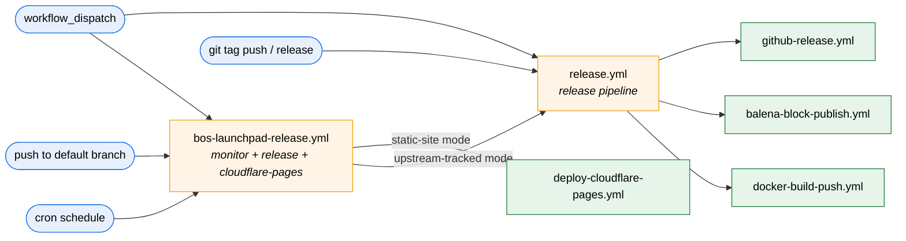

# bos-automation-hub

> Maintained by [Blackout Secure](https://blackoutsecure.app)

[](https://github.com/blackoutsecure)

Two things live in this repo:

1. **Reusable GitHub Actions workflows and composite actions** under
   [`.github/`](.github/), shared across **blackoutsecure** repositories
   (Docker build/push, Balena block publish, Cloudflare Pages deploy,
   GitHub release rendering, upstream-release monitoring, …).
2. **OS administration scripts** under [`linux/`](linux/) and
   [`macos/`](macos/) — idempotent, MDM-friendly install/configure
   scripts for managed Ubuntu, OpenWrt/GL.iNet, and macOS endpoints.

This repo is public so any repository (including forks) can call these
workflows directly without needing a token, and any host can fetch the
scripts directly with `wget`/`curl`.

### Configuration model

- **`secrets:`** — things that grant access (Docker Hub token, Balena
  API token).
- **`vars:`** — things that identify *what* you're publishing (image
  name, namespace, block name). Set them once on the repository or
  organisation and the caller workflow stays free of literals.

The Docker Hub namespace is **public information** (it appears in every
`docker pull` URL), so it's modelled as `vars.DOCKERHUB_NAMESPACE` /
`inputs.dockerhub_namespace` rather than a secret. The legacy
`secrets.DOCKERHUB_NAMESPACE` is still accepted for back-compat.

### Runner resolution

Every `runs-on:` in this repo is resolved from one of three
org-shared variables. Set the vars at the **organisation** level
(Settings → Variables → Actions) and every reusable workflow
automatically picks them up — no caller changes needed.

| Variable | Used for |
|----------|----------|
| `vars.DEFAULT_RUNNER` | Lightweight orchestration jobs (setup, plan, manifest, release publish, etc.). |
| `vars.RUNNER_X64` | The amd64 leg of the multi-arch Docker build matrix in `docker-build-push.yml`, all Docker Scout jobs, and the amd64-pinned balena `publish` / `deploy` jobs (`deploy-to-balena-action` is amd64-only). NOT used by the `codeql` job in `bos-launchpad-code-scan.yml` — CodeQL defaults to hosted `ubuntu-latest` because the bundled Temurin 21 JIT routinely SIGILLs on self-hosted "X64" pools that are actually emulated (CodeQL [system requirements](https://codeql.github.com/docs/codeql-overview/system-requirements/)). Callers with verified-native amd64 hardware can opt back in via `security_scan_codeql_runs_on` on the launchpad wrappers. |
| `vars.RUNNER_ARM64` | The arm64 leg of the multi-arch Docker build matrix in `docker-build-push.yml`. |

Values may be either a single bare label (e.g. `ubuntu-latest`) or a
JSON-array string of labels for self-hosted runner targeting:

```text
["self-hosted","Linux","ARM64"]
```

The resolver expression in each workflow accepts both shapes
(`fromJSON` + `startsWith` dance — see the inline comment above any
`runs-on:` in this repo).

**Arch-agnostic targeting.** For lightweight orchestration jobs where
arch doesn't matter (most `DEFAULT_RUNNER` work — shell, `actions/*`,
balena CLI, etc.), set:

```text
DEFAULT_RUNNER=["self-hosted","Linux"]
```

GitHub will dispatch each job to whichever self-hosted Linux runner is
idle first, regardless of `x64` vs `arm64`. Reserve the arch-pinned
forms (`["self-hosted","Linux","ARM64"]` etc.) for `RUNNER_X64` /
`RUNNER_ARM64` and anywhere a job has a native binary dependency.

#### Preflight gate — no silent fallbacks anywhere

Every workflow that consumes a runner variable starts with a
`preflight-runner-config` job that runs the shared composite action at
[`.github/actions/shared/preflight-runner-config`](.github/actions/shared/preflight-runner-config).
That job runs on `ubuntu-latest` (the validator needs a runner that is
always present), checks each variable required by the workflow, and
fails fast with a clear `::error::` annotation when something is
missing or malformed. All downstream jobs in the workflow declare
`needs: preflight-runner-config`, so a misconfigured variable surfaces
in seconds instead of leaving real jobs queued indefinitely against an
unmatched label.

The validator enforces, for each required variable:

* **non-empty** (or a clear annotation explaining which variable to set);
* **well-formed shape** — either a bare label matching
  `^[A-Za-z0-9][A-Za-z0-9._-]*$`, or a JSON-array string containing
  one or more non-empty label strings (validated with `jq`).

Per-workflow requirements:

| Workflow | Required variables |
|----------|--------------------|
| `release.yml`, `github-release.yml`, `openwrt-readsb-wiedehopf-bump.yml`, `deploy-cloudflare-pages.yml` | `DEFAULT_RUNNER` |
| `balena-block-publish.yml`, `balena-fleet-deploy.yml` | `DEFAULT_RUNNER` + `RUNNER_X64` |
| `docker-build-push.yml` | `DEFAULT_RUNNER` + `RUNNER_X64` + `RUNNER_ARM64` |
| `bos-launchpad-code-scan.yml` | `DEFAULT_RUNNER` (always, for the `scan` job); the `codeql` matrix job defaults to hosted `ubuntu-latest` — see `codeql_runs_on` input docs |
| `lint.yml`, `monitor-upstream-release.yml` | _(pinned to `ubuntu-latest` by design)_ |
| `sync-managed-files.yml` | _(uses caller-supplied `inputs.runs_on` directly)_ |
| `bos-launchpad-release.yml`, `bos-launchpad-marketplace.yml` | _(pure delegator; each downstream workflow runs its own preflight)_ |

Because preflight guarantees the variable is set and well-formed, the
per-job `runs-on:` expressions no longer carry a `'ubuntu-latest'`
fallback or a `vars-…-not-set` sentinel — a job that reaches the
`runs-on` stage is guaranteed to evaluate against a valid label set.

**Per-call overrides:** workflows that ship a deploy-style step expose
a `runs_on` input (currently `deploy-cloudflare-pages.yml`,
`balena-block-publish.yml`, `balena-fleet-deploy.yml`). Pass a literal
label or JSON-array string to override the resolved variable for that
one job; leave it empty to inherit. The shape rule is identical and
is also validated by preflight on the source variable.

---

## Contents

| Path | Kind | Purpose |
|------|------|---------|
| [.github/workflows/docker-build-push.yml](.github/workflows/docker-build-push.yml) | Reusable workflow | Multi-arch Docker build, push-by-digest, and single-manifest publish to Docker Hub. Includes default-on Docker Scout CVE scanning (PR comment + SARIF upload to code scanning). |
| [.github/workflows/balena-block-publish.yml](.github/workflows/balena-block-publish.yml) | Reusable workflow | Resolve a block version, optionally sync `balena.yml`, and publish via `balena-io/deploy-to-balena-action`. |
| [.github/workflows/balena-fleet-deploy.yml](.github/workflows/balena-fleet-deploy.yml) | Reusable workflow | Render a per-fleet `balena.yml` from inputs and deploy the same block to one or more balenaCloud fleets in a matrix. |
| [.github/workflows/github-release.yml](.github/workflows/github-release.yml) | Reusable workflow | Render Markdown release notes from a template + structured inputs and create/update a GitHub Release via `softprops/action-gh-release`. |
| [.github/workflows/monitor-upstream-release.yml](.github/workflows/monitor-upstream-release.yml) | Reusable workflow | Discover the latest upstream version from a pluggable source (GitHub Releases / branch HEAD / tag list / container registry / npm / PyPI / generic URL), dispatch downstream workflows on change, and commit a tracking file. Discovery is delegated to the [bos-upstream-watcher](https://github.com/blackoutsecure/bos-upstream-watcher) standalone action. |
| [.github/workflows/release.yml](.github/workflows/release.yml) | Reusable **meta-workflow** | Tag-driven end-to-end release pipeline that orchestrates `docker-build-push.yml` → `balena-block-publish.yml` → `github-release.yml`. Each stage is independently togglable. |
| [.github/workflows/bos-launchpad-release.yml](.github/workflows/bos-launchpad-release.yml) | Reusable **meta-workflow** | Single front-door composer (Blackout Secure Launchpad). **Container mode:** composes `monitor-upstream-release.yml` → `release.yml` to detect a new upstream release and run the full Docker → Balena → GitHub Release pipeline against the new version. **Static-site mode:** runs `deploy-cloudflare-pages.yml` on every push for continuous Cloudflare Pages deploys. Both modes can run side-by-side in the same call. Opt-in `security_scan` stage (`enable_security_scan: true`, see [`bos-launchpad-code-scan.yml`](.github/workflows/bos-launchpad-code-scan.yml)) runs in parallel with `monitor`; by default it GATES the release (the `release` and `cloudflare-pages` jobs `needs:` it and skip themselves on scan failure). Override knobs: `security_scan_fail_on` (default `fail`, matches Marketplace launchpad) and `security_scan_blocks_release` (default `true`; set `false` to revert to the legacy advisory model where scan runs in parallel and deploy never waits). |
| [.github/workflows/deploy-cloudflare-pages.yml](.github/workflows/deploy-cloudflare-pages.yml) | Reusable workflow | Stage a static-site build, optionally generate `sitemap.xml` / `robots.txt` / `security.txt` / Web App Manifest, and deploy to Cloudflare Pages via `cloudflare/wrangler-action`. |
| [.github/workflows/sync-managed-files.yml](.github/workflows/sync-managed-files.yml) | Reusable workflow | Keep standardized "managed" sections of `.gitignore`, `.dockerignore`, `.editorconfig`, `.gitattributes`, and `.github/dependabot.yml` in sync — plus canonical whole files (`root/usr/local/bin/log-functions.sh`, `.prettierrc.yaml`, hub-managed launchpad kicker workflows) and init-once starter workflows (`.github/workflows/sync-managed-files.yml`, `sync-drift-check.yml`, `lint.yml`). Pluggable per-service: section (`common`, `docker`, `balena`, `node`, `python`, `lf_line_endings`, `dependabot_actions`, `dependabot_npm`, `dependabot_pip`), whole-file (`logger`, `prettier`, `bos_launchpad_release` \| `bos_launchpad_cf_pages` \| `bos_launchpad_sync_files`), init-if-missing (`gha_sync_commit`, `gha_sync_drift_check`, `gha_lint_node` \| `gha_lint_python` \| `gha_lint_shell`). Two modes: `commit` (write + push) and `check` (PR drift-check). Disabled services are skipped entirely — their existing blocks / files are never touched. |
| [.github/workflows/nginx-config-validate.yml](.github/workflows/nginx-config-validate.yml) | Reusable workflow | PR / push CI gate for repos with an in-repo nginx config tree (e.g. `docker-tar1090`, `docker-graphs1090`, `docker-dump978`). Renders `*.conf.template` files via `envsubst` with caller-supplied placeholder values and runs `nginx -t -c /etc/nginx/nginx.conf` inside the official `nginx:alpine` image. Catches syntax errors, unresolved directives, and missing `include` targets at merge time instead of at container start. |
| [.github/actions/shared/resolve-docker-image-tags/action.yml](.github/actions/shared/resolve-docker-image-tags/action.yml) | Composite action | Resolves an image version from a Dockerfile `ARG`, version file, git tag, or commit SHA and emits a deduplicated tag list. |
| [.github/actions/shared/resolve-release-context/action.yml](.github/actions/shared/resolve-release-context/action.yml) | Composite action | Shared "publish-on-default-branch" gate + version/`build_date` selection used by both reusable workflows. |
| [.github/actions/shared/resolve-upstream-version/action.yml](.github/actions/shared/resolve-upstream-version/action.yml) | Composite action | Shallow-clones an upstream git repo at a ref and resolves a version (file → `git describe` → short SHA), commit SHA, and commit date. |
| [.github/actions/shared/docker-multiarch-manifest/action.yml](.github/actions/shared/docker-multiarch-manifest/action.yml) | Composite action | Assembles a multi-arch Docker manifest from per-arch digest artifacts and pushes it under one or more tags, with retry on transient registry failures. |
| [.github/actions/sync-dockerhub-description/action.yml](.github/actions/sync-dockerhub-description/action.yml) | Composite action | Validates inputs and pushes a repo's README + short description to Docker Hub via `peter-evans/dockerhub-description`. |
| [.github/actions/docker-scout-enable-repo/action.yml](.github/actions/docker-scout-enable-repo/action.yml) | Composite action | Idempotently enrolls a Docker Hub repository in Docker Scout's continuous-monitoring service. Validates credentials, logs in to Docker Hub, installs the Scout CLI, and calls `docker scout repo enable`. |
| [.github/actions/shared/docker-scout-scan/action.yml](.github/actions/shared/docker-scout-scan/action.yml) | Composite action | Wraps `docker/scout-action` with input validation, Docker Hub login, and optional SARIF upload to GitHub code scanning. Used by the embedded scan in `docker-build-push.yml`; reach for it directly to weave Scout into custom job topologies (ad-hoc / scheduled re-scans of an already-published image). |
| [.github/actions/shared/render-balena-yml/action.yml](.github/actions/shared/render-balena-yml/action.yml) | Composite action | Renders `balena.yml` from scalar inputs (PyYAML `safe_dump`, path-traversal + HTTPS-URL + default-vs-supported-device-type validation, defensive re-parse). Shared by `balena-block-publish.yml` (default `type: sw.block`) and `balena-fleet-deploy.yml` (default `type: sw.application`, `emit_assets: false` for the legacy per-target omit-assets behavior). |
| [.github/actions/shared/balena-publish/action.yml](.github/actions/shared/balena-publish/action.yml) | Composite action | Pushes a project to balenaCloud via the `balena` CLI (standalone tarball, no Docker container action) with the same release-tag dedup + `--draft` / `--nocache` / `--debug` semantics as `balena-io/deploy-to-balena-action`. Drop-in replacement used by `balena-block-publish.yml` and `balena-fleet-deploy.yml` so the publish job can run on containerized self-hosted runners where the upstream container action's `/github/workspace` bind-mount fails against the host's read-only rootfs. |
| [.github/actions/render-release-notes/action.yml](.github/actions/render-release-notes/action.yml) | Composite action | Renders Markdown release notes from a template with safe `{{ key }}` substitution — no shell or template-engine execution against user values. |
| [.github/actions/sync-managed-files/action.yml](.github/actions/sync-managed-files/action.yml) | Composite action | Inserts / replaces canonical managed-section blocks (`.gitignore`, `.dockerignore`, `.editorconfig`, `.gitattributes`, `.github/dependabot.yml`), writes canonical whole files (`root/usr/local/bin/log-functions.sh`, `.prettierrc.yaml`, hub-managed launchpad kicker workflows in `.github/workflows/bos-launchpad-release.yml`), and initializes starter templates (`.github/workflows/sync-managed-files.yml`, `sync-drift-check.yml`, `lint.yml`) on first run only. Pure-Python (stdlib only). Used by `sync-managed-files.yml`. |
| [.github/actions/nginx-config-validate/action.yml](.github/actions/nginx-config-validate/action.yml) | Composite action | Spins up the official `nginx` image, renders the consumer repo's `*.conf.template` files via `envsubst`, and runs `nginx -t -c /etc/nginx/nginx.conf`. Used by `nginx-config-validate.yml`. Positional-key envsubst (only listed keys are substituted) so nginx-native variables like `$remote_addr` pass through unchanged. |
| [.github/actions/shared/commit-and-push/action.yml](.github/actions/shared/commit-and-push/action.yml) | Composite action | Stage files, commit, and push to the current branch with rebase-retry on concurrent commits. Single-line message + author validation. Exits cleanly with `committed=false` when nothing is staged. Used by `monitor-upstream-release.yml` and `sync-managed-files.yml`. |
| [.github/workflows/release-promote.yml](.github/workflows/release-promote.yml) | Reusable workflow | **Marketplace-compliant release.** Promotes an allowlisted set of paths from a source branch (typically `dev`) to a target branch (typically `main`), tags the promoted SHA, and chains into `github-release.yml` to publish a GitHub Release. Paths under `.github/workflows/**` are hard-rejected by the underlying primitive — keeps Marketplace Action repos' default branch clean of CI workflow files. Called via [`bos-launchpad-marketplace.yml`](.github/workflows/bos-launchpad-marketplace.yml). |
| [.github/workflows/marketplace-repo-guard.yml](.github/workflows/marketplace-repo-guard.yml) | Reusable workflow | **Marketplace compliance guard.** PR-time check that fails any PR whose diff (or post-merge tree state) would add a file under `.github/workflows/**` to the default branch. Defense-in-depth companion to the org-level ruleset in [`scripts/marketplace-repo/`](scripts/marketplace-repo/). Called via [`bos-launchpad-marketplace.yml`](.github/workflows/bos-launchpad-marketplace.yml). |
| [.github/workflows/marketplace-action-ci.yml](.github/workflows/marketplace-action-ci.yml) | Reusable workflow | **Marketplace Action CI.** PR-time `check` (manifest + LICENSE + README + branding + community-health) + `branding-preview` (Marketplace card SVG, uploaded as artifact) + opt-in `name-check` (Marketplace name availability). Drives every PR into `dev` on a Marketplace Action repo. Called via [`bos-launchpad-marketplace.yml`](.github/workflows/bos-launchpad-marketplace.yml). |
| [.github/workflows/bos-launchpad-code-scan.yml](.github/workflows/bos-launchpad-code-scan.yml) | Reusable workflow | **Consolidated security scan wrapper.** Wraps the published [`blackoutsecure/bos-code-scanning-kit@v1`](https://github.com/marketplace/actions/bos-code-scanning-kit) composite (posture audit + bundled scanners: actionlint / gitleaks / shellcheck + unified SARIF upload) AND `github/codeql-action` (matrix-parallel semantic analysis) behind one reusable. Three sub-jobs (`scan`, `resolve-codeql-languages`, `codeql`) gated by `enable_kit_composite` + `codeql_languages` (`''`, `'auto'`, or a JSON array — see [§8. CodeQL language autodetect](#8-codeql-language-autodetect--codeql_languages-auto)); producer-kit escape hatch (`enable_kit_composite: false`) lets kits get CodeQL-only coverage without running the published @v1 against their dev source. Shared by [`bos-launchpad-marketplace.yml`](.github/workflows/bos-launchpad-marketplace.yml) (PR-time gate, default `fail_on: fail`) and [`bos-launchpad-release.yml`](.github/workflows/bos-launchpad-release.yml) (deploy-time gate, default `fail_on: fail` + `security_scan_blocks_release: true`). Direct callers like [`bos-marketplace-kit/.github/workflows/bos-launchpad-code-scan.yml`](https://github.com/blackoutsecure/bos-marketplace-kit/blob/dev/.github/workflows/bos-launchpad-code-scan.yml) also consume it. |
| [.github/workflows/bos-launchpad-marketplace.yml](.github/workflows/bos-launchpad-marketplace.yml) | Reusable **meta-workflow** | Single front-door composer (Blackout Secure Marketplace Launchpad). Composes `marketplace-action-ci.yml` + `bos-launchpad-code-scan.yml` (opt-in security scan) + `marketplace-repo-guard.yml` + `release-promote.yml` with internal event routing: PRs / pushes to `dev` → CI (+ security scan when enabled); PRs to `main` → guard; `workflow_dispatch` mode `release` → promote + GH Release; `workflow_dispatch` mode `name-check` → one-shot name probe. Consumers drop a ~60-line thin caller on their `dev` branch ([`examples/bos-launchpad-marketplace.example.yaml`](examples/bos-launchpad-marketplace.example.yaml)); all orchestration logic lives here. Sibling to [`bos-launchpad-release.yml`](.github/workflows/bos-launchpad-release.yml) for the container/site family. |
| [bos-code-scanning-kit](https://github.com/marketplace/actions/bos-code-scanning-kit) (external) | Marketplace Action | Source of the posture-audit + bundled-scanners composite consumed by [`bos-launchpad-code-scan.yml`](.github/workflows/bos-launchpad-code-scan.yml). SHA / version pin uses the floating `@v1` tag in the wrapper so a single bump there propagates everywhere. |
| [bos-marketplace-kit](https://github.com/marketplace/actions/blackout-secure-marketplace-kit) (external) | Marketplace Action | Source of the `check` / `guard` / `promote` / `name-check` / `branding-preview` composite primitives consumed by `marketplace-repo-guard.yml`, `release-promote.yml`, and `marketplace-action-ci.yml`. SHA-pinned to `v0.1.1`; Dependabot tracks bumps. |
| [scripts/marketplace-repo/](scripts/marketplace-repo/) | Bootstrap scripts | One-time platform-setup scripts for Marketplace Action repos: org ruleset template + `gh api` bootstrap (`bootstrap-ruleset.sh`) for `file_path_restriction` enforcement, and a per-repo branch-protection fallback (`bootstrap-branch-protection.sh`). See [`scripts/marketplace-repo/README.md`](scripts/marketplace-repo/README.md). |
| [.github/workflows/lint.yml](.github/workflows/lint.yml) | Workflow | Runs `actionlint` + `shellcheck` on this repo's workflows and actions. |
| [.github/workflows/openwrt-readsb-wiedehopf-bump.yml](.github/workflows/openwrt-readsb-wiedehopf-bump.yml) | Scheduled automation | Tracks new `wiedehopf/readsb` releases and proposes them upstream as a cross-repo PR to `openwrt/packages` (bumps `PKG_VERSION`/`PKG_HASH`, resets `PKG_RELEASE`) via a bot-owned fork. |
| [linux/](linux/) | OS administration scripts | Distribution-grouped install/configure scripts for managed Linux endpoints (Ubuntu, OpenWrt / GL.iNet). See [linux/README.md](linux/README.md). |
| [macos/](macos/) | OS administration scripts | Application/lifecycle scripts for managed macOS endpoints (MDM-friendly: Intune, Jamf, Kandji, Mosyle, Workspace ONE). See [macos/README.md](macos/README.md). |

---

## Quick start — caller wiring

Consumer repos wire themselves up by committing a small caller
workflow under `.github/workflows/` that calls one of the reusable
workflows in this repo. Copy the relevant block, drop it into your
repo, set the listed `vars` / `secrets`, and commit.

### 1. Tag-driven release (Docker → Balena → GitHub Release)

Calls the [`release.yml`](#releaseyml--reusable-meta-workflow)
meta-workflow on every SemVer tag push, on `release: published`, and
from a manual dispatch. One file in the consumer repo drives all
three publish stages; turn any stage off with `docker: false`,
`balena: false`, or `github_release: false`.

Required `vars`: `IMAGE_NAME`, `DOCKERHUB_NAMESPACE`,
`BALENA_BLOCK_NAME`, `BALENA_NAMESPACE`.
Required `secrets`: `DOCKERHUB_USERNAME`, `DOCKERHUB_TOKEN`,
`BALENA_API_TOKEN`.

```yaml
# .github/workflows/release.yml
name: Release (tag-driven)

on:
  push:
    tags: ['v[0-9]+.[0-9]+.[0-9]+', 'v[0-9]+.[0-9]+.[0-9]+-*']
  release:
    types: [published]
  workflow_dispatch:
    inputs:
      tag_name:
        description: 'Release tag (e.g. v1.2.3).'
        required: true
        type: string

permissions:
  contents: read

concurrency:
  group: release-${{ github.workflow }}-${{ github.ref }}
  cancel-in-progress: false

jobs:
  release:
    permissions:
      contents: write   # balena commit-back + GitHub Release publish
    uses: blackoutsecure/bos-automation-hub/.github/workflows/release.yml@main
    with:
      tag_name:                 ${{ github.event_name == 'workflow_dispatch' && inputs.tag_name || '' }}
      image_name:               ${{ vars.IMAGE_NAME }}
      dockerhub_namespace:      ${{ vars.DOCKERHUB_NAMESPACE }}
      docker_extra_tags:        sha-${{ github.sha }}
      docker_short_description: ${{ github.event.repository.description }}
      block_name:               ${{ vars.BALENA_BLOCK_NAME }}
      balena_namespace:         ${{ vars.BALENA_NAMESPACE }}
    secrets:
      DOCKERHUB_USERNAME: ${{ secrets.DOCKERHUB_USERNAME }}
      DOCKERHUB_TOKEN:    ${{ secrets.DOCKERHUB_TOKEN }}
      BALENA_API_TOKEN:   ${{ secrets.BALENA_API_TOKEN }}
```

### 2. Upstream-tracked release (poll upstream, then run the same pipeline)

Calls the [`bos-launchpad-release.yml`](#bos-launchpad-releaseyml--reusable-meta-workflow)
meta-workflow on a 6-hourly cron. When the tracked upstream repo cuts
a new release, the full Docker → Balena → GitHub Release pipeline runs
against `v<upstream_version>` automatically — no tag push required in
the consumer repo.

> **Setup:** enable the `bos_launchpad_release` service in your
> [`sync-managed-files`](#sync-managed-filesyml--reusable-workflow)
> caller — it writes `.github/workflows/bos-launchpad-release.yml` (the
> kicker) for you. Your only customization point is
> `.bos-launchpad.yaml` at the repo root; see
> [examples/bos-launchpad-release.example.yaml](examples/bos-launchpad-release.example.yaml)
> for an annotated starter and the
> [`.bos-launchpad.yaml` schema](#bos-launchpadyaml-schema-used-by-the-bos_launchpad_-services)
> for the full field reference. The kicker shape below is for
> reading — you don't author it by hand.

Required `vars`: `UPSTREAM_REPO`, `IMAGE_NAME`, `DOCKERHUB_NAMESPACE`,
`BALENA_NAMESPACE`.
Required `secrets`: `DOCKERHUB_USERNAME`, `DOCKERHUB_TOKEN`,
`BALENA_API_TOKEN`.

```yaml
# .github/workflows/bos-launchpad-release.yml
name: Blackout Secure Launchpad

on:
  schedule:
    - cron: '17 */6 * * *'   # stagger off :00 to dodge org cron pile-ups
  workflow_dispatch:
    inputs:
      force_run:
        description: Run the pipeline even if upstream is unchanged.
        type: boolean
        default: false

# No top-level `concurrency:` here — the hub workflow owns serialization.
# Declaring it on both sides triggers a GHA self-deadlock.
permissions:
  contents: read

jobs:
  release:
    permissions:
      contents:        write   # monitor tracking-file commit + GitHub Release publish
      actions:         write   # nested monitor declares this; cascade requires it
      pull-requests:   write   # nested Docker Scout PR annotations
      security-events: write   # nested Docker Scout SARIF upload
    uses: blackoutsecure/bos-automation-hub/.github/workflows/bos-launchpad-release.yml@main
    with:
      # Every launchpad stage defaults to `false`. Opt in explicitly so
      # this caller keeps doing only what it asked for, even if the hub
      # grows new stages later.
      docker:         true
      balena:         true
      github_release: true

      upstream_repo:       ${{ vars.UPSTREAM_REPO }}
      force_run:           ${{ github.event_name == 'workflow_dispatch' && inputs.force_run }}
      image_name:          ${{ vars.IMAGE_NAME }}
      dockerhub_namespace: ${{ vars.DOCKERHUB_NAMESPACE }}
      # `block_name` defaults to `image_name` when omitted — only set it
      # when the docker image and balena block slugs intentionally diverge.
      balena_namespace:    ${{ vars.BALENA_NAMESPACE }}
    secrets:
      DOCKERHUB_USERNAME: ${{ secrets.DOCKERHUB_USERNAME }}
      DOCKERHUB_TOKEN:    ${{ secrets.DOCKERHUB_TOKEN }}
      BALENA_API_TOKEN:   ${{ secrets.BALENA_API_TOKEN }}
```

#### 2a. Upstream-tracked release for projects without GitHub Releases (branch-HEAD mode)

Some upstreams ship rolling builds off a development branch and never
cut GitHub Releases (e.g. `wiedehopf/readsb` on `dev`). The same
`bos-launchpad-release.yml` meta-workflow handles that case via
`source: github_branch_file` — the monitor reads a version file from
the branch HEAD and resolves the commit SHA via the GitHub API.

Required `vars` and `secrets` are identical to example 2.

```yaml
# .github/workflows/bos-launchpad-release.yml
name: Blackout Secure Launchpad

on:
  schedule:
    - cron: '17 */6 * * *'
  workflow_dispatch:
    inputs:
      force_run:
        type: boolean
        default: false

# No top-level `concurrency:` — the hub workflow owns serialization.
permissions:
  contents: read

jobs:
  release:
    permissions:
      contents:        write
      actions:         write
      pull-requests:   write
      security-events: write
    uses: blackoutsecure/bos-automation-hub/.github/workflows/bos-launchpad-release.yml@main
    with:
      docker:            true                # opt in explicitly (default `false`)
      balena:            true
      github_release:    true
      upstream_repo:     wiedehopf/readsb
      source:            github_branch_file  # \u2190 the only structural difference vs. example 2
      upstream_branch:   dev                 # \u2190 required when source: github_branch_file
      track_file:        .github/upstream/readsb-dev.json
      force_run:         ${{ github.event_name == 'workflow_dispatch' && inputs.force_run }}

      image_name:          ${{ vars.IMAGE_NAME }}
      dockerhub_namespace: ${{ vars.DOCKERHUB_NAMESPACE }}
      # `block_name` defaults to `image_name` when omitted.
      balena_namespace:    ${{ vars.BALENA_NAMESPACE }}
    secrets:
      DOCKERHUB_USERNAME: ${{ secrets.DOCKERHUB_USERNAME }}
      DOCKERHUB_TOKEN:    ${{ secrets.DOCKERHUB_TOKEN }}
      BALENA_API_TOKEN:   ${{ secrets.BALENA_API_TOKEN }}
```

The monitor SemVer-validates the fetched version string and synthesizes
`upstream_tag = upstream_version`, so the downstream release pipeline
sees a uniform output shape regardless of source mode. By default the
file path is `version` (the wiedehopf convention); override with
`version_file_path: path/to/your/version-file`.

#### 2b. Other upstream sources (tags, container image, npm, PyPI, arbitrary URL)

The monitor delegates version discovery to the
[bos-upstream-watcher](https://github.com/blackoutsecure/bos-upstream-watcher)
standalone action, which ships with seven pluggable providers. Switch
providers by changing `source:` and the matching input:

| `source:`               | Required inputs                                  | Notes |
|-------------------------|--------------------------------------------------|-------|
| `github_release`        | `upstream_repo`                                  | Default. Polls `releases/latest`. |
| `github_branch_file`    | `upstream_repo`, `upstream_branch`               | Reads `version_file_path` from branch HEAD. |
| `github_tags`           | `upstream_repo`                                  | Lists tags, picks highest SemVer. Filter via `tag_pattern`. |
| `container_image`       | `image_ref` (e.g. `docker.io/library/nginx`)     | Docker Hub tags only in this revision. Picks highest SemVer. |
| `npm`                   | `package_name` (scoped names allowed)            | `registry.npmjs.org/<pkg>/latest`. |
| `pypi`                  | `package_name`                                   | `pypi.org/pypi/<pkg>/json`. |
| `generic_url`           | `version_url`, `version_regex` (1 capture group) | Stdlib-only HTTP, no auth. |

### 3. Monitor upstream and dispatch other workflows in this repo

Use this when the consumer repo *isn't* a Docker/Balena/Release product
and you just want to fan out to one or more existing local workflows
on every upstream version change. For Docker/Balena/Release products,
prefer pattern (2) above — it composes the monitor and the release
pipeline in one job graph and avoids the extra `workflow_dispatch`
hop.

```yaml
# .github/workflows/monitor-upstream.yml
name: Monitor upstream release

on:
  schedule:
    - cron: '17 */6 * * *'
  workflow_dispatch:
    inputs:
      force_dispatch:
        description: Dispatch downstream workflows even if upstream is unchanged.
        type: boolean
        default: false

permissions:
  contents: read

concurrency:
  group: monitor-upstream-${{ github.workflow }}-${{ github.ref }}
  cancel-in-progress: false

jobs:
  monitor:
    permissions:
      contents: write   # commit the tracking file
      actions:  write   # dispatch the target workflows
    uses: blackoutsecure/bos-automation-hub/.github/workflows/monitor-upstream-release.yml@main
    with:
      upstream_repo:    actions/runner
      track_file:       .github/upstream/actions-runner.json
      target_workflows: |
        publish.yml
        release.yml
      force_dispatch: ${{ github.event_name == 'workflow_dispatch' && inputs.force_dispatch && 'true' || 'false' }}
```

### 4. Multi-arch Docker build only

For a repo that just builds and pushes a Docker image (no Balena, no
GitHub Release), call [`docker-build-push.yml`](#docker-build-pushyml--reusable-workflow)
directly — see the [Minimal caller](#minimal-caller) example in that
section.

### 5. Multi-fleet balenaBlock deploy

For a block deployed to multiple fleets that differ only by device
type, use [`balena-fleet-deploy.yml`](#balena-fleet-deployyml--reusable-workflow)
— see the [Minimal caller](#minimal-caller-1) example in that
section. (This is a different topology from `balena-block-publish.yml`
and is **not** part of the `release.yml` pipeline.)

### 6. Cloudflare Pages deploy (static-site launchpad)

For static-site repos, drive the deploy through the
[`bos-launchpad-release.yml`](#bos-launchpad-releaseyml--reusable-meta-workflow)
meta-workflow with only the `cloudflare_pages` stage enabled. The
launchpad gives every consumer one canonical front door — container
releases, upstream-tracked releases, and static-site deploys all wire
the same way — and forwards every input straight through to
[`deploy-cloudflare-pages.yml`](#deploy-cloudflare-pagesyml--reusable-workflow).

> **Setup:** enable the `bos_launchpad_cf_pages` service in your
> [`sync-managed-files`](#sync-managed-filesyml--reusable-workflow)
> caller — it writes `.github/workflows/bos-launchpad-cf-pages.yml`
> (the kicker) for you. Your only customization point is
> `.bos-launchpad.yaml` at the repo root; see
> [examples/bos-launchpad-cf-pages.example.yaml](examples/bos-launchpad-cf-pages.example.yaml)
> for an annotated starter and the
> [`.bos-launchpad.yaml` schema](#bos-launchpadyaml-schema-used-by-the-bos_launchpad_-services)
> for the full field reference.

Required `vars`: `CLOUDFLARE_PROJECT_NAME`.
Required `secrets`: `CLOUDFLARE_API_TOKEN`.
Optional `vars`: `CLOUDFLARE_ACCOUNT_ID`, `CLOUDFLARE_ZONE_ID` — both
auto-resolved via the Cloudflare API when omitted (token then needs
`Zone:Read` for the zone resolve). Prefer `vars` over `secrets` for
these IDs: they're public Cloudflare identifiers (visible in dashboard
URLs), and storing them as secrets makes the runner auto-mask them,
which prevents the resolved values from flowing through `GITHUB_OUTPUT`
to downstream jobs. The legacy `secrets.CLOUDFLARE_ACCOUNT_ID` /
`secrets.CLOUDFLARE_ZONE_ID` inputs are still honoured for back-compat.

```yaml
# .github/workflows/bos-launchpad-release.yml
name: Blackout Secure Launchpad

on:
  push:
    branches: [main]
  workflow_dispatch:

# No top-level `concurrency:` — the hub workflow owns serialization.
permissions:
  contents: read

jobs:
  launchpad:
    permissions:
      # GHA validates nested reusable-workflow permissions statically
      # at workflow-call time, so static-site callers must still grant
      # the full superset declared by the hub's monitor + release leaf
      # jobs even though those stages are `if:`-skipped at runtime.
      contents:        write   # nested monitor / github-release
      actions:         write   # nested monitor (`gh workflow run`)
      pull-requests:   write   # nested Docker Scout PR annotations
      security-events: write   # nested Docker Scout SARIF upload
    uses: blackoutsecure/bos-automation-hub/.github/workflows/bos-launchpad-release.yml@main
    with:
      cloudflare_pages: true

      cloudflare_project_name: ${{ vars.CLOUDFLARE_PROJECT_NAME }}
      cloudflare_site_url:     https://example.com
      cloudflare_copy_files: |
        index.html
        favicon.ico
        _headers
        _redirects
      cloudflare_copy_dirs: |
        assets
        .well-known
    secrets:
      CLOUDFLARE_API_TOKEN:  ${{ secrets.CLOUDFLARE_API_TOKEN }}
      # Back-compat only — prefer `vars.CLOUDFLARE_ACCOUNT_ID` /
      # `vars.CLOUDFLARE_ZONE_ID` (see the note above this example).
      # CLOUDFLARE_ACCOUNT_ID: ${{ secrets.CLOUDFLARE_ACCOUNT_ID }}
      # CLOUDFLARE_ZONE_ID:    ${{ secrets.CLOUDFLARE_ZONE_ID }}
```

The launchpad skips its `monitor` and `release` stages when
`upstream_repo` is empty, so the only job that actually runs is
`cloudflare-pages`. Mixed repos (e.g. a container product that also
ships a docs site) can enable `cloudflare_pages: true` alongside
`docker|balena|github_release: true` to run both pipelines in the
same launchpad call.

If you'd rather skip the launchpad and call
[`deploy-cloudflare-pages.yml`](#deploy-cloudflare-pagesyml--reusable-workflow)
directly, the [Minimal caller](#minimal-caller-organisation-shared-pattern)
example in that section still works — same workflow, same inputs.

### 7. Advanced posture probes — `SCANNING_PAT` org secret

The kit composite inside
[`bos-launchpad-code-scan.yml`](.github/workflows/bos-launchpad-code-scan.yml)
runs a posture audit covering GitHub Advanced Security (GHAS)
settings (`PS001` code-scanning default-setup, `PS002` secret-scanning
enablement, `PS003` Dependabot alerts enablement) and branch
protection (`PS020`–`PS024`). The default `GITHUB_TOKEN` granted to a
workflow run does **not** carry the scopes needed for the GHAS
settings probes — those probes return `skip` rather than `pass` /
`fail` unless the caller forwards a personal access token with `repo`
+ `admin:org` (classic) or the fine-grained equivalents.

The reusables read the elevated token from a **single org-wide secret
named `SCANNING_PAT`** so every consumer kit can opt in without
re-provisioning per repo. Once the secret exists in the org, flip
`use_advanced_pat: true` (or its launchpad alias) on any caller and
add `secrets: inherit` to the outer `uses:` block — every other layer
is already wired and ignores the toggle when the secret is absent
(no-op rather than hard failure).

**One-time org setup**

1. **Generate the PAT** at
   <https://github.com/settings/tokens> (pick one):

   - **Classic PAT** with scopes `repo` + `admin:org`. Simplest;
     covers every current and future GHAS probe.
   - **Fine-grained PAT** scoped to the orgs that own the repos
     you'll scan (e.g. `blackoutsecure`, `blackoutmode`) with
     repository permissions: `Administration: Read-only`,
     `Code scanning alerts: Read-only`, `Contents: Read-only`,
     `Dependabot alerts: Read-only`, `Metadata: Read-only`,
     `Secret scanning alerts: Read-only`.

   For SAML SSO orgs, click **Configure SSO** next to the token after
   generation and authorize each org you intend to scan — otherwise
   the probes get back `403 SAML SSO required` and the kit logs a
   targeted hint instead of falling back to `skip`.

2. **Store the PAT as the org secret `SCANNING_PAT`** in every org
   that owns scanned repos:

   ```sh
   gh secret set SCANNING_PAT --org blackoutsecure --visibility all
   gh secret set SCANNING_PAT --org blackoutmode   --visibility all
   # you'll be prompted to paste the token
   ```

   Prefer `--visibility selected --repos <csv>` if you want to limit
   which repos can read it. The name **must** be uppercase
   `SCANNING_PAT` at the secret-store level — the reusables reference
   `secrets.scanning_pat` (GHA secret matching is case-insensitive),
   so the lowercase form inside the workflow YAML is intentional.

3. **Opt in at the caller** by adding `secrets: inherit` to the
   launchpad `uses:` block and flipping the relevant toggle:

   | Caller surface                                                                                                       | Toggle input                            |
   | -------------------------------------------------------------------------------------------------------------------- | --------------------------------------- |
   | [`bos-launchpad-code-scan.yml`](.github/workflows/bos-launchpad-code-scan.yml) (direct)                              | `use_advanced_pat: true`                |
   | [`bos-launchpad-release.yml`](.github/workflows/bos-launchpad-release.yml)                                           | `security_scan_use_advanced_pat: true`  |
   | [`bos-launchpad-marketplace.yml`](.github/workflows/bos-launchpad-marketplace.yml)                                   | `security_scan_use_advanced_pat: true`  |
   | Producer-kit caller (e.g. `bos-code-scanning-kit`, `bos-marketplace-kit`)                                            | dispatch input `advanced_scanning: true` (paired with `require_pat`) |

4. **Verify** by triggering a `workflow_dispatch` on any consumer's
   code-scan caller with `advanced_scanning: true` (and
   `require_pat: true` on the producer kits' preflight, which
   fails-fast if the secret is missing). PS001/PS002/PS003 should
   report `pass` or `fail` instead of `skip` in the run summary.

5. **Rotate annually** (or per your security policy). Re-run the
   `gh secret set SCANNING_PAT --org <org>` command with the new
   token; nothing else changes because callers reference the secret
   by name. Consider provisioning the PAT from a non-human GitHub
   account (e.g. a dedicated `bos-bot` machine user) so rotation
   isn't coupled to any individual contributor's offboarding.

### 8. CodeQL language autodetect — `codeql_languages: 'auto'`

[`bos-launchpad-code-scan.yml`](.github/workflows/bos-launchpad-code-scan.yml)
accepts three values for `codeql_languages` (forwarded as
`security_scan_codeql_languages` from both launchpads):

| Mode               | Value                              | Behaviour                                                                                                                                                                                                                                                                                                                  |
| ------------------ | ---------------------------------- | -------------------------------------------------------------------------------------------------------------------------------------------------------------------------------------------------------------------------------------------------------------------------------------------------------------------------- |
| Off (default)      | `''` (empty string)                | The `codeql` matrix job is skipped entirely. The `resolve-codeql-languages` preflight is also skipped — zero cost when CodeQL isn't wanted. The kit composite (`scan` job) is unaffected.                                                                                                                                  |
| **Autodetect**     | `'auto'`                           | The `resolve-codeql-languages` job runs first on hosted `ubuntu-latest`. It queries the caller repo's [GitHub linguist stats](https://docs.github.com/en/rest/repos/repos#list-repository-languages) (`/repos/{owner}/{repo}/languages`), maps them to the CodeQL-supported language set (see table below), and additionally appends `actions` whenever `.github/workflows/*.{yml,yaml}` exists. The detected set drives the `codeql` matrix. If nothing supported is detected the matrix job is silently skipped — no failure. Mirrors the language-selection behaviour of GitHub's first-party ["CodeQL default setup"](https://docs.github.com/en/code-security/code-scanning/enabling-code-scanning/configuring-default-setup-for-code-scanning) UI. |
| Explicit           | JSON array string, e.g. `'["python", "actions"]'` | The `resolve-codeql-languages` job echoes the value back unchanged; the `codeql` matrix runs once per listed language. Use this when the source mix is audit-relevant and shouldn't drift with linguist's view of the repo — e.g. `bos-marketplace-kit` pins `'["python", "actions"]'` to guarantee Python CLI + workflow taint coverage every run, regardless of how much Markdown / YAML accrues. **MUST** be valid JSON with double-quoted strings (`'[python, actions]'` is REJECTED with `fromJSON: Unexpected symbol`). |

**Linguist → CodeQL language mapping (used by `'auto'` mode)**

| Linguist name (from `/languages` API) | CodeQL language identifier   |
| ------------------------------------- | ---------------------------- |
| `Python`                              | `python`                     |
| `JavaScript`, `TypeScript`            | `javascript-typescript`      |
| `Go`                                  | `go`                         |
| `Java`, `Kotlin`                      | `java-kotlin`                |
| `C`, `C++`                            | `c-cpp`                      |
| `C#`                                  | `csharp`                     |
| `Ruby`                                | `ruby`                       |
| `Swift`                               | `swift`                      |
| _(any)_ + `.github/workflows/*.yml`   | `actions` (always appended)  |

Languages outside this table (e.g. `Shell`, `HTML`, `Dockerfile`,
`Makefile`) are silently dropped — CodeQL has no analyser for them.
Deduplication is automatic: a repo with both JavaScript and
TypeScript source emits `javascript-typescript` once, not twice.
Compiled languages (`java-kotlin`, `c-cpp`, `csharp`, `go`, `swift`)
require an in-caller build step before this reusable runs — the
autodetect path does NOT inject one. For build-capable languages,
either (a) keep `codeql_languages: ''` and use the kit composite
only, or (b) author your own CodeQL workflow with the appropriate
autobuild / manual-build steps and invoke `github/codeql-action`
directly.

**Why a separate `resolve-codeql-languages` job?** Putting the
detection inside the `codeql` matrix would create a chicken-and-egg
problem (the matrix needs the language list to define its strategy,
but the strategy expression is evaluated at workflow-load time —
before any step can run). The resolver job emits a JSON-array string
output that the `codeql` job's `matrix.language` consumes via
`fromJSON`, which is the standard GHA pattern for dynamic matrices.

**When NOT to use `'auto'`**

- **Producer kits** where the source mix is part of the audit
  surface. `bos-marketplace-kit` keeps its `["python", "actions"]`
  pin so a future docs / TypeScript snippet drop can't silently
  expand the CodeQL workload mid-release.
- **Compiled-language repos** that need a custom build matrix —
  autodetect would happily emit `c-cpp` or `java-kotlin` but the
  reusable has no autobuild step, so the analyser would error.
  Pin an explicit list AND wire the build steps yourself.
- **Repos with intentionally narrow CodeQL coverage** — e.g. you
  only care about the `actions` analyser for workflow taint and
  explicitly do NOT want Python source scanned. Pin
  `'["actions"]'`.

**Default-setup conflict auto-skip.** GitHub disallows running an
advanced CodeQL workflow against a repo that has [CodeQL default
setup](https://docs.github.com/en/code-security/code-scanning/enabling-code-scanning/configuring-default-setup-for-code-scanning)
enabled — the SARIF upload from the advanced path is rejected with
"CodeQL analyses from advanced configurations cannot be processed
when the default setup is enabled". To avoid burning compute on
analyses that will fail to upload, `resolve-codeql-languages` probes
`/repos/{owner}/{repo}/code-scanning/default-setup` unconditionally
and emits `[]` (skip) when `state == 'configured'`, regardless of
input mode, with a `::warning::` pointing at the disable path. The
endpoint requires `Administration: read` (not grantable to the
default `GITHUB_TOKEN`), so the probe uses the org-level
`SCANNING_PAT` when available (`use_advanced_pat: true` + secret
forwarded) and falls back to `github.token` otherwise — in the
fallback case the call typically 403s, the probe logs "could not
determine", and the codeql job runs and surfaces the same conflict
error directly. Callers that know they have default setup should
also set `codeql_languages: ''` explicitly to skip the wasted API
call per run.

**Cost.** The resolver job is one API call + one sparse-checkout
+ one shell script; typically completes in ≈10 s. It's gated on
`codeql_languages != ''` so callers with CodeQL disabled pay zero.

### 9. Release-time gating — `require_workflow_success`

The marketplace launchpad's nested `ci` and `security_scan` jobs run
on `pull_request` / `push` events (the PR-time gates), but are
**skipped on the `release` dispatch itself** — releases are tagged
via `workflow_dispatch + mode: release`, which routes only to the
`release` job. Without an explicit hard gate, a maintainer could
dispatch a release against a `dev` branch whose latest commit broke
CI or self-scan and the release would still publish.

[`bos-launchpad-marketplace.yml`](.github/workflows/bos-launchpad-marketplace.yml)
exposes the optional input **`require_workflow_success`** — a
comma-separated list of workflow filenames that MUST have a
successful run on `source_branch` HEAD before the `release` job is
allowed to execute. The dedicated `verify-required-checks` preflight
resolves the HEAD SHA, queries each workflow's runs via
`gh api .../actions/workflows/<filename>/runs?head_sha=<sha>`, and
fails the dispatch with a precise annotation pointing at any
workflow that's missing, in-progress, or non-`success` at that SHA.

```yaml
# kit's bos-launchpad-marketplace.yml kicker
jobs:
  launchpad:
    uses: blackoutsecure/bos-automation-hub/.github/workflows/bos-launchpad-marketplace.yml@main
    with:
      # … per-repo context inputs …

      # Block release dispatch unless these three workflows are green
      # at `dev` HEAD. List filenames as they appear on disk —
      # whitespace is trimmed, empty entries ignored. Each named
      # workflow MUST trigger on `push: dev` so the gate has a run
      # to find at every commit.
      require_workflow_success: 'tests.yml,self-scan.yml,codeql.yml'
```

Behavior notes:

- **Opt-in.** Empty string (default) skips the preflight entirely —
  no behavior change for callers that don't set this input.
- **Dry-run bypass.** `dry_run: true` skips the preflight so
  maintainers can validate the release pipeline against a red
  branch. Real releases (non-dry) always gate.
- **Skipped-dep semantics.** The `release` job declares
  `needs: [verify-required-checks]`. GHA treats a skipped dependency
  as satisfied, so `release` still runs when the preflight is
  skipped (opt-out callers + dry-runs).
- **No extra secrets.** The preflight uses the `GITHUB_TOKEN` with
  the launchpad's existing `actions: read` + `contents: read`
  grants. Works against private repos.
- **Filename, not display name.** Pass the on-disk filename
  (`tests.yml`), not the workflow's `name:` field (`Test · Python
  CLI`). The GitHub API workflow ID accepts either, but matching by
  filename is robust against name-field edits.

### Topology

The reusable workflows split cleanly into **trigger**, **orchestrator**,
and **stage** layers. Consumer repos pick a trigger and let it drive
the orchestrator, which fans out to the per-task stage workflows.



Stage workflows are also reusable on their own — a consumer that only
needs `docker-build-push.yml` or `deploy-cloudflare-pages.yml` calls
it directly without going through the launchpad.

---

## OS administration scripts

`linux/` and `macos/` hold idempotent shell scripts intended for
managed-deployment tooling (Ansible, Intune for Linux, Chef, Puppet,
Salt, and the macOS MDMs listed above). They are independent of the
reusable workflows above — every script is self-contained, runs as
root, logs to `/var/log/<script>.log`, and exits non-zero on failure.

### Layout

```
linux/
  ubuntu/                # Ubuntu desktop / server / endpoint scripts
    application-management/   nodejs
    container-runtime/        rootless-docker
    power-management/         no-suspend
    storage-optimization/     usb-boot
    system-configuration/     cgroups-v1, sh-to-bash
  openwrt/               # OpenWrt 21.02+ and GL.iNet firmware
    network-security/         wireguard-ipv4-only
macos/
  application-management/     homebrew, plex-media-server, sublime-text
```

### Conventions

| Aspect | Rule |
|---|---|
| Path layout | `<os>/<distribution-or-category>/<area>/<target>/<action>-<target>.sh` |
| Shell | `#!/bin/bash` on Linux/macOS; POSIX `sh` (BusyBox `ash`) on OpenWrt. |
| Privilege | Require `EUID 0`; refuse to run otherwise. |
| Logging | Tee stdout+stderr to `/var/log/<script>.log` and the console. |
| Idempotency | Re-running an `install` / `apply` is always safe. |
| Modes (where supported) | `apply` (default) and `--check` (read-only audit). Exit `0` on PASS, `2` on drift, `1` on error. |
| Backups | Configuration-touching scripts snapshot the affected files into a timestamped backup directory before mutating them. |

### Adding a new script

1. Create the folder `<os>/<distribution>/<category>/<target>/`.
2. Add `<action>-<target>.sh` (typically `install-<target>.sh` or
   `configure-<target>.sh`). Copy the header / mode-handling / logging
   pattern from any existing sibling script.
3. Add a `README.md` covering: what it does, modes, usage (manual +
   managed deployment), idempotency, verification, reverting, and any
   security notes.
4. Update the parent category `README.md` table so the new target is
   discoverable.

`shellcheck` runs against every `.sh` file via the `extra-lint` job
in [.github/workflows/lint.yml](.github/workflows/lint.yml), which
invokes the [`blackoutsecure/bos-marketplace-kit`](https://github.com/blackoutsecure/bos-marketplace-kit)
`lint` composite (markdown + YAML + shell). This job is currently
**advisory** (`severity: warn`) — findings are annotated in the job
summary but do not block CI; the companion `actionlint` job (strict)
covers workflow YAML and shell snippets embedded in `run:` blocks.
Keep new scripts shellcheck-clean so the `extra-lint` job can be
flipped to strict in the future.

---

## `docker-build-push.yml` — reusable workflow

Build a multi-arch Docker image (amd64 + arm64 by default), push each
architecture by digest, and assemble a single OCI manifest with the
resolved version tag (plus optional `:latest` and extra tags).

### Minimal caller

```yaml
name: Build image

on:
  push:
    branches: [main]
  pull_request:

permissions:
  contents: read

jobs:
  docker:
    uses: blackoutsecure/bos-automation-hub/.github/workflows/docker-build-push.yml@main
    with:
      image_name: my-service
      dockerhub_namespace: ${{ vars.DOCKERHUB_NAMESPACE }}
    secrets:
      DOCKERHUB_USERNAME: ${{ secrets.DOCKERHUB_USERNAME }}
      DOCKERHUB_TOKEN:    ${{ secrets.DOCKERHUB_TOKEN }}
```

### Default behaviour

- **Push trigger:** the workflow pushes only when the caller event is a
  `push` to the default branch. Override with the `push` input.
- **Version resolution:** `auto` cascade → Dockerfile `ARG APP_VERSION` →
  `VERSION` file → annotated git tag → commit SHA.
- **Platforms:** `linux/amd64` + `linux/arm64`. Set `multi_arch: false`
  for amd64-only.
- **Tagging:** `:<version>`, `:latest` (toggle with `latest`), plus any
  caller-supplied `extra_tags`.
- **Labels:** standard OCI labels (`created`, `version`, `revision`,
  `source`) are attached to every build.

### Inputs

| Input | Type | Default | Description |
|-------|------|---------|-------------|
| `image_name` | string | **required** | Image name (no registry/namespace). |
| `dockerhub_namespace` | string | `''` | Docker Hub namespace. Set via `vars.DOCKERHUB_NAMESPACE`. Falls back to `secrets.DOCKERHUB_NAMESPACE` for back-compat. |
| `dockerfile` | string | `./Dockerfile` | Path to the Dockerfile. |
| `build_context` | string | `.` | Docker build context. |
| `registry` | string | `docker.io` | Registry hostname. |
| `push` | string | `''` | `'true'`/`'false'` to force push; empty = push on default branch only. |
| `image_version` | string | `''` | Explicit version; overrides auto-resolution. |
| `extra_tags` | string | `''` | Newline-separated extra tags. |
| `latest` | boolean | `true` | Also tag `:latest` when pushing. |
| `multi_arch` | boolean | `true` | Build amd64 + arm64. |
| `platforms` | string | `''` | Override platform list (comma-separated). |
| `build_args` | string | `''` | Newline-separated `KEY=VALUE` build args. |
| `version_build_arg` | string | `APP_VERSION` | Dockerfile `ARG` to read/populate with the version. |
| `inject_oci_build_args` | boolean | `true` | Inject `BUILD_DATE`, `VCS_REF`, `VCS_URL` build args. |
| `auto_resolve_version` | boolean | `true` | Run the composite resolver. |
| `version_source` | string | `auto` | `auto` \| `dockerfile` \| `file` \| `git_tag` \| `sha`. |
| `version_file` | string | `VERSION` | Plain-text version file path. |
| `distro` | string | `''` | Variant suffix (e.g. `alpine`). |
| `build_date` | string | `''` | Override ISO-8601 build date. |
| `manifest_retries` | number | `3` | Retry attempts for manifest creation. |
| `manifest_retry_delay` | number | `15` | Seconds between manifest retries. |
| `update_description` | boolean | `true` | Sync the repo README + short description to Docker Hub after a successful manifest push. No-op when not pushing. |
| `readme_filepath` | string | `./README.md` | Path to the README uploaded as the Docker Hub full description. |
| `short_description` | string | `''` | Docker Hub short description (max 100 chars). Longer values are truncated to 99 chars + `…` with a `::warning::`. Empty leaves the existing one untouched. |
| `enable_url_completion` | boolean | `true` | Convert relative URLs in the README to absolute GitHub URLs. |
| `enable_scout` | boolean | `true` | Run Docker Scout against the image (PR comment on PRs, SARIF upload on pushes). See **Docker Scout** below. |
| `scout_command` | string | `cves` | Scout command, or comma-separated list (`quickview`, `cves`, `compare`, `recommendations`, `sbom`, `environment`). |
| `scout_severities` | string | `critical,high` | Severities to keep. |
| `scout_only_fixed` | boolean | `false` | Filter to CVEs that have a fix available. |
| `scout_ignore_base` | boolean | `false` | Ignore vulnerabilities inherited from the base image (`cves` only). |
| `scout_ignore_unchanged` | boolean | `true` | Filter out unchanged packages (`compare` only). |
| `scout_to` / `scout_to_env` / `scout_to_latest` / `scout_organization` | mixed | `''` / `''` / `false` / `''` | `compare`-mode targets. Mutually exclusive (validated). |
| `scout_record_environment` | string | `''` | Publish-mode only: when set, also run `environment` to record the image into this Scout environment (requires `scout_organization`). |
| `scout_sarif_upload` | boolean | `true` | Publish-mode only: upload the SARIF report to GitHub code scanning. |
| `scout_write_comment` | boolean | `true` | PR-mode only: post the Scout output as a PR comment. |
| `scout_keep_previous_comments` | boolean | `false` | PR-mode only: keep previous Scout comments hidden instead of updating one in place. |
| `scout_exit_code` | boolean | `false` | Fail the Scout job on findings. |
| `scout_exit_on` | string | `''` | `compare`-mode worsening conditions to fail on (`vulnerability,policy`). |
| `scout_enable_repo` | boolean | `true` | Publish-mode only: after a successful manifest push, enroll the Docker Hub repository in Docker Scout's continuous-monitoring service (idempotent — no-op on an already-enrolled repo). Requires a Docker Hub PAT with admin scope on the namespace. |

### Secrets

| Secret | Required | Description |
|--------|:--------:|-------------|
| `DOCKERHUB_USERNAME` | ✔ | Docker Hub username. |
| `DOCKERHUB_TOKEN` | ✔ | Docker Hub access token (not your password). |
| `DOCKERHUB_NAMESPACE` | ✖ | **Deprecated.** Pass `dockerhub_namespace:` (or set `vars.DOCKERHUB_NAMESPACE`) instead. Still accepted for back-compat. |

### Outputs

| Output | Description |
|--------|-------------|
| `image` | Fully qualified image reference (`registry/namespace/name`). |
| `image_version` | Resolved version tag. |
| `namespace` | Effective Docker Hub namespace. |

### Runner targeting

See [Runner resolution](#runner-resolution) for the global model. In this
workflow specifically:

- **setup**, **manifest**, **update-description** → `vars.DEFAULT_RUNNER`.
- Per-arch **build** matrix → `vars.RUNNER_X64` (amd64 leg) and
  `vars.RUNNER_ARM64` (arm64 leg).
- **scout-pr**, **scout-published**, **scout-enable-repo** →
  `vars.RUNNER_X64`. Scout indexes one architecture per scan, and the
  matrix already covers arm64 on its own runner; pinning Scout to x64
  also avoids arm64 self-hosted instability during the CPU/RAM-heavy
  index step.

All three variables (`DEFAULT_RUNNER`, `RUNNER_X64`, `RUNNER_ARM64`)
are validated by the `preflight-runner-config` job at the top of the
workflow — see [Runner resolution](#runner-resolution).

### Docker Scout

When `enable_scout: true` (the default), the workflow runs
[`docker/scout-action`](https://github.com/docker/scout-action) against
the image. The behaviour differs by trigger:

- **Pull request / non-publish run** — a parallel `scout-pr` job builds
  the amd64 image with `outputs: type=docker` (reusing the matrix's
  `cache-from: type=gha,scope=amd64` for a near-instant load) and runs
  Scout against the locally-loaded image. Findings are posted as a PR
  comment via `docker/scout-action`'s built-in commenter. SARIF upload
  is **disabled** in PR mode because GitHub code scanning rejects SARIF
  uploads from forked PRs.
- **Publish run** — a `scout-published` job runs after the multi-arch
  manifest is pushed. It scans the registry image at the resolved
  version tag, and (when `scout_sarif_upload: true`, the default)
  uploads a SARIF report to the GitHub code-scanning alerts surface so
  CVEs in shipped artifacts are visible in the **Security** tab.
- **Recording for later `compare`** — set
  `scout_record_environment: production` (and `scout_organization`)
  on a publish run to record the image into a Scout environment.
  Subsequent PR builds can then `compare` against `to_env: production`
  to show only newly-introduced CVEs.

Scout uses the existing `DOCKERHUB_USERNAME` / `DOCKERHUB_TOKEN`
secrets — no extra credentials are required. The Scout API itself is
free for public Docker Hub repos and included in paid Hub plans for
private ones.

To opt out for a single repo, pass `enable_scout: false`. To opt out
just on PRs, leave `enable_scout: true` and set
`scout_write_comment: false` and `scout_sarif_upload: false`.

For ad-hoc / scheduled scans of an image not produced by this
workflow, use the [`docker-scout-scan`](.github/actions/shared/docker-scout-scan/action.yml)
composite action directly in a custom job.

#### Permissions

When `enable_scout: true` the caller's job needs the standard
`contents: read` plus, for the PR scan, `pull-requests: write`. The
publish-time SARIF upload elevates `security-events: write` inside
the called workflow itself — callers do not need to grant it.

---

## `resolve-docker-image-tags` — composite action

Standalone version/tag resolver. Usable outside the reusable workflow.

```yaml
- uses: blackoutsecure/bos-automation-hub/.github/actions/shared/resolve-docker-image-tags@main
  id: tags
  with:
    version_source: auto            # auto | dockerfile | file | git_tag | sha
    dockerfile: ./Dockerfile
    dockerfile_arg: APP_VERSION
    version_file: VERSION
    distro: alpine                  # optional
    extra_tags: |
      stable
      prod
- run: echo "version=${{ steps.tags.outputs.version }}"
```

### Outputs

- `version` — resolved version tag
- `short_sha` — shortened commit SHA
- `build_date` — ISO-8601 UTC timestamp
- `source` — which resolver path produced the version
- `extra_tags` — newline-separated deduplicated tag list

See [action.yml](.github/actions/shared/resolve-docker-image-tags/action.yml)
for the full input list.

---

## `sync-dockerhub-description` — composite action

Uploads a repository README and short description to Docker Hub. Wraps
[`peter-evans/dockerhub-description`](https://github.com/peter-evans/dockerhub-description)
with preflight validation (README exists, credentials/repository slug
are non-empty and single-line) so failures surface with a clear
message instead of a 401 from the registry API. Short descriptions
longer than Docker Hub's 100-char cap are truncated to 99 chars + `…`
with a `::warning::` so an oversized value never blocks the run
(Hub's API would otherwise reject it with a 400).

It is invoked automatically by the `update-description` job in
[`docker-build-push.yml`](.github/workflows/docker-build-push.yml) after
a successful manifest push, and can also be used standalone:

```yaml
- uses: blackoutsecure/bos-automation-hub/.github/actions/sync-dockerhub-description@main
  with:
    repository: ${{ vars.DOCKERHUB_NAMESPACE }}/my-service
    username: ${{ secrets.DOCKERHUB_USERNAME }}
    password: ${{ secrets.DOCKERHUB_TOKEN }}
    readme_filepath: ./README.md
    short_description: A short tagline shown on the Docker Hub repo page.
```

See [action.yml](.github/actions/sync-dockerhub-description/action.yml)
for the full input list.

---

## `docker-scout-enable-repo` — composite action

Idempotently enrolls a Docker Hub repository in Docker Scout's
continuous-monitoring service. New Hub repositories are NOT
automatically indexed by Scout until enrolled — this closes that gap
so the first release of a brand-new repo surfaces in the Scout
dashboard without a manual onboarding step. Calling
`docker scout repo enable` against an already-enrolled repository is a
no-op, so the action is safe to run on every release.

It is invoked automatically by the `scout-enable-repo` job in
[`docker-build-push.yml`](.github/workflows/docker-build-push.yml)
after a successful manifest push (gated on the `scout_enable_repo`
input, default `true`), and can also be used standalone:

```yaml
- uses: blackoutsecure/bos-automation-hub/.github/actions/docker-scout-enable-repo@main
  with:
    repository: ${{ vars.DOCKERHUB_NAMESPACE }}/my-service
    username:   ${{ secrets.DOCKERHUB_USERNAME }}
    password:   ${{ secrets.DOCKERHUB_TOKEN }}
```

Requires a Docker Hub PAT with admin scope on the namespace — a
`repo:read` PAT cannot call `docker scout repo enable`. Outputs
`state` (`enabled` or `already enabled`) so callers can branch on the
result.

See [action.yml](.github/actions/docker-scout-enable-repo/action.yml)
for the full input list.

---

## `docker-multiarch-manifest` — composite action

Assemble a multi-arch Docker manifest from per-architecture digest
artifacts and push it under one or more tags. Used internally by the
manifest job in [`docker-build-push.yml`](.github/workflows/docker-build-push.yml),
and reusable on its own when you need finer control (e.g. building
amd64 and arm64 in different jobs/runners and merging at the end).

```yaml
- uses: docker/setup-buildx-action@v3
- uses: docker/login-action@v3
  with:
    username: ${{ secrets.DOCKERHUB_USERNAME }}
    password: ${{ secrets.DOCKERHUB_TOKEN }}

- uses: actions/download-artifact@v4
  with:
    path: /tmp/digests
    pattern: digest-*
    merge-multiple: true

- uses: blackoutsecure/bos-automation-hub/.github/actions/shared/docker-multiarch-manifest@main
  id: manifest
  with:
    image_ref: docker.io/${{ vars.DOCKERHUB_NAMESPACE }}/my-service
    digests_dir: /tmp/digests
    version_tag: 1.2.3
    latest: true
    extra_tags: |
      stable
      sha-${{ github.sha }}
- run: echo "Pushed ${{ steps.manifest.outputs.digest_count }} arch(es)"
```

### Inputs

- `image_ref` — fully qualified image name **without a tag**.
- `digests_dir` — directory of per-arch digest files. Each filename
  must be the 64-char lowercase hex sha256 (no `sha256:` prefix), as
  written by `docker/build-push-action`'s `push-by-digest=true` mode.
- `version_tag` — primary tag, always applied.
- `latest` — also tag `:latest` (default `true`).
- `extra_tags` — newline-separated extra tags. Empty lines and
  `#`-comments are ignored. Tags are deduplicated.
- `max_attempts` — manifest create retries (1–10, default `3`).
- `retry_delay_seconds` — delay between retries (1–300, default `15`).
- `inspect_after_push` — run `imagetools inspect` after success
  (default `true`).

### Outputs

- `applied_tags` — newline-separated list of tags actually applied.
- `digest_count` — number of per-arch digests merged.
- `index_digest` — sha256 digest of the published OCI image index
  (manifest list) under `version_tag`. Empty if the post-push registry
  inspect failed.
- `per_arch_sizes` — newline-separated per-arch breakdown of the
  published image, one entry per arch in the form
  `<arch>\t<bytes>\t<sha256-digest>`. `<bytes>` is the compressed
  download size for that arch (config descriptor + sum of layer
  descriptor sizes). Empty if the post-push registry inspect failed.
- `total_compressed_size_bytes` — sum of `per_arch_sizes` bytes across
  every architecture. Empty if the post-push registry inspect failed.

See [action.yml](.github/actions/shared/docker-multiarch-manifest/action.yml)
for full details.

---

## `docker-scout-scan` — composite action

Direct wrapper around
[`docker/scout-action`](https://github.com/docker/scout-action) used
by the embedded scan jobs in `docker-build-push.yml`. Reach for it
directly when you need to weave Scout into a custom job topology —
e.g. scanning an image you've already built and loaded earlier in
the same job, running multiple Scout commands sharing a single login,
or running ad-hoc / scheduled re-scans of an already-published image
outside the build pipeline.

```yaml
- uses: blackoutsecure/bos-automation-hub/.github/actions/shared/docker-scout-scan@main
  with:
    image: local://acme/widget:scan-${{ github.sha }}
    command: cves
    severities: critical,high
    sarif_file: scout.sarif.json   # empty disables SARIF
    dockerhub_username: ${{ secrets.DOCKERHUB_USERNAME }}
    dockerhub_token: ${{ secrets.DOCKERHUB_TOKEN }}
```

The action runs preflight validation (allow-list checks for
`command` / `severities` / `exit_on`, slug regex on `environment` /
`organization`, mutex check between `to` / `to_env` / `to_latest`,
path-traversal check on `sarif_file`) before invoking Scout, so
malformed inputs fail fast with an actionable error.

See [action.yml](.github/actions/shared/docker-scout-scan/action.yml)
for the full input/output surface.

---

## `resolve-upstream-version` — composite action

Shallow-clone an upstream git repo at a branch, tag, or commit and emit
its version string, full commit SHA, and ISO-8601 commit date. Designed
for downstream wrappers (Docker images, Balena blocks, OpenWrt packages)
where the build version should track the upstream project. Resolution
cascade: explicit `version_file` → `git describe --tags` → short SHA;
each fallback opt-out via its own input.

```yaml
- uses: blackoutsecure/bos-automation-hub/.github/actions/shared/resolve-upstream-version@main
  id: upstream
  with:
    repo_url: https://github.com/wiedehopf/readsb
    ref: main
    version_file: version
- run: echo "tracking ${{ steps.upstream.outputs.version }}"
```

### Inputs

- `repo_url` — HTTPS URL to the upstream repo (with or without `.git`).
  SSH/`git://`/`file://` are rejected.
- `ref` — branch, tag, or commit SHA to fetch. Charset restricted to
  `[A-Za-z0-9._/-]+`; `..` and leading `-` are rejected.
- `version_file` — repo-relative path to a plain-text version file
  (default `version`). Path traversal is rejected. Empty disables the
  file probe.
- `fallback_to_describe` — fall back to `git describe --tags FETCH_HEAD`
  when the file probe fails (default `true`).
- `fallback_to_sha` — fall back to the short SHA when the other
  resolvers fail (default `true`).
- `sha_length` — short-SHA length (4–40, default `12`).
- `strip_v_prefix` — strip a leading `v` from the resolved version
  (default `true`).

### Outputs

- `version` — resolved upstream version (no whitespace).
- `vcs_ref` — full upstream commit SHA at the resolved ref.
- `build_date` — ISO-8601 UTC commit date.
- `source` — which resolver path produced the version: `file`,
  `describe`, or `sha`.

See [action.yml](.github/actions/shared/resolve-upstream-version/action.yml)
for full details.

---

## `balena-block-publish.yml` — reusable workflow

Resolve a block version (same logic as the Docker workflow), optionally
sync the version back into `balena.yml`, and publish to balenaCloud via
[`balena-io/deploy-to-balena-action`](https://github.com/balena-io/deploy-to-balena-action).

> **Why no Docker Scout integration here?** The Balena workflows
> (`balena-block-publish.yml` and `balena-fleet-deploy.yml`) build
> images **inside balenaCloud's builders**, not on the GitHub runner.
> No Docker artifact ever lands on the runner for Scout to scan. The
> recommended pattern is to publish the same image to Docker Hub via
> [`docker-build-push.yml`](.github/workflows/docker-build-push.yml)
> first (Scout runs there by default), then call the Balena workflow
> as the second stage of [`release.yml`](.github/workflows/release.yml).
> If you only ship via balenaCloud, run a scheduled job that calls the
> [`docker-scout-scan`](.github/actions/shared/docker-scout-scan/action.yml)
> composite action against the published Hub image to keep code-scanning
> alerts current.

### Required configuration on the caller repo

| Kind     | Name                  | Used for |
|----------|-----------------------|----------|
| Variable | `BALENA_BLOCK_NAME`   | Block slug (without namespace). |
| Variable | `BALENA_NAMESPACE`    | Balena user/org that owns the block. |
| Variable | `DOCKERHUB_NAMESPACE` | Docker Hub namespace for the image. |
| Secret   | `BALENA_API_TOKEN`    | balenaCloud API token (forwarded via `secrets:`). |

### Default behaviour

- **Publish trigger:** publishes only on `push` to the default branch.
  Override with the `publish` input (or via `workflow_dispatch`).
- **Version resolution:** `auto` cascade → Dockerfile `ARG APP_VERSION` →
  `VERSION` file → annotated git tag → commit SHA.
- **`balena.yml` sync:** when `sync_balena_yml: true` (default) and the
  workflow is publishing on the default branch, the top-level `version:`
  is rewritten and committed back. Requires `contents: write` on the
  caller job (set in the template).
- **Concurrency:** balenaCloud rejects concurrent pushes to the same
  block; in-progress runs are never cancelled.

See [.github/workflows/balena-block-publish.yml](.github/workflows/balena-block-publish.yml)
for the full input/output list.

---

## `balena-fleet-deploy.yml` — reusable workflow

Render a balena block manifest (`balena.yml`) per architecture from a
JSON list of fleet targets, then deploy to each target in a fan-out
matrix via
[`balena-io/deploy-to-balena-action`](https://github.com/balena-io/deploy-to-balena-action).

Use this when the *same* block is deployed to *multiple* fleets that
differ only in their `defaultDeviceType` / `supportedDeviceTypes`
(e.g. an x64 fleet and an arm64 fleet of the same self-hosted runner).
For a single-fleet block whose `balena.yml` lives in the repo, use
[`balena-block-publish.yml`](#balena-block-publishyml--reusable-workflow)
instead.

### Minimal caller

```yaml
name: Balena fleets

on:
  push:
    branches: [main]
  workflow_dispatch:

permissions:
  contents: read

jobs:
  deploy:
    uses: blackoutsecure/bos-automation-hub/.github/workflows/balena-fleet-deploy.yml@main
    with:
      block_name: my-block
      block_version: 1.0.0
      targets: |
        [
          {
            "name": "x64",
            "fleet": "acme/my-block-x64",
            "default_device_type": "genericx86-64-ext",
            "supported_device_types": "genericx86-64-ext,intel-nuc"
          },
          {
            "name": "arm64",
            "fleet": "acme/my-block-arm64",
            "default_device_type": "raspberrypi4-64",
            "supported_device_types": "raspberrypi4-64,raspberrypi5,generic-aarch64"
          }
        ]
    secrets:
      BALENA_API_TOKEN: ${{ secrets.BALENA_API_TOKEN }}
```

### Default behaviour

- **`balena.yml` is rendered, never committed.** Each matrix job writes
  it transiently before the deploy step. The caller repo doesn't need
  a checked-in `balena.yml`.
- **One job per target.** `strategy.fail-fast: false` so a failure in
  one fleet doesn't cancel the others.
- **Per-fleet concurrency.** balenaCloud rejects concurrent pushes to
  the same fleet; the workflow serialises them per fleet and never
  cancels an in-progress run.
- **Event-agnostic.** Trigger logic stays in the caller; pass the
  active subset via `target_filter`. The starter workflow demonstrates
  the `push` / `workflow_dispatch` / `repository_dispatch` fan-out
  pattern.

### Inputs

| Input | Type | Default | Description |
|-------|------|---------|-------------|
| `targets` | string | **required** | JSON array of fleet targets (see below). |
| `target_filter` | string | `''` | Comma-separated subset of target `name`s. Empty/`all` = every target. |
| `block_name` | string | **required** | Top-level `name:` written to `balena.yml`. |
| `block_version` | string | **required** | Top-level `version:`. |
| `block_type` | string | `sw.application` | Top-level `type:`. |
| `description_template` | string | `''` | Template for `description:` with `{{ name }}` / `{{ fleet }}` / `{{ labels }}` / `{{ default_device_type }}` / `{{ supported_device_types }}` substitution. |
| `post_provisioning_template` | string | `''` | Template for `post-provisioning:`. Same placeholders. |
| `assets_repository_url` | string | `''` | Sets `assets.repository.data.url`. Must be `https://`. Empty omits the assets block. |
| `balena_yml_path` | string | `./balena.yml` | Repo-relative path the rendered file is written to. |
| `source` | string | `.` | Forwarded to `deploy-to-balena-action`. |
| `cache` | boolean | `true` | Forwarded to `deploy-to-balena-action`. |
| `layer_cache` | boolean | `true` | Forwarded to `deploy-to-balena-action`. |
| `debug` | boolean | `false` | Forwarded to `deploy-to-balena-action`. |
| `draft` | boolean | `false` | Publish as a draft (sets `finalize: false`). |
| `runs_on` | string | `''` | Optional runner override for the deploy job. Empty resolves from `vars.RUNNER_X64` (the deploy job is amd64-pinned because `deploy-to-balena-action` is amd64-only). Pass a literal label or JSON-array string (e.g. `["self-hosted","Linux","X64"]`) to override. No silent fallback — `vars.RUNNER_X64` is validated by `preflight-runner-config`. See [Runner resolution](#runner-resolution). |
| `timeout_minutes` | number | `60` | Per-deploy job timeout. |

### Target object schema

Each entry in `targets` is a JSON object with these fields:

| Field | Required | Description |
|-------|:--------:|-------------|
| `name` | ✔ | Slug used by `target_filter` and shown in job names. Must be unique. |
| `fleet` | ✔ | balenaCloud fleet slug (`<namespace>/<fleet>`). |
| `default_device_type` | ✔ | Device-type slug written as `data.defaultDeviceType`. Must appear in `supported_device_types`. |
| `supported_device_types` | ✔ | Comma-separated device-type slugs written as `data.supportedDeviceTypes`. |
| `labels` | ✖ | Free-form string available as `{{ labels }}` in templates. |
| `description` | ✖ | Per-target literal that overrides `description_template`. |
| `post_provisioning` | ✖ | Per-target literal that overrides `post_provisioning_template`. |

### Secrets

| Secret | Required | Description |
|--------|:--------:|-------------|
| `BALENA_API_TOKEN` | ✔ | balenaCloud API token with deploy access to every fleet listed in `targets`. |

### Outputs

| Output | Description |
|--------|-------------|
| `selected` | JSON list of target names actually selected for deploy. |
| `count` | Number of fleets selected for deploy. |

### Security notes specific to this workflow

- `targets` JSON is parsed and validated in a dedicated `plan` job
  before any deploy runs. `name`, `fleet`, `default_device_type`, and
  every entry in `supported_device_types` are regex-checked; unknown
  keys are rejected.
- `balena_yml_path` and `assets_repository_url` are rejected if they
  resolve outside the workspace or use a non-`https://` scheme.
- The rendered manifest is written via PyYAML's `safe_dump`, which
  quotes/escapes any special characters — caller-supplied
  `description` / `post-provisioning` text cannot break out of the YAML
  doc.
- Template substitution accepts only keys matching `^[a-z][a-z0-9_]*$`
  drawn from a fixed allow-list, so caller values cannot inject
  arbitrary template tokens.
- `BALENA_API_TOKEN` is rejected if it contains whitespace (a stray
  newline would silently truncate `GITHUB_OUTPUT`).
- All `${{ … }}` template expansions go through `env:` blocks — caller
  values never appear inline in any `run:` body, eliminating the
  script-injection class of bug.
- The deploy step runs with `persist-credentials: false` and the
  workflow defaults to `permissions: contents: read`.

See [.github/workflows/balena-fleet-deploy.yml](.github/workflows/balena-fleet-deploy.yml)
for the full input/output list.

---

## `github-release.yml` — reusable workflow

Create or update a GitHub Release with a rendered Markdown body that
includes `docker pull` commands, supported architectures, and any
caller-supplied context. Wraps
[`softprops/action-gh-release`](https://github.com/softprops/action-gh-release)
(SHA-pinned) and the [`render-release-notes`](.github/actions/render-release-notes/action.yml)
composite action.

### Default behaviour

- **Trigger-agnostic.** The caller passes `tag_name:` explicitly, so
  the workflow works on `release` events, tag pushes, or manual
  dispatches without hard-coding event assumptions.
- **Pre-release auto-detection.** Tags shaped like `vX.Y.Z-<suffix>`
  (e.g. `v1.2.3-rc1`) are marked as pre-releases automatically. Override
  with `prerelease: 'true'` or `prerelease: 'false'`.
- **Update-in-place.** Re-running against the same `tag_name:`
  patches the existing release body instead of erroring.
- **Auto-generated notes.** GitHub's PR/contributor notes are appended
  after the rendered template body when `generate_release_notes: true`
  (the default).
- **Least-privilege.** Workflow defaults to `contents: read`; the
  publish job opts into `contents: write` itself — the caller doesn't
  need to grant it.

### Template substitution

The bundled template at
[.github/actions/render-release-notes/default-template.md](.github/actions/render-release-notes/default-template.md)
supports these placeholders out of the box:

| Placeholder | Source |
|-------------|--------|
| `{{ release_name }}` | `release_name` input (defaults to `tag_name`). |
| `{{ tag_name }}`     | `tag_name` input. |
| `{{ version }}`      | `version` input (defaults to `tag_name` minus leading `v`). |
| `{{ short_sha }}`    | First 12 chars of `github.sha`. |
| `{{ commit_url }}`   | Auto-built from `github.server_url` + `github.repository`. |
| `{{ build_date }}`   | ISO-8601 UTC timestamp at render time. |
| `{{ image_section }}`     | Rendered when `image_ref:` is set. |
| `{{ platforms_section }}` | Rendered when `platforms:` is set. |
| `{{ extra_section }}`     | Bullet list built from `extra_context:` `KEY=VALUE` pairs. |

Keys passed via `extra_context:` are also available as `{{ KEY }}` for
custom templates. Substitution is regex-based on a fixed key shape
(`^[A-Z][A-Z0-9_]*$`) — there is no template-engine evaluation, so
user-supplied values cannot inject runner commands.

See [.github/workflows/github-release.yml](.github/workflows/github-release.yml)
for the full input/output list.

---

## `monitor-upstream-release.yml` — reusable workflow

Poll a public GitHub repo on a schedule and react when its upstream
version changes. Designed for downstream repos that wrap an upstream
project (e.g. building a custom Docker image of `actions/runner`,
`balena-io/balena-cli`, `wiedehopf/readsb`) and want their pipeline to
rebuild whenever upstream advances — without polling logic
living in every caller repo.

### Source modes

The `source` input selects how the upstream version is discovered.
All modes produce the same outputs (`upstream_tag`, `upstream_version`,
`upstream_commit`, `changed`) so downstream consumers don't branch on it.
Discovery is delegated to the
[bos-upstream-watcher](https://github.com/blackoutsecure/bos-upstream-watcher)
standalone action; see its README for the full provider list, behaviour
details, and tracker-file schemas.

| `source` | Behaviour | When to use |
|---|---|---|
| `github_release` *(default)* | Polls `GET /repos/<repo>/releases/latest`. Uses the release's `tag_name` and resolves the commit via `repos/.../commits/<tag>`. | Upstream publishes proper GitHub Releases (the majority case). |
| `github_branch_file` | Fetches a version file from the branch HEAD; resolves the commit via the GitHub API. SemVer-validates the fetched string and synthesizes `upstream_tag = upstream_version`. | Upstream ships rolling builds off a development branch and never cuts GitHub Releases (e.g. `wiedehopf/readsb` on `dev`). |

The action exposes four additional providers — `github_tags`,
`container_image`, `npm`, `pypi`, `generic_url` — that this workflow
also forwards. See the table in [§2b](#2b-other-upstream-sources-tags-container-image-npm-pypi-arbitrary-url)
above.

`github_branch_file` requires `upstream_branch`; the file path defaults
to `version` and is overridable via `version_file_path`.

### Default behaviour

- **Tracking file.** A small JSON file at `inputs.track_file` (default
  `.github/upstream/tracked-release.json`) records the last-seen state.
  Schema depends on `source`:
  - `github_release`: `{repo, tag, version, commit}` — held byte-stable
    for back-compat with existing tracker files.
  - `github_branch_file`: `{repo, source: "github_branch_file", branch, version, commit}` —
    self-describing on inspection.
  The file is committed back to the default branch when the upstream
  changes; subsequent runs diff against it to detect change.
- **Real commit SHA.** In `github_release` mode, the release's
  `target_commitish` field is often a branch name (`main`), and the Git
  Refs API returns the *tag-object* SHA for annotated tags — neither is
  the commit you want. The action resolves the actual commit SHA via
  `repos/<owner>/<repo>/commits/<tag>`, which handles lightweight and
  annotated tags uniformly. In `github_branch_file` mode, the commit
  comes from `repos/<owner>/<repo>/commits/<branch>`.
- **Dispatch-then-commit ordering.** Downstream workflows are
  dispatched **before** the tracking file is committed — if dispatch
  fails, the marker is unchanged and the next scheduled run retries.
- **Concurrent-push safety.** `git push` retries up to `push_retries`
  attempts with a `git pull --rebase` between tries.
- **No false positives.** `published_at` is deliberately excluded from
  the tracking file — GitHub re-publishing a release with a tweaked
  timestamp must not look like a new version.
- **Least-privilege.** Workflow defaults to `contents: read`; the
  monitor job opts into `contents: write` (for the marker commit) and
  `actions: write` (for `gh workflow run`).

### Optional `DISPATCH_TOKEN` secret

The default `GITHUB_TOKEN` cannot trigger further `workflow_run` /
`workflow_dispatch` chains. If your dispatched workflow itself needs
to trigger another workflow, pass a fine-scoped PAT or GitHub App
token via the `DISPATCH_TOKEN` secret.

See [.github/workflows/monitor-upstream-release.yml](.github/workflows/monitor-upstream-release.yml)
for the full input/output list.

---

## `release.yml` — reusable **meta-workflow**

End-to-end tag-driven release pipeline. Composes three single-purpose
reusable workflows in this repo into one call:

1. [`docker-build-push.yml`](.github/workflows/docker-build-push.yml) —
   multi-arch image to Docker Hub.
2. [`balena-block-publish.yml`](.github/workflows/balena-block-publish.yml) —
   publish source tree as a balenaBlock.
3. [`github-release.yml`](.github/workflows/github-release.yml) —
   render notes and create/update the GitHub Release.

Each stage is independently togglable (`docker: true|false`,
`balena: true|false`, `github_release: true|false`), so the same
meta-workflow powers Docker-only, Balena-only, or any combination.

### Tag resolution

`tag_name` is optional. When empty, the meta-workflow auto-resolves
from the calling event:

- `push` of a tag → `github.ref_name`
- `release` event → `github.event.release.tag_name`
- `workflow_dispatch` → caller **must** pass `tag_name` explicitly

The resolved tag is validated against `vX.Y.Z[-suffix]` (SemVer with an
optional pre-release suffix) before any stage runs.

### Minimal caller

```yaml
name: Release (tag-driven)

on:
  push:
    tags: ['v[0-9]+.[0-9]+.[0-9]+', 'v[0-9]+.[0-9]+.[0-9]+-*']
  release:
    types: [published]
  workflow_dispatch:
    inputs:
      tag_name:
        description: 'Release tag (e.g. v1.2.3).'
        required: true
        type: string

permissions:
  contents: read

jobs:
  release:
    permissions:
      contents: write   # balena commit-back + GitHub Release publish
    uses: blackoutsecure/bos-automation-hub/.github/workflows/release.yml@main
    with:
      tag_name:            ${{ github.event_name == 'workflow_dispatch' && inputs.tag_name || '' }}
      image_name:          ${{ vars.IMAGE_NAME }}
      dockerhub_namespace: ${{ vars.DOCKERHUB_NAMESPACE }}
      block_name:          ${{ vars.BALENA_BLOCK_NAME }}
      balena_namespace:    ${{ vars.BALENA_NAMESPACE }}
    secrets:
      DOCKERHUB_USERNAME: ${{ secrets.DOCKERHUB_USERNAME }}
      DOCKERHUB_TOKEN:    ${{ secrets.DOCKERHUB_TOKEN }}
      BALENA_API_TOKEN:   ${{ secrets.BALENA_API_TOKEN }}
```

A drop-in caller is shown in [Quick start](#quick-start--caller-wiring)
below. To wire the same pipeline to an upstream-tracked schedule
instead of a tag push, use the
[`bos-launchpad-release.yml`](#bos-launchpad-releaseyml--reusable-meta-workflow)
meta-workflow.

### Stage skipping semantics

`github-release` runs when `inputs.github_release` is true and **no**
upstream stage failed or was cancelled. Skipped upstream stages
(because their toggle was `false`) do **not** prevent it from running.

### Inputs

See [.github/workflows/release.yml](.github/workflows/release.yml) for
the authoritative list. High-level groups:

- **Tag/version:** `tag_name`
- **Stage toggles:** `docker`, `balena`, `github_release`
- **Docker:** `image_name`, `dockerhub_namespace`, `docker_extra_tags`,
  `docker_short_description`, `docker_latest`, `docker_multi_arch`,
  `docker_update_description`
- **Docker Scout** (forwarded to `docker-build-push.yml`):
  `docker_enable_scout` (default `true`), `docker_scout_command`,
  `docker_scout_severities`, `docker_scout_only_fixed`,
  `docker_scout_ignore_base`, `docker_scout_organization`,
  `docker_scout_record_environment`, `docker_scout_sarif_upload`,
  `docker_scout_exit_code`,
  `docker_scout_enable_repo` (default `true` — auto-enrolls the
  Hub repo in Scout's continuous-monitoring service)
- **Balena:** `block_name`, `balena_namespace`, `balena_sync_yml`,
  `balena_draft`
- **GitHub Release:** `release_template_path`, `release_extra_context`,
  `generate_release_notes`, `release_files`, `release_draft`,
  `release_prerelease`, `platforms`

### Secrets

| Secret | Required when |
|--------|---------------|
| `DOCKERHUB_USERNAME` / `DOCKERHUB_TOKEN` | `docker: true` (default) |
| `BALENA_API_TOKEN` | `balena: true` (default) |

### Outputs

| Output | Description |
|--------|-------------|
| `tag_name` | Resolved release tag (with `v` prefix when present). |
| `version` | Resolved version (tag with leading `v` stripped). |
| `image` | Fully qualified Docker image reference (when the docker stage ran). |
| `release_url` | GitHub Release HTML URL (when the github-release stage ran). |

---

## `bos-launchpad-release.yml` — reusable **meta-workflow**

Single front-door composer — the **Blackout Secure Launchpad**. One
caller workflow, one input contract, three stages — consumer repos
enable the stages they need and leave the rest at their default-off
toggles.

1. **Monitor** —
   [`monitor-upstream-release.yml`](#monitor-upstream-releaseyml--reusable-workflow):
   poll the upstream `latest` release, commit a tracking JSON file,
   emit a `changed` flag. Skipped when `upstream_repo` is empty.
2. **Release** —
   [`release.yml`](#releaseyml--reusable-meta-workflow): when upstream
   changed (or `force_run: true`), run the full Docker → Balena →
   GitHub Release pipeline against `v<upstream_version>`. Skipped
   when monitor was skipped or when every `docker|balena|github_release`
   toggle is `false`.
3. **Cloudflare Pages** —
   [`deploy-cloudflare-pages.yml`](#deploy-cloudflare-pagesyml--reusable-workflow):
   continuous deploy of a static site, including optional sitemap /
   robots.txt / security.txt / PWA manifest generators and a post-deploy
   edge cache purge. Skipped unless `cloudflare_pages: true`.

The two **container** stages chain via a job-level `needs:` (no
`workflow_dispatch` hop, so no `DISPATCH_TOKEN` PAT is required). The
**Cloudflare Pages** stage runs independently of the container chain
and off the caller event — typically `push: branches: [main]` — so
static-site repos do not need a tag or an upstream version. All
[`release.yml`](#releaseyml--reusable-meta-workflow) and
[`deploy-cloudflare-pages.yml`](#deploy-cloudflare-pagesyml--reusable-workflow)
inputs that matter for each use case are surfaced as launchpad inputs
so consumers don't need to fork either workflow to tweak stage
settings.

### Operating modes at a glance

| Use case | Stages that run | Required toggles |
|----------|-----------------|------------------|
| Upstream-tracked container release | monitor → release | `upstream_repo` set; one or more of `docker`/`balena`/`github_release` true |
| Static-site continuous deploy | cloudflare-pages | `cloudflare_pages: true`; `upstream_repo` empty |
| Mixed (container release + companion docs site) | monitor → release; cloudflare-pages (parallel) | both of the above |

For tag-driven container releases **without** upstream polling, call
[`release.yml`](#releaseyml--reusable-meta-workflow) directly —
launchpad always runs through the monitor in container mode.

### Tag and version resolution

The release tag is always `v<upstream_version>` — i.e. the upstream
version with `v` stripped (the monitor's `strip_v_prefix: true`
default), then re-prefixed by this workflow. Upstream tags must be
SemVer (`X.Y.Z[-suffix]`); the release stage rejects calendar-versioned
or otherwise non-SemVer tags.

### Operator-config examples

The kicker workflows at `.github/workflows/bos-launchpad-release.yml`,
`bos-launchpad-cf-pages.yml`, and `bos-launchpad-sync-files.yml` are
auto-written by the `bos_launchpad_release` / `bos_launchpad_cf_pages` /
`bos_launchpad_sync_files`
[`sync-managed-files`](#sync-managed-filesyml--reusable-workflow)
services — you don't author them by hand. Your only manual file is
`.bos-launchpad.yaml` at the repo root. Three annotated starter
configs ship with the hub:

- **Upstream-tracked container release:**
  [examples/bos-launchpad-release.example.yaml](examples/bos-launchpad-release.example.yaml).
  See [Quick start §2](#2-upstream-tracked-release-poll-upstream-then-run-the-same-pipeline)
  for the inline kicker walkthrough.
- **Static-site Cloudflare Pages deploy:**
  [examples/bos-launchpad-cf-pages.example.yaml](examples/bos-launchpad-cf-pages.example.yaml).
  See [Quick start §7](#7-cloudflare-pages-deploy-static-site-launchpad)
  for the inline kicker walkthrough.
- **Managed-files sync (meta-kicker):**
  [examples/bos-launchpad-sync-files.example.yaml](examples/bos-launchpad-sync-files.example.yaml).
  Hub-managed replacement for the hand-authored
  `sync-managed-files.yml` caller pattern — wraps the same reusable
  that writes the kicker itself.

A hand-authored consumer workflow for static sites whose build step
can't live inside the launchpad's `cloudflare_prebuild_command`
(needs `actions/cache`, sudo apt, a non-default runner SKU, or
>30 min) is checked in as a separate copy-paste starter — uses a
dedicated `build` job that uploads the staged site as an artifact,
then a downstream `release` job that hands off to the launchpad
via the `cloudflare_deploy_artifact_name` input:

- [examples/bos-launchpad-cf-pages.with-build-artifact.example.yml](examples/bos-launchpad-cf-pages.with-build-artifact.example.yml)

Read-only snapshots of the kicker workflows themselves (i.e. exactly
what `sync-managed-files` writes into the consumer repo) are checked in
alongside the operator-config examples, for reference / code-review use
only:

- [examples/bos-launchpad-release.kicker.example.yml](examples/bos-launchpad-release.kicker.example.yml)
- [examples/bos-launchpad-cf-pages.kicker.example.yml](examples/bos-launchpad-cf-pages.kicker.example.yml)
- [examples/bos-launchpad-sync-files.kicker.example.yml](examples/bos-launchpad-sync-files.kicker.example.yml)

These snapshots are regenerated by
[`scripts/sync-kicker-examples-from-sync.py`](scripts/sync-kicker-examples-from-sync.py)
and CI-guarded against drift via the `kicker example snapshot drift`
job in [.github/workflows/lint.yml](.github/workflows/lint.yml). Do not
hand-edit them; do not copy them into a consumer repo — the hub
overwrites the kicker in place on every sync.

Full schema reference for `.bos-launchpad.yaml` is in the
[schema section](#bos-launchpadyaml-schema-used-by-the-bos_launchpad_-services)
below.

### Stage toggle policy (forward-compatibility guarantee)

Every stage toggle on this workflow — `docker`, `balena`,
`github_release`, `cloudflare_pages`, and any future additions —
defaults to `false`. Callers MUST explicitly opt into each capability
they want.

**Why:** when we add a new stage (a 4th, 5th, …), existing
kickstarted callers continue to run exactly the stages they originally
asked for. We never silently enable new behavior on a caller that
wasn't updated to acknowledge it. If you copy this caller in 2026 and
we ship a `signing` stage in 2027, your caller doesn't suddenly start
signing images.

**What to do:** the two example templates above (docker + Cloudflare
Pages) already opt in explicitly. When you adopt a new stage on an
existing caller, add the `<stage>: true` line and any related inputs;
until you do, the new stage is a no-op for your repo.

The same `default: false` policy applies to every secret on the
`workflow_call` contract — unused secrets are not required, and a
stage that you didn't opt into never demands its secrets.

### Smart fallbacks

Where it's obvious what a caller meant, the launchpad fills in a
sensible default so the caller doesn't have to. Today the list is
short and conservative; we add more as patterns prove themselves:

| Input | Fallback when empty |
|-------|---------------------|
| `block_name` | `image_name` — most repos publish the docker image and balena block under the same slug. |
| `balena_logo_url` | `https://raw.githubusercontent.com/<repo>/<default-branch>/logo.png` — drop a `logo.png` in the repo root and every Balena block in the org gets a logo automatically. |

Set the input explicitly to override.

The minimum viable shape (upstream-tracked) is:

```yaml
jobs:
  release:
    permissions:
      contents:        write
      actions:         write
      pull-requests:   write
      security-events: write
    uses: blackoutsecure/bos-automation-hub/.github/workflows/bos-launchpad-release.yml@main
    with:
      # Explicit opt-in to the stages this caller wants (all default `false`).
      docker:              true
      balena:              true
      github_release:      true

      upstream_repo:       wiedehopf/readsb
      image_name:          ${{ vars.IMAGE_NAME }}
      dockerhub_namespace: ${{ vars.DOCKERHUB_NAMESPACE }}
      # `block_name` defaults to `image_name` when omitted.
      balena_namespace:    ${{ vars.BALENA_NAMESPACE }}
    secrets:
      DOCKERHUB_USERNAME: ${{ secrets.DOCKERHUB_USERNAME }}
      DOCKERHUB_TOKEN:    ${{ secrets.DOCKERHUB_TOKEN }}
      BALENA_API_TOKEN:   ${{ secrets.BALENA_API_TOKEN }}
```

### Inputs

See [.github/workflows/bos-launchpad-release.yml](.github/workflows/bos-launchpad-release.yml)
for the authoritative list. High-level groups:

- **Monitor stage:** `upstream_repo`, `track_file`, `force_run`
- **Container stage toggles:** `docker`, `balena`, `github_release` (forwarded)
- **Docker / Scout / Balena / GitHub Release:** every `release.yml`
  input is proxied through with the same name so it works as a
  drop-in replacement for `release.yml` callers that want
  upstream-driven scheduling instead of tag-driven.
- **Cloudflare Pages stage:** `cloudflare_pages` toggle plus every
  `deploy-cloudflare-pages.yml` input, prefixed with `cloudflare_`
  to avoid colliding with `release_*` / `docker_*` / `balena_*`
  names (e.g. `cloudflare_site_url`, `cloudflare_copy_files`,
  `cloudflare_generate_sitemap`).

### Outputs

| Output | Description |
|--------|-------------|
| `changed` | `true` when the upstream version differed from the tracked file. Empty when monitor was skipped. |
| `upstream_version` | Latest upstream version (with `v` stripped). Empty when monitor was skipped. |
| `upstream_tag` | Raw upstream tag name. Empty when monitor was skipped. |
| `upstream_commit` | Resolved upstream commit SHA at the release tag. Empty when monitor was skipped. |
| `tag_name` | Resolved release tag (with `v` prefix). Empty when release was skipped. |
| `version` | Resolved version (tag with leading `v` stripped). Empty when release was skipped. |
| `image` | Fully qualified Docker image reference (when the docker stage ran). |
| `release_url` | GitHub Release HTML URL (when the github-release stage ran). |
| `cloudflare_deployed` | `true` when the Cloudflare Pages stage pushed a deploy. |
| `cloudflare_deployment_url` | Primary Cloudflare Pages deployment URL. |
| `cloudflare_deployment_id` | Cloudflare Pages deployment ID. |
| `cloudflare_environment` | `production` or `preview` for the deploy. |
| `cloudflare_purged` | `true` when the post-deploy zone cache purge ran. |

### Release-notes integration

The monitor's resolved upstream metadata is appended to the release
template's `extra_context` automatically:

```text
UPSTREAM_REPO=<owner/repo>
UPSTREAM_TAG=<raw upstream tag>
UPSTREAM_COMMIT=<resolved commit SHA>
```

These are available to the release-notes template as
`{{ UPSTREAM_REPO }}`, `{{ UPSTREAM_TAG }}`, and
`{{ UPSTREAM_COMMIT }}`. Caller-supplied `release_extra_context:` is
appended after them and can override them or add additional keys.

---

## `sync-managed-files.yml` — reusable workflow

Keep the dotfiles every consumer repo cares about — `.gitignore`,
`.dockerignore`, `.editorconfig`, `.gitattributes`,
`.github/dependabot.yml` — in sync with canonical content defined once
in the hub. **Three** delivery modes are supported, picked per-service
in [`sync.py`](.github/actions/sync-managed-files/sync.py):

* **Section mode** (default for dotfiles) — only the text between

  ```
  # >>> bos-automation-hub:<service> >>>
  …
  # <<< bos-automation-hub:<service> <<<
  ```

  is touched. Everything outside those markers is preserved verbatim,
  including any user-authored rules in the same file. Files listed in
  `SECTION_FILE_HEADERS` (currently `.github/dependabot.yml`) are
  created with a top-level scaffold (`version: 2\nupdates:\n`) when
  they don't already exist; existing files are left alone.

* **Whole-file mode** (used by the `logger`, `prettier`,
  `bos_launchpad_release`, `bos_launchpad_cf_pages`, and
  `bos_launchpad_sync_files` services) —
  the target file is overwritten outright with the canonical body,
  preceded by a `# Managed by …` header comment so editors and `head`
  immediately reveal the file is hub-owned. Use this when the entire
  file body is authoritative (e.g. a shared shell library, a
  formatter config, a thin kicker workflow that just calls a hub
  reusable). Multiple services MAY target the same path (e.g. the
  `gha_lint_*` init flavors all write `.github/workflows/lint.yml`);
  at most ONE may be enabled per repo, enforced at parse time with a
  clear error message naming both services and the contested path.
  Some service pairs are also **semantically** mutually exclusive
  even when their paths differ — e.g. `bos_launchpad_release`
  (writes `bos-launchpad-release.yml`) and `bos_launchpad_cf_pages`
  (writes `bos-launchpad-cf-pages.yml`) — listed in
  `_SEMANTIC_MUTEX_GROUPS` and rejected at the same parse-time check.
  A whole-file target may not also be a section or init-if-missing
  target — that conflict raises `RuntimeError` at import time.

* **Init-if-missing mode** (used by the `gha_*` services) — the
  target file is written ONCE on the first run if it does not exist,
  preceded by an `# Initialized by …` header that explicitly states
  the file is **safe to customize**. On subsequent runs the hub sees
  the file present and does nothing — your edits are never
  overwritten. Use this for starter templates (CI workflows, caller
  workflow scaffolds) the consumer is expected to tune per repo.
  Multiple services MAY target the same path (e.g. `gha_lint_node` /
  `gha_lint_python` / `gha_lint_shell` all write
  `.github/workflows/lint.yml`); at most ONE may be enabled per repo,
  enforced at parse time with a clear error message naming both
  services and the contested path.

### Services

Pass the services your repo uses; pass nothing for the rest. Skipped
services are **not** removed — they're simply ignored on this run.

| Service                | Mode             | Files it contributes to                          | Contents (summary) |
|------------------------|------------------|--------------------------------------------------|--------------------|
| `common`               | section          | `.gitignore`, `.editorconfig`                    | OS / editor noise, `.env*` + private-key ignores, LF + 2-space defaults. |
| `docker`               | section          | `.dockerignore`                                  | CI / git metadata, editor / OS noise, README / LICENSE / SECURITY.md, `.env*` and private keys. |
| `balena`               | section          | `.dockerignore`                                  | `!balena.yml` re-include (the hub renders this file into the build context before `balena push`). |
| `node`                 | section          | `.gitignore`, `.dockerignore`                    | `node_modules/`, `npm-debug.log*`, etc. Don't enable for Marketplace Action repos — those have no Dockerfile and the `.dockerignore` becomes an orphan. |
| `python`               | section          | `.gitignore`, `.dockerignore`                    | `__pycache__/`, `.venv/`, `.pytest_cache/`, etc. Same caveat as `node` re: orphan `.dockerignore` in non-Docker repos. |
| `lf_line_endings`      | section          | `.gitattributes`                                 | `* text=auto eol=lf` + binary-type marks. Opt-in (some repos legitimately need CRLF for Windows scripts). |
| `dependabot_actions`   | section          | `.github/dependabot.yml`                         | `package-ecosystem: github-actions` weekly schedule, grouped for `docker/*` and `actions/*` patterns. Recommended for every repo that uses GitHub Actions. Honors `dependabot_target_branch:` in `bos-managed-files.yaml` (see *Per-repo `bos-managed-files.yaml` config* below). |
| `dependabot_npm`       | section          | `.github/dependabot.yml`                         | `package-ecosystem: npm` weekly schedule, grouped by `dev-dependencies` / `prod-dependencies`. Enable for Node Marketplace Action repos. Honors `dependabot_target_branch:`. |
| `dependabot_pip`       | section          | `.github/dependabot.yml`                         | `package-ecosystem: pip` weekly schedule. Enable for Python Marketplace Action repos. Honors `dependabot_target_branch:`. |
| `prettier`             | whole-file       | `.prettierrc.yaml`                               | Canonical Prettier config (semi, single-quote, trailing-comma, 100-char width, LF). YAML-flavored so the file can carry the "Managed by" header comment. |
| `logger`               | whole-file       | `root/usr/local/bin/log-functions.sh`            | Canonical shared logging library for s6-overlay init / svc scripts. Emits `<RFC3339 UTC> <tag>[<level>]: <msg>`. Supports both `log_info "x"` (function-per-level, `SVC_NAME`) and `log info "x"` (generic dispatcher, `LOG_TAG`) APIs so existing consumers keep working unchanged. Includes `LOG_LEVEL` gating, `log_kv`, and `log_pipe_cmd`. |
| `bos_launchpad_release` | whole-file      | `.github/workflows/bos-launchpad-release.yml`            | Hub-managed thin kicker for **container / Balena / GitHub-Release** workloads. Calls `bos-launchpad-release.yml@main` on a 6-hour cron + `main` push (paths-filtered) + `workflow_dispatch`. Reads per-repo customization from `.bos-launchpad.yaml` at the repo root (schema below). Semantically mutually exclusive with `bos_launchpad_cf_pages` — each kicker writes its own file but a repo should enable only one delivery flavor. |
| `bos_launchpad_cf_pages` | whole-file     | `.github/workflows/bos-launchpad-cf-pages.yml`           | Hub-managed thin kicker for **Cloudflare Pages** workloads. Calls `bos-launchpad-release.yml@main` on `main` push + `workflow_dispatch`. Reads per-repo customization from `.bos-launchpad.yaml` at the repo root (schema below). Semantically mutually exclusive with `bos_launchpad_release`. |
| `bos_launchpad_sync_files` | whole-file   | `.github/workflows/bos-launchpad-sync-files.yml`         | Hub-managed thin kicker for **continuous managed-files sync** — the META-kicker that wraps the same `sync-managed-files.yml` reusable that writes itself. Calls the reusable on a weekly cron + `main` push (paths-filtered to `.bos-launchpad.yaml` / `bos-managed-files.yaml`) + `workflow_dispatch` (with a `mode` choice input). Reads per-repo customization from the `sync_files:` block in `.bos-launchpad.yaml` at the repo root (schema below). **Not mutex** with `bos_launchpad_release` / `bos_launchpad_cf_pages` — a repo may enable all three. Replaces the hand-authored `sync-managed-files.yml` caller pattern (`gha_sync_commit` remains as the init-if-missing starter for repos that prefer the manual flavor). |
| `gha_sync_commit`      | init-if-missing  | `.github/workflows/sync-managed-files.yml`       | Starter caller workflow that runs the hub's `sync-managed-files.yml` reusable in `commit` mode weekly. Carries a comment listing every known service so the maintainer can uncomment what their repo needs. Treat as a one-shot scaffold — once a repo settles on a service list, prefer migrating to `bos_launchpad_sync_files` (hub-managed kicker reading `.bos-launchpad.yaml`) and retiring this file. |
| `gha_sync_drift_check` | init-if-missing  | `.github/workflows/sync-drift-check.yml`         | PR-time drift gate that runs the same reusable in `check` mode against the dotfiles / dependabot / prettier targets. Fails the PR on drift. |
| `gha_lint_node`        | init-if-missing  | `.github/workflows/lint.yml`                     | Lint starter for Node-based GitHub Action repos. Runs `actionlint` + `eslint` (`npm run lint`) + `prettier --check`. Mutually exclusive with `gha_lint_python` / `gha_lint_shell`. |
| `gha_lint_python`      | init-if-missing  | `.github/workflows/lint.yml`                     | Lint starter for Python-based GitHub Action repos. Runs `actionlint` + `ruff check` + `pytest`. Mutually exclusive with `gha_lint_node` / `gha_lint_shell`. |
| `gha_lint_shell`       | init-if-missing  | `.github/workflows/lint.yml`                     | Lint starter for shell/bash-based GitHub Action repos. Runs `actionlint` + `shellcheck` + `bats`. Mutually exclusive with `gha_lint_node` / `gha_lint_python`. |
| `license`              | init-if-missing  | `LICENSE`                                        | Multi-license: writes the canonical text for `license_type` in `bos-managed-files.yaml` (one of `apache-2.0`, `mit`, `bsd-3-clause`, `isc`; default `apache-2.0`). MIT / BSD-3-Clause / ISC carry `{{COPYRIGHT_YEAR_RANGE}}` and `{{COPYRIGHT_HOLDER}}` inline; Apache 2.0 is verbatim (per Apache convention, copyright lives in NOTICE). Written WITHOUT the "Initialized by hub" header so license-detection tools (GitHub linguist, FOSSA, etc.) match the canonical SHA. The hub will NEVER overwrite an existing LICENSE — switching license type after the first sync requires `git rm LICENSE` followed by re-sync (deliberate legal decision). Mutex with `license_apache2`. |
| `license_apache2`      | init-if-missing  | `LICENSE`                                        | **Deprecated alias** kept for back-compat. ALWAYS emits Apache 2.0 regardless of `license_type` in config. Use `license` + `license_type: apache-2.0` for new repos. Mutex with `license`. |
| `notice_apache2`       | init-if-missing  | `NOTICE`                                         | Apache 2.0-style NOTICE with placeholders rendered from `bos-managed-files.yaml` (schema below). Written WITHOUT the hub header (same reasoning as `license`). **Requires `license_type: apache-2.0` when used alongside `license`** — NOTICE files are an Apache 2.0 §4 distribution requirement and don't apply under MIT/BSD/ISC. The hub fails loud rather than silently producing a misleading NOTICE. |
| `codeowners`           | init-if-missing  | `.github/CODEOWNERS`                             | Default CODEOWNERS with a catch-all `* @<team>` rule routing all PRs to the maintainers team. Placeholder rendered from `bos-managed-files.yaml`. Once present, the hub leaves the file alone — consumers add per-path overrides below the catch-all (last-match-wins). CODEOWNERS does NOT inherit from the org `.github` repo; each repo curates its own. |

### `.bos-launchpad.yaml` schema (used by the `bos_launchpad_*` services)

When you enable any of `bos_launchpad_release`,
`bos_launchpad_cf_pages`, or `bos_launchpad_sync_files`,
the hub overwrites the corresponding kicker file
(`.github/workflows/bos-launchpad-release.yml` for the release flavor,
`.github/workflows/bos-launchpad-cf-pages.yml` for the Cloudflare
Pages flavor, or `.github/workflows/bos-launchpad-sync-files.yml` for
the sync-files flavor) with a thin "kicker" that calls the
corresponding org-level reusable workflow
(`bos-launchpad-release.yml@main` or `sync-managed-files.yml@main`).
The `bos_launchpad_sync_files` kicker is orthogonal to the other
two: a repo may enable all three. The `release` and `cf_pages`
flavors remain semantically mutually exclusive with each other. **All per-repo customization** (image name, upstream
source, Balena type, Cloudflare project, …) is read at run-time from a
**consumer-owned** `.bos-launchpad.yaml` file at the repo root. The
hub never writes that file — you author it once and own it.

The kicker pipes the file through `yq -o=json` (preinstalled on
ubuntu-latest), validates it round-trips via Python's `json.loads`,
emits it as a job output, then forwards every launchpad input via
`${{ fromJson(needs.parse-config.outputs.cfg).<path>.<key> || '<default>' }}`.
Missing keys cleanly fall through to the documented default — every
section below is optional unless explicitly marked.

**Schema (full reference — release flavor uses `upstream`, `stages`,
`triggers`, `docker`, `scout`, `balena`, `companion_docker`,
`release`, `platforms`; cf-pages flavor uses `stages` + `cloudflare`;
sync-files flavor uses `sync_files`):**

```yaml
# .bos-launchpad.yaml — REQUIRED at repo root when any of
# `bos_launchpad_release`, `bos_launchpad_cf_pages`, or
# `bos_launchpad_sync_files` is enabled.
# Schema docs: https://github.com/blackoutsecure/bos-automation-hub

# ----- Upstream tracking (release flavor) -----
upstream:
  repo: ''                 # 'owner/repo' for github_* sources
  source: 'github_release' # github_release | github_branch_file | github_tags | container_registry | npm | pypi | url
  branch: ''               # for github_branch_file
  version_file_path: 'version' # for github_branch_file
  version_regex: ''        # optional capture-group regex
  image_ref: ''            # for container_registry source
  package_name: ''         # for npm / pypi
  version_url: ''          # for url source
  tag_pattern: ''          # for github_tags
  track_file: '.github/upstream/tracked-release.json'

# ----- Stage toggles (default: all false unless noted) -----
stages:
  docker: false
  balena: false
  github_release: false
  companion_docker: false
  cloudflare_pages: false  # cf-pages flavor; default true if section present

# ----- Trigger gating (release flavor) -----
triggers:
  force_on_push: false     # `true` makes `git push` force a rebuild
                           # even when upstream hasn't moved. Useful
                           # for repos that build their own source
                           # (e.g. docker-github-runner).

# ----- Docker build & push -----
docker:
  image_name: ''
  namespace_var: 'DOCKERHUB_NAMESPACE'   # name of vars.* lookup
  extra_tags: ''
  short_description: ''
  latest: true             # default true (`!= false` semantics)
  multi_arch: true
  update_description: true

# ----- Docker Scout vuln scan -----
scout:
  enable: true             # default true
  command: 'cves'
  severities: 'critical,high'
  only_fixed: false
  ignore_base: false
  organization: ''
  record_environment: ''
  sarif_upload: true       # default true
  exit_code: false
  enable_repo: true        # default true

# ----- Balena block publish -----
balena:
  block_name: ''
  namespace_var: 'BALENA_NAMESPACE'
  sync_yml: true           # default true
  draft: false
  generate_yml: false
  type: 'sw.block'         # default 'sw.block'
  repository_url: ''
  logo_url: ''
  default_device_type: ''
  supported_device_types: |-
    raspberrypi3-64
    raspberrypi4-64
    intel-nuc
  description: ''          # multi-line markdown OK via |-
  post_provisioning: ''    # multi-line markdown OK via |-

# ----- Companion Docker image (optional sidecar) -----
companion_docker:
  image_name: ''
  build_target: ''
  short_description: ''

# ----- GitHub Release publish -----
release:
  template_path: ''
  extra_context: ''        # YAML / JSON map serialized as a string
  generate_notes: true     # default true
  files: ''
  draft: false

# ----- Shared -----
platforms: 'linux/amd64,linux/arm64'

# ----- Managed-files sync (sync-files flavor) -----
# REQUIRED when `bos_launchpad_sync_files` is enabled.
sync_files:
  services: []              # REQUIRED non-empty list of service
                            # names — e.g. ['common', 'docker',
                            # 'balena', 'logger', 'lf_line_endings'].
                            # The kicker fails fast at parse time
                            # if missing / empty / non-list.
  mode: 'commit'            # commit | check; workflow_dispatch input wins
  commit_message: 'chore: sync managed files from bos-automation-hub'
  git_user_name:  'github-actions[bot]'
  git_user_email: '41898282+github-actions[bot]@users.noreply.github.com'
  push_retries:    3
  runs_on:         'ubuntu-latest'   # or JSON-array string e.g. '["self-hosted","linux","x64"]'
  timeout_minutes: 5

# ----- Cloudflare Pages (cf-pages flavor) -----
cloudflare:
  project_name: ''
  site_url: ''
  deployment_environment: ''
  public_dir: '.'
  deploy_dir: './dist'
  clean_deploy_dir: true   # default true
  copy_files: |-           # one path per line — `|-` chomps trailing newline
    index.html
    robots.txt
  copy_dirs: |-
    assets
  prebuild_command: ''
  working_directory: ''
  branch: ''
  commit_message: ''
  wrangler_version: ''
  extra_wrangler_args: ''
  runs_on: ''
  checkout_fetch_depth: 0
  purge_cache: true        # default true

  # Cloudflare generators (default false — opt in per generator)
  generate_sitemap: false
  generate_robots: false
  generate_security_txt: false
  security_contact: ''
  generate_manifest: false
  manifest_name: ''
  manifest_short_name: ''
  manifest_description: ''
  manifest_orientation: ''
  manifest_theme_color: ''
  manifest_background_color: ''
  manifest_lang: ''
  manifest_dir: ''
  manifest_categories: ''
  manifest_icons_dir: ''

  # Cloudflare _headers generator (hub-local composite action).
  # Dynamically writes `<deploy_dir>/_headers` from composable presets.
  # When enabled, omit `_headers` from `copy_files` above.
  headers:
    generate: false
    presets: 'security,cache'                 # security,cache,cors-fonts,opkg-feed,none
    csp: ''                                   # single-line CSP value
    hsts_max_age: '63072000'                  # '0' to suppress HSTS
    permissions_policy: 'accelerometer=(), camera=(), geolocation=(), gyroscope=(), magnetometer=(), microphone=(), payment=(), usb=()'
    cache_html_control: 'public, max-age=0, must-revalidate'
    cache_assets_pattern: '/assets/*'
    cache_assets_control: 'public, max-age=31536000, immutable'
    custom_rules: ''                          # raw _headers blocks appended verbatim
    replace_existing: false                   # set true once you stop hand-maintaining _headers
```

**Repo-side `vars`:** the kicker defaults to looking up `vars.DOCKERHUB_NAMESPACE`
and `vars.BALENA_NAMESPACE`; override the key names via
`docker.namespace_var` and `balena.namespace_var` (the kicker resolves
`vars[<expr>]` dynamically at run time).

**Repo-side `secrets`:** the **release** kicker forwards
`DOCKERHUB_USERNAME`, `DOCKERHUB_TOKEN`, `BALENA_API_TOKEN`,
`UPSTREAM_TOKEN` (last one optional, used only for private upstream
repos). The **cf-pages** kicker forwards `CLOUDFLARE_API_TOKEN`,
`CLOUDFLARE_ACCOUNT_ID`, `CLOUDFLARE_ZONE_ID`. The **sync-files**
kicker forwards no secrets — it relies on the default `GITHUB_TOKEN`
that the reusable's leaf job receives via `permissions: contents: write`.

**Manual force:** every kicker exposes a `workflow_dispatch` input
`force_run` (boolean). Checking it forces the release pipeline to run
even when upstream hasn't moved, OR forces a cf-pages deploy past the
hub's "only on default-branch pushes" gate.

**Out-of-scope repos:** `blackoutmode/runner` has a hand-authored
preflight job that has to gate the launchpad call. Don't enable
`bos_launchpad_release` or `bos_launchpad_cf_pages` for that repo —
keep its delivery caller hand-authored. (`bos_launchpad_sync_files`
is orthogonal and safe to enable for that repo, since the sync
pipeline has no preflight to preserve.)

> **Migration tip:** see [examples/](examples/) for a worked
> `.bos-launchpad.yaml` for each kicker flavor (release + cf-pages
> + sync-files).

### `bos-managed-files.yaml` schema (used by `license` / `notice_apache2` / `codeowners` / `dependabot_*`)

Optional per-repo file at the repo root that supplies values for
`{{KEY}}` placeholders rendered into the templated services. All
keys are optional — when the file is absent OR a key is missing the
hub falls back to org-canonical defaults. The file is parsed by a
tiny stdlib-only flat-YAML reader: only `key: value` pairs are
supported (no nesting, no lists, no multi-line scalars). Unknown
keys, malformed lines, out-of-range years, unknown `license_type`,
and invalid Git branch names fail the action.

> **Visible filename (not a dotfile).** The config lives at
> `bos-managed-files.yaml` — deliberately NOT a dotfile — so it shows
> up in `ls`, file pickers, and code reviews without needing `ls -a`.

```yaml
# bos-managed-files.yaml
# All keys optional. Comment lines (#) and inline comments are stripped.

# Copyright holder rendered into LICENSE (MIT/BSD/ISC only) AND NOTICE.
# Default: "Blackout Secure"
copyright_holder: "Blackout Secure"

# First-publication year for this repo. The hub computes
# `COPYRIGHT_YEAR_RANGE` automatically:
#   * unset OR equal to current year → "YYYY"
#   * earlier year                   → "YYYY-current"
# Must be between 1970 and the current year if set.
# Default: "" (renders as just the current year)
copyright_year_start: 2024

# CODEOWNERS catch-all team. Must be a valid GitHub team slug or
# username (prefix `@`). Last-match-wins per path, so consumers add
# per-path overrides BELOW the catch-all rule.
# Default: "@blackoutsecure/maintainers"
maintainers_team: "@blackoutsecure/maintainers"

# SPDX short identifier (lowercased) for the `license` service.
# Supported: apache-2.0 | mit | bsd-3-clause | isc
# Changing this does NOT rewrite an existing LICENSE — the `license`
# service is init-if-missing; switching license type requires
# `git rm LICENSE && <resync>` (deliberate legal decision).
# Default: "apache-2.0"
license_type: apache-2.0

# Optional Dependabot target-branch override for ALL enabled
# `dependabot_*` section services. When set, every ecosystem block
# in `.github/dependabot.yml` gets a `target-branch: <value>` line
# so Dependabot opens PRs against that branch instead of the repo
# default. Useful for Marketplace Action repos that use the
# dev/main split pattern (workflows + ongoing work live on `dev`;
# `main` is the curated Marketplace artifact) — Dependabot itself
# reads its config only from the default branch (`main`), so this
# knob is the supported way to point PRs at `dev` without keeping
# `dependabot.yml` on `main`.
# Validated against `^[A-Za-z0-9][A-Za-z0-9._/-]{0,99}$`.
# Default: "" (no `target-branch:` line — Dependabot uses the
# repo default branch).
dependabot_target_branch: dev
```

**Placeholder reference**

| Placeholder              | Source                                            | Example output                  |
|--------------------------|---------------------------------------------------|---------------------------------|
| `{{COPYRIGHT_HOLDER}}`   | `copyright_holder` (default: `Blackout Secure`)   | `Blackout Secure`               |
| `{{COPYRIGHT_YEAR_RANGE}}` | computed from `copyright_year_start` + current year | `2024-2026` or `2026`         |
| `{{MAINTAINERS_TEAM}}`   | `maintainers_team` (default: `@blackoutsecure/maintainers`) | `@blackoutsecure/maintainers` |
| `{{REPO_NAME}}`          | `GITHUB_REPOSITORY` (after the slash), else workspace basename | `docker-tar1090`           |
| `{{REPO_OWNER}}`         | `GITHUB_REPOSITORY` (before the slash), else `blackoutsecure` | `blackoutsecure`              |
| `{{DEPENDABOT_TARGET_BRANCH_LINE}}` | `dependabot_target_branch` (default: `""`) | `""` or `\n    target-branch: dev` |

`{{KEY}}` markers in the canonical bodies are validated at module
import time — an unknown placeholder name in any templated service
body fails the action before any file is written, so typos cannot
silently land in a consumer's committed file. The same import-time
check walks every entry in `_LICENSE_REGISTRY` so unknown placeholders
in MIT / BSD-3-Clause / ISC texts also fail fast.

**License switching workflow**

The `license` service is init-if-missing — changing `license_type`
does NOT rewrite an existing `LICENSE` because re-licensing a
distributed work is a legal decision that should be deliberate, not
automated. To switch:

1. Edit `bos-managed-files.yaml` → set new `license_type`.
2. **STOP — first check whether your existing `LICENSE` is a
   composite/forked file** (multiple Copyright holders, separator
   lines, or significantly larger than canonical SPDX text). See the
   "Composite LICENSE warning" section directly below. If yes, the
   hub will emit a `::notice file=LICENSE::` annotation on every sync
   when `license` is enabled — read it.
3. `git rm LICENSE` (and `NOTICE` if dropping Apache 2.0).
4. If dropping Apache, also remove `notice_apache2` from your
   `services:` list (the hub will refuse to render NOTICE under
   non-Apache `license_type`).
5. Re-run the sync. The hub writes the new LICENSE; commit it.
6. Update package metadata: `package.json` `"license"`,
   `pyproject.toml` `[project] license`, etc. — these are NOT
   managed by the hub.

**Composite LICENSE warning (sub-licenses / forks / bundled upstream)**

Many repos in the org carry **composite LICENSE files** — the
maintainer's own license text PLUS appended sub-license sections for
bundled upstream code or sub-components. Examples in this org:

| Repo                | Top-level license  | Appended sub-licenses                       |
|---------------------|--------------------|---------------------------------------------|
| `docker-readsb`     | GPL-3.0+ (Docker packaging) | dump1090 (BSD-style, FlightAware), original dump1090 (Sanfilippo BSD) |
| `docker-dump978`    | MIT (Docker packaging)      | dump978-fa (BSD-2-Clause, FlightAware)      |
| `docker-graphs1090` | MIT (Docker packaging)      | graphs1090 upstream (MIT, wiedehopf)        |
| `docker-tar1090`    | GPL-2.0+ (composite of tar1090 + dump1090 + Docker packaging) | (single composite file, no separators) |

The `license` service is **safe by design** for these repos — the
init-if-missing contract means the hub will NEVER overwrite an
existing `LICENSE`. But two pitfalls remain:

1. **Don't blindly `git rm LICENSE && resync` to switch
   `license_type`** — the appended sub-licenses will be LOST,
   replaced with just the canonical text for the new SPDX ID. Always
   preserve the appended sections manually first (`grep -nE
   '^Copyright|^-{20,}$' LICENSE` to find them).
2. **Don't blindly enable `license` thinking the hub will manage
   sub-licenses for you** — it won't. The hub only knows the four
   single-license SPDX templates listed above. Sub-license content
   stays in-repo and is the maintainer's responsibility.

The hub detects composite LICENSE files via three heuristics
(multiple distinct `Copyright (c) ...` lines, presence of
`^-{20,}$` separator lines, or file size > 13000 bytes) and emits
a `::notice file=LICENSE::` GitHub Actions annotation when `license`
or `license_apache2` is enabled on such a repo. The notice fires on
every sync run as a continuous heads-up. Behavior is unchanged —
the file is never modified.

**Why these three services don't inherit from `.github`**

GitHub's [community-health inheritance](https://docs.github.com/communities/setting-up-your-project-for-healthy-contributions/creating-a-default-community-health-file)
covers `README`, `CODE_OF_CONDUCT`, `CONTRIBUTING`, `GOVERNANCE`,
`SECURITY`, `SUPPORT`, `FUNDING`, and the `ISSUE_TEMPLATE` /
`PULL_REQUEST_TEMPLATE` / `DISCUSSION_TEMPLATE` directories. It does
NOT cover `LICENSE` (every distributed work needs its own under
copyright law; required for GitHub Marketplace listings), `NOTICE`
(part of the Apache 2.0 distribution requirement under §4), or
`CODEOWNERS` (used at PR-review time and resolved per-repo). For
those three the hub centralizes the canonical content/template and
delivers it on first sync; subsequent edits stay in-repo.

**Roadmap: managed-mode for NOTICE and CODEOWNERS (deferred)**

Two dynamic-update patterns are designed but not yet shipped — they
deserve focused review on their own merits:

- **NOTICE year-refresh** — every Jan 1, `{{COPYRIGHT_YEAR_RANGE}}`
  in NOTICE should auto-bump (e.g. `2024-2025` → `2024-2026`)
  without manual edits. Planned implementation: new
  `notice_apache2_managed` service in `SERVICE_FILES` (whole-file
  overwrite mode) sharing the NOTICE path with the existing
  init-if-missing `notice_apache2`. Mutex per repo: pick one mode.
- **CODEOWNERS team-rename propagation** — when `maintainers_team`
  in `bos-managed-files.yaml` changes, the catch-all rule should
  update without clobbering per-path overrides. Planned
  implementation: new `codeowners_managed` service using
  **section-mode** markers around just the catch-all line,
  reusing the existing `apply_block()` mechanism. Per-path rules
  below the marker pair survive untouched.

LICENSE itself stays init-only (no managed-mode planned): changing
a distributed work's LICENSE is a deliberate legal act, not
something CI should automate. The init-if-missing semantics
correctly model "hub provides the initial LICENSE, human owns
subsequent changes."

### Modes

| `mode:`  | Behaviour |
|----------|-----------|
| `commit` | (default) Write changes and push to the current branch using `shared/commit-and-push`, with rebase-retry on concurrent commits. |
| `check`  | Compute drift only; print a unified diff in the job log; exit non-zero if any block drifted. Use in a PR caller to enforce that consumers commit canonical blocks. Init-if-missing files are reported as drift on the FIRST run only (file would be created); subsequent runs see the file present and emit no change. |

### Minimal caller

```yaml
# .github/workflows/sync-managed-files.yml
name: Sync managed dotfiles

on:
  schedule:
    - cron: '0 13 * * 1'   # weekly Monday 13:00 UTC
  workflow_dispatch:
  push:
    branches: [main]
    paths:
      - '.github/workflows/sync-managed-files.yml'

permissions:
  contents: read

concurrency:
  group: sync-managed-files-${{ github.ref }}
  cancel-in-progress: false

jobs:
  sync:
    permissions:
      contents: write
    uses: blackoutsecure/bos-automation-hub/.github/workflows/sync-managed-files.yml@main
    with:
      services: |
        common
        docker
        balena
```

### PR drift-check pattern

Run the same workflow on every PR with `mode: check` and a read-only
`contents:` permission. The job fails (with a diff in the log) if a
managed block drifted, prompting the contributor to re-run the
`commit` mode locally or in a separate job.

```yaml
jobs:
  drift-check:
    permissions:
      contents: read
    uses: blackoutsecure/bos-automation-hub/.github/workflows/sync-managed-files.yml@main
    with:
      services: |
        common
        docker
        balena
      mode: check
```

### Marketplace Action repo enrollment

GitHub Marketplace requires that the **default branch of an Action
repo contain zero workflow files under `.github/workflows/`**. This
is a hard prerequisite for publishing or remaining listed — source:
[Publishing actions in GitHub Marketplace](https://docs.github.com/en/actions/how-tos/create-and-publish-actions/publish-in-github-marketplace).
The rule scope is `.github/workflows/*.yml` only; `.github/dependabot.yml`,
`.github/CODEOWNERS`, etc. are unaffected.

The hub solves this with a **two-branch model**:

* **`main` (default branch)** — the published-to-Marketplace surface.
  Contains `action.yml`, `src/`, `dist/`, README, LICENSE, NOTICE,
  and nothing under `.github/workflows/`. Only the
  [bos-marketplace-kit `promote` Action](https://github.com/blackoutsecure/bos-marketplace-kit/tree/main/.github/actions/promote)
  (invoked from [`release-promote.yml`](.github/workflows/release-promote.yml))
  ever writes to this branch.
* **`dev` (working branch)** — the day-to-day development surface.
  Contains everything `main` has PLUS `.github/workflows/*.yml` (the
  release caller, the guard caller, lint workflows, etc.). All PRs
  target `dev`; CI runs on `dev`.

When the operator wants to publish, they trigger the release caller
on `dev`. The hub:

1. Promotes an **allowlisted** set of paths from `dev` to `main` via
   [`release-promote.yml`](.github/workflows/release-promote.yml). The
   underlying [bos-marketplace-kit `promote` Action](https://github.com/blackoutsecure/bos-marketplace-kit/tree/main/.github/actions/promote)
   hard-rejects any allowlist entry that directly references
   `.github/workflows` or a path under it. Listing a PARENT directory
   (most commonly bare `.github`, to bring across `dependabot.yml`,
   `CODEOWNERS`, `ISSUE_TEMPLATE/`, etc.) is allowed — the
   `.github/workflows/` subtree is silently stripped from the staged
   tree before commit, with a `::notice` listing the filtered files.
2. Tags `main` at the promoted SHA.
3. Calls [`github-release.yml`](.github/workflows/github-release.yml)
   to render notes + create the Release, which is what triggers
   Marketplace pickup.

The promote is **wipe-and-replay**: anything on `main` that is NOT
in the merged allowlist (`allowlist_paths` + the toggles + any
`extra_sync_paths`) is REMOVED by the promote commit. The workflow
surfaces two outputs to make this visible:

* `removed_paths` — every path the promote deleted from `main`.
* `removed_violations` — the subset that matched known
  Marketplace-prohibited patterns (currently `.github/workflows/**`).
  Non-empty means drift was caught — the job summary highlights it
  as a warning so an operator notices and tightens the platform-level
  rule that should have prevented the drift.

PR-time fast feedback is provided by
[`marketplace-repo-guard.yml`](.github/workflows/marketplace-repo-guard.yml),
which fails any PR whose diff or post-merge tree state would put a
workflow file onto `main`. Platform-level enforcement (the layer that
catches direct pushes, UI merges, GraphQL writes, and force-pushes)
is configured via the org ruleset under
[`scripts/marketplace-repo/`](scripts/marketplace-repo/).

The guard also exposes a symmetric **`required_paths`** input — a
newline-separated list of paths that MUST exist on the protected
branch AND must not be deleted by a PR. Recommended baseline for
Marketplace Action repos is `.github/dependabot.yml`, `action.yml`,
`LICENSE`, and `README.md`. The check runs in both directions:

* **Tree-state direction** — fails the run if a required path is
  currently absent from the protected branch (catches drift, e.g.
  someone accidentally dropped `dependabot.yml` from `main` outside
  the release flow).
* **PR-diff direction** — fails the PR if its diff DELETES a
  required path (catches the inverse regression where removing
  `dependabot.yml` from `dev` would silently cascade to `main` on
  the next promote and break Dependabot).

The guard emits `missing_required` and `removed_required` outputs
alongside the existing `violations` output, and surfaces all three
in the job summary with per-failure remediation hints. Together with
`blocked_paths`, this gives the guard a fully symmetric MUST-NOT-EXIST
plus MUST-EXIST policy surface for the protected branch. See the
[`bos-launchpad-marketplace.example.yaml`](examples/bos-launchpad-marketplace.example.yaml)
caller for a recommended baseline.

#### Auto-sync of `.github/*` files to `main`

Most `.github/*` files (everything except `.github/workflows/*.yml`)
are allowed on a Marketplace repo's default branch. Some of them
**only work when present on the default branch** — most notably
`.github/dependabot.yml`, which Dependabot reads exclusively from
the default branch. A `dev`-only `dependabot.yml` is ignored by
Dependabot entirely.

`release-promote.yml` exposes opt-in toggles for the safe-on-`main`
files so they're auto-copied on every promote without each one
needing to be listed manually in `allowlist_paths`:

* **`include_dependabot_config: true` (default)** — auto-copies
  `.github/dependabot.yml` if present on `dev`. Silently skipped if
  absent. Leave on; this is the standard setup for Marketplace Action
  repos that use Dependabot.
* **`include_github_metadata: false` (default off)** — when `true`,
  also auto-copies `.github/CODEOWNERS`, `.github/FUNDING.yml`,
  `.github/SECURITY.md`, `.github/CONTRIBUTING.md`,
  `.github/ISSUE_TEMPLATE/`, `.github/PULL_REQUEST_TEMPLATE.md`, and
  `.github/PULL_REQUEST_TEMPLATE/`. Each is silently skipped if
  absent. Off by default because most repos curate these explicitly
  via `allowlist_paths`; flip on if you want all of them auto-synced.
* **`extra_sync_paths: ''`** — free-form newline-separated extra
  paths with the same hard-blocks but missing-on-`dev` entries are
  silently skipped. Use for paths that may legitimately be absent on
  some forks/snapshots.

Recommended `.github/dependabot.yml` shape on `dev` (route
Dependabot PRs to `dev` where CI runs, not to `main` which would
only trip the marketplace guard):

```yaml
version: 2
updates:
  - package-ecosystem: "github-actions"
    directory: "/"
    schedule: { interval: "weekly" }
    target-branch: "dev"
```

The `dependabot_actions` / `dependabot_npm` / `dependabot_pip`
services in `sync-managed-files` produce this layout for you on
`dev`; the release caller propagates it to `main`.

#### What is auto-setup vs manual setup

| Setup item                                              | Auto-setup-able? | How                                                                                  |
|---------------------------------------------------------|------------------|--------------------------------------------------------------------------------------|
| PR-time block on workflow-file additions to `main`      | **Yes**          | Drop `bos-launchpad-marketplace.example.yaml` on `dev` (guard stage auto-routes for `pull_request_target`). |
| PR-time `check` + branding preview + (opt-in) name check | **Yes**         | Drop `bos-launchpad-marketplace.example.yaml` on `dev` (ci stage auto-routes for `pull_request`/`push`). |
| PR-time block on deletion of `.github/dependabot.yml` (or other required files) | **Yes** | Same launchpad guard stage — default `required_paths` covers action.yml/LICENSE/NOTICE/README.md/dependabot; override `required_paths` on the caller to extend or replace. |
| Hard-block on workflow paths during `dev -> main` promotion | **Yes**       | Baked into the [bos-marketplace-kit `promote` Action](https://github.com/blackoutsecure/bos-marketplace-kit/tree/main/.github/actions/promote) — cannot be disabled. |
| `dev -> main` promotion + tag + Release publish         | **Yes**          | Drop `bos-launchpad-marketplace.example.yaml` on `dev` (release stage auto-routes for `workflow_dispatch` mode `release`). |
| Auto-sync of `.github/dependabot.yml` to `main`         | **Yes**          | `include_dependabot_config: true` on the release caller (default on).                |
| Auto-sync of `.github/CODEOWNERS` / `FUNDING.yml` / `ISSUE_TEMPLATE/` / `PULL_REQUEST_TEMPLATE.md` / `SECURITY.md` / `CONTRIBUTING.md` to `main` | **Yes** | `include_github_metadata: true` on the release caller (default off). |
| Removal of Marketplace-violating files from `main` during promote | **Yes** | Inherent to wipe-and-replay; surfaced via `removed_violations` workflow output and job summary. |
| Platform-level block on direct `main` writes (org-wide) | **Manual (one-time)** | `scripts/marketplace-repo/bootstrap-ruleset.sh blackoutsecure scripts/marketplace-repo/main-protection-ruleset.json`. Requires org admin. |
| Platform-level block on direct `main` writes (per-repo) | **Manual (one-time)** | `scripts/marketplace-repo/bootstrap-branch-protection.sh <owner/repo> main`. Requires repo admin. Weaker (no `file_path_restriction`); relies on the in-PR guard. |
| Setting default branch to `main`                        | **Manual (one-time)** | UI: Settings → Branches → default branch.                                       |
| Creating the `dev` branch initially                     | **Manual (one-time)** | `git push origin main:dev`.                                                     |
| First Marketplace publish acceptance                    | **Manual (one-time)** | Maintainer ticks "Publish to Marketplace" in the first Release UI; subsequent releases auto-publish. |

#### Per-repo enrollment steps

> **Two `bos-*-launchpad` reusables, two different domains.** The hub
> ships parallel meta-workflows for the org's two repo families:
>
> * [`bos-launchpad-release.yml`](.github/workflows/bos-launchpad-release.yml) —
>   **container / site** delivery (upstream monitor → Docker → Balena
>   → GitHub Release; or Cloudflare Pages on push). Drives the
>   `docker-*` family and `blackoutsecure-site`. Config-driven via
>   `.bos-launchpad.yaml` + `sync-managed-files`-rendered caller.
> * [`bos-launchpad-marketplace.yml`](.github/workflows/bos-launchpad-marketplace.yml) —
>   **Marketplace Action publishing** (CI + guard + release). Drives
>   `bos-sitemap-generator`, `bos-upstream-watcher`,
>   `bos-nginx-config-validator`. Driven by a ~60-line thin caller
>   on the consumer's `dev` branch (see
>   [`examples/bos-launchpad-marketplace.example.yaml`](examples/bos-launchpad-marketplace.example.yaml)).
>
> Both follow the same shape — hub-side reusable, thin consumer
> caller, all orchestration logic in the hub. They share no inputs,
> no stages, and no event model; use the one that matches your repo
> family.

1. **Set the default branch to `main`** (UI: Settings → Branches).
2. **Push `dev`**: `git push origin main:dev`.
3. **On `dev`**, add the thin Marketplace Launchpad caller:
   * `.github/workflows/bos-launchpad-marketplace.yml` — copy from
     [`examples/bos-launchpad-marketplace.example.yaml`](examples/bos-launchpad-marketplace.example.yaml).
     ~60 lines: event triggers + concurrency + a single `uses:` job
     forwarding event context to the hub-side
     [`bos-launchpad-marketplace.yml`](.github/workflows/bos-launchpad-marketplace.yml)
     reusable, which composes the three single-purpose Marketplace
     reusables (`marketplace-action-ci.yml` + `marketplace-repo-guard.yml`
     + `release-promote.yml`) and routes each event-type internally.
     Per-repo customization happens via the `with:` block on that one
     job — typically just `runtime_artifact_dir: 'dist'` (JS Actions)
     or `'src'` (composite Actions). All other inputs default to the
     Marketplace minimum (`action.yml`, `LICENSE`, `NOTICE`,
     `README.md`, `.github/dependabot.yml`); see the hub reusable for
     the full overridable input list.
4. **Enroll a sync-managed-files caller on `dev`** (NOT on `main`)
   with the service set from the table below.
5. **Apply platform-level enforcement** — once per org via
   `scripts/marketplace-repo/bootstrap-ruleset.sh`, OR once per repo
   via `scripts/marketplace-repo/bootstrap-branch-protection.sh`.
6. **First release**: trigger the `bos-launchpad-marketplace.yml`
   workflow from the Actions tab with mode `release` and the tag
   (e.g. `v1.0.0`). The first time, also visit the Release in the
   UI and tick "Publish to GitHub Marketplace". Subsequent releases
   auto-publish.

#### Service sets

Service sets are split into **safe-on-`main`** (these write only to
files allowed on a Marketplace repo's default branch) and
**dev-branch-only** (these emit or modify `.github/workflows/*.yml`
and would break Marketplace publishing if applied to `main`).

The recommended setup is to enroll a sync-managed-files caller **on
the `dev` branch** with both columns merged — `dev` carries
everything. `main` is built only via `release-promote.yml`, which by
design copies only the allowlisted paths and never workflow files.

Do NOT enroll a sync-managed-files caller on `main` for Marketplace
Action repos. The promote pipeline IS the way `main` gets updated.

| Repo type                | Safe on `main` (via promotion if listed)                                    | Dev-branch only (workflow-emitting)                                       |
|--------------------------|------------------------------------------------------------------------------|---------------------------------------------------------------------------|
| Node Marketplace Action  | `common` `lf_line_endings` `dependabot_actions` `dependabot_npm` `prettier`  | `gha_sync_commit` `gha_sync_drift_check` `gha_lint_node`                  |
| Python Marketplace Action| `common` `lf_line_endings` `dependabot_actions` `dependabot_pip`             | `gha_sync_commit` `gha_sync_drift_check` `gha_lint_python`                |
| Shell Marketplace Action | `common` `lf_line_endings` `dependabot_actions`                              | `gha_sync_commit` `gha_sync_drift_check` `gha_lint_shell`                 |

Notes:

* `dependabot_*` services write `.github/dependabot.yml`, which is
  **not** under `.github/workflows/` and is therefore Marketplace-safe.
  They appear in the "safe on `main`" column. The file is
  auto-propagated to `main` by the release caller via
  `include_dependabot_config: true` (default) — critical because
  Dependabot reads its config only from the default branch.
* `gha_sync_commit`, `gha_sync_drift_check`, and `gha_lint_*` services
  emit files under `.github/workflows/` and MUST stay confined to `dev`.
  They are categorically incompatible with Marketplace publishing on
  `main`.
* `prettier` writes `.prettierrc.yaml`, also Marketplace-safe.
* `node` / `python` / `docker` / `balena` / `logger` services target
  container-build files (`.dockerignore`, `balena.yml`, s6-overlay)
  that don't apply to Marketplace Action repos. Leave them disabled.

#### First-sync cleanup

Section services append the canonical block to existing files. If your
hand-authored `.editorconfig` (or `.gitattributes`, etc.) already has
content that overlaps with the canonical block, the result after the
first sync will contain BOTH versions — the hand-authored block above
the canonical block. EditorConfig / `.gitattributes` are last-match-wins
so the canonical block takes effect, but the duplication is ugly. The
one-time fix is: after the first sync commit lands, open the file,
delete the hand-authored duplicates, keep only repo-specific
extensions (e.g. `[*.sh] indent_size = 4`) outside the markers. The
hub never touches anything outside its markers, so cleanup is
permanent.

### Adding a new service

Open [`sync.py`](.github/actions/sync-managed-files/sync.py), then:

* **Section service** — add the block constant, register it in
  `SERVICE_BLOCKS`, and add a row to the table above. The block must
  end with a newline so the close marker sits on its own line. If the
  file requires a top-level scaffold (e.g. YAML / JSON header) for
  the markered blocks to be syntactically valid in a fresh file, add
  an entry to `SECTION_FILE_HEADERS`.

* **Whole-file service** — add the canonical body as a Python
  triple-quoted string (use a raw string `r"""…"""` if it contains
  awk-style backslash escapes), register it in `SERVICE_FILES` under
  the target repo-relative path, and add a row to the table above. A
  whole-file path may only be claimed by one service — sync.py raises
  `RuntimeError` at import time if a path is double-registered or
  appears in more than one mode.

* **Init-if-missing service** — add the starter body (with a
  leading explanatory comment is conventional), register it in
  `SERVICE_INIT_FILES`, and add a row. Multiple services MAY claim
  the same path here (intentional — see `gha_lint_*`); the
  parse-time check in `parse_services()` then prevents a single repo
  from enabling more than one of them.

In all three cases run the action's self-test in
[`.github/actions/sync-managed-files/`](.github/actions/sync-managed-files/)
to confirm idempotency (a second run on a fully-synced repo must
produce zero drift).

---

## `deploy-cloudflare-pages.yml` — reusable workflow

Stage a static-site build into a deploy directory, optionally generate
SEO/PWA companion files (`sitemap.xml`, `robots.txt`,
`/.well-known/security.txt`, Web App Manifest), and publish to
[Cloudflare Pages](https://developers.cloudflare.com/pages/) via
[`cloudflare/wrangler-action`](https://github.com/cloudflare/wrangler-action).

### Minimal caller (organisation-shared pattern)

Configure the project name once at the org or repo level, store the
account ID as an org-scoped secret, then any caller stays free of
literals:

```yaml
name: Deploy site

on:
  push:
    branches: [main]
  workflow_dispatch:

permissions:
  contents: read

jobs:
  pages:
    uses: blackoutsecure/bos-automation-hub/.github/workflows/deploy-cloudflare-pages.yml@main
    with:
      cloudflare_project_name: ${{ vars.CLOUDFLARE_PROJECT_NAME }}
      copy_files: |
        index.html
        favicon.ico
      copy_dirs: |
        assets
    secrets:
      CLOUDFLARE_API_TOKEN:  ${{ secrets.CLOUDFLARE_API_TOKEN }}
      # CLOUDFLARE_ACCOUNT_ID / CLOUDFLARE_ZONE_ID:
      #   Prefer setting `vars.CLOUDFLARE_ACCOUNT_ID` /
      #   `vars.CLOUDFLARE_ZONE_ID` at org or repo level — vars are
      #   inherited automatically and don't need to appear here. Only
      #   uncomment the lines below for back-compat with callers that
      #   already provisioned the IDs as secrets:
      # CLOUDFLARE_ACCOUNT_ID: ${{ secrets.CLOUDFLARE_ACCOUNT_ID }}
      # CLOUDFLARE_ZONE_ID:    ${{ secrets.CLOUDFLARE_ZONE_ID }}
```

`CLOUDFLARE_ACCOUNT_ID` and `CLOUDFLARE_ZONE_ID` are both optional
in this org — the workflow auto-resolves each from the Cloudflare
API using `CLOUDFLARE_API_TOKEN`. **Prefer `vars.*` over `secrets.*`**
for both: they're public Cloudflare identifiers (visible in dashboard
URLs), and storing them as secrets makes the runner auto-mask them,
which prevents the resolved values from flowing through
`needs.<job>.outputs.account_id` to downstream jobs. Set them
explicitly only when the token can access multiple accounts/zones, or
to skip the round trip on every run. The API token then needs
`Zone → Zone → Read` on top of `Cache Purge` for the zone auto-resolve
path.

### Default behaviour

- **Deploy trigger:** the workflow deploys only on `push` events to the
  repository's default branch. Override with `deploy: 'true'` /
  `deploy: 'false'`, or branch-target via `branch:`.
- **Staging model:** files listed in `copy_files` and directories
  listed in `copy_dirs` are copied from `public_dir` (default `.`) into
  `deploy_dir` (default `./dist`), which is wiped first when
  `clean_deploy_dir: true`. A `prebuild_command` may run beforehand
  (e.g. `npm ci && npm run build`).
- **Generators are opt-in.** Each of `generate_sitemap`,
  `generate_robots`, `generate_security_txt`, `generate_manifest`,
  and `generate_headers` defaults to `false`. Enabling any of the
  first three requires `site_url:` to be set; enabling
  `generate_security_txt` additionally requires `security_contact:`;
  enabling `generate_manifest` requires `manifest_name:`. The
  `_headers` generator (hub-local composite action — see
  `.github/actions/cf-pages-headers-generate/`) writes
  `<deploy_dir>/_headers` from composable presets (`security`,
  `cache`, `cors-fonts`, `opkg-feed`) per the
  [Cloudflare Pages headers spec](https://developers.cloudflare.com/pages/configuration/headers/);
  when enabled, omit `_headers` from `copy_files`.
- **Concurrency:** Cloudflare Pages serialises deploys per project, so
  in-progress runs are never cancelled.
- **Production vs preview:** wrangler treats the deploy as a production
  release when `branch:` matches the project's production branch in
  Cloudflare Pages; otherwise it's a preview. The resolved environment
  is reported as the `environment` output and in the job summary.
- **Production gating via GitHub Environments.** Set
  `deployment_environment: production` (or any environment name) to
  bind the deploy job to a [GitHub Environment](https://docs.github.com/en/actions/deployment/targeting-different-environments/using-environments-for-deployment)
  and inherit its required-reviewer rules, wait timer, branch policy,
  and environment-scoped secrets. Required reviewers approve from the
  Actions UI before wrangler runs.

### Caller-side configuration

The same `vars:` vs `secrets:` model used by the Docker workflow
applies here:

| Kind         | Name                       | Used for |
|--------------|----------------------------|----------|
| **Variable** | `CLOUDFLARE_PROJECT_NAME`  | Pages project name. Pass through `inputs.cloudflare_project_name`. |
| **Secret**   | `CLOUDFLARE_API_TOKEN`     | Cloudflare API token. Requires `Account → Cloudflare Pages → Edit` for the deploy step; add `Zone → Cache Purge → Purge` and `Zone → Zone → Read` for the purge step (the Zone:Read scope lets the purge step auto-resolve the zone from `site_url`, removing the need to provision `CLOUDFLARE_ZONE_ID` at all). The same token can carry all three scopes. |
| **Variable** | `CLOUDFLARE_ACCOUNT_ID`    | 32-char hex account ID. **Optional, prefer `vars` over `secrets`** — it's a public Cloudflare identifier (visible in dashboard URLs), and storing it as a secret makes the runner auto-mask it, which prevents the resolved value from flowing through `needs.<job>.outputs.account_id` to downstream jobs. When neither the var nor the secret is set, the workflow auto-resolves it via `GET /accounts` using `CLOUDFLARE_API_TOKEN`. Provide it explicitly only when the token can access multiple accounts (the lookup needs a deterministic choice in that case) or to skip the round trip on every run. `secrets.CLOUDFLARE_ACCOUNT_ID` is still honoured for back-compat. |
| **Variable** | `CLOUDFLARE_ZONE_ID`       | 32-char hex zone ID for the production domain. **Optional, prefer `vars` over `secrets`** for the same reason as the account ID. When neither the var nor the secret is set, the purge step auto-resolves it from `site_url` via the Cloudflare API. Provide it explicitly only when the API token cannot be widened to include `Zone:Read`, or to skip the auto-resolve round trip on every run. `secrets.CLOUDFLARE_ZONE_ID` is still honoured for back-compat. |

Set `vars.CLOUDFLARE_PROJECT_NAME` once at the **organisation** level
for a shared default, override at the repo level when a project
differs. `CLOUDFLARE_ACCOUNT_ID` and `CLOUDFLARE_ZONE_ID` are both
optional — auto-resolved via the Cloudflare API using
`CLOUDFLARE_API_TOKEN`. Set them as **organisation variables** (or
secrets, for back-compat) only to pin a specific account/zone or skip
the auto-resolve round trip on every run.

### Inputs

| Input | Type | Default | Description |
|-------|------|---------|-------------|
| `cloudflare_project_name` | string | **required** | Pages project name (lowercase, digits, `-`; 1–58 chars). |
| `deployment_environment` | string | `''` | GitHub Environment name to bind the deploy job to (production gates, env-scoped secrets). |
| `site_url` | string | `''` | Canonical site URL. Required when any generator is enabled. |
| `public_dir` | string | `.` | Source root in the caller repo. |
| `deploy_dir` | string | `./dist` | Staging directory uploaded to Pages. |
| `clean_deploy_dir` | boolean | `true` | Remove `deploy_dir` before staging. |
| `copy_files` | string | `''` | Newline-separated files/globs (relative to `public_dir`) copied to `deploy_dir/`. |
| `copy_dirs` | string | `''` | Newline-separated `SRC[:DEST]` directory entries (relative to `public_dir`). |
| `prebuild_command` | string | `''` | Shell command run from `working_directory` before staging. |
| `working_directory` | string | `''` | Working dir for `prebuild_command` and wrangler. |
| `branch` | string | `''` | Override the deploy branch passed to `wrangler pages deploy`. |
| `commit_message` | string | `''` | Override the Pages deploy commit message. |
| `wrangler_version` | string | `''` | Pin wrangler (e.g. `4`, `^4.0.0`, `latest`). |
| `extra_wrangler_args` | string | `''` | Extra args appended to `wrangler pages deploy` (newlines = spaces). |
| `deploy` | string | `''` | `'true'`/`'false'` to force; empty deploys only on default-branch pushes. |
| `runs_on` | string | `''` | Optional runner override for the deploy job. Empty resolves from `vars.DEFAULT_RUNNER`. Pass a literal label or JSON-array string (e.g. `["self-hosted","Linux","ARM64"]`) to override. No silent fallback — `vars.DEFAULT_RUNNER` is validated by `preflight-runner-config`. See [Runner resolution](#runner-resolution). |
| `checkout_fetch_depth` | number | `0` | `fetch-depth` for `actions/checkout`. |
| `purge_cache` | boolean | `true` | Purge the entire Cloudflare edge cache after a successful deploy. Zone is taken from `vars.CLOUDFLARE_ZONE_ID` when set, otherwise `secrets.CLOUDFLARE_ZONE_ID` (back-compat), otherwise auto-resolved from `site_url` via the Cloudflare API (token needs `Zone:Read`). Skips with a `::notice::` when none are available. Set to `false` to disable. |
| `generate_sitemap` | boolean | `false` | Run `bos-sitemap-generator`. |
| `generate_robots` | boolean | `false` | Run `bos-robotstxt-generator`. |
| `generate_security_txt` | boolean | `false` | Run `bos-securitytxt-generator`. |
| `security_contact` | string | `''` | Email or `https://` URL written to `security.txt`. |
| `generate_manifest` | boolean | `false` | Run `bos-web-application-manifest-generator`. |
| `manifest_name` | string | `''` | PWA manifest `name` (required when generating). |
| `manifest_short_name` | string | `''` | PWA manifest `short_name`. |
| `manifest_description` | string | `''` | PWA manifest `description`. |
| `manifest_orientation` | string | `''` | PWA manifest `orientation`. |
| `manifest_theme_color` | string | `''` | PWA manifest `theme_color` (CSS hex). |
| `manifest_background_color` | string | `''` | PWA manifest `background_color` (CSS hex). |
| `manifest_lang` | string | `''` | PWA manifest `lang` (BCP 47 tag). |
| `manifest_dir` | string | `''` | PWA manifest `dir` (`ltr`/`rtl`/`auto`). |
| `manifest_categories` | string | `''` | PWA manifest `categories` (comma-separated). |
| `manifest_icons_dir` | string | `''` | Directory inside `deploy_dir` to scan for icons. |
| `generate_headers` | boolean | `false` | Run hub-local `cf-pages-headers-generate` (writes `<deploy_dir>/_headers` from composable presets). |
| `headers_presets` | string | `'security,cache'` | Comma-separated preset list: `security`, `cache`, `cors-fonts`, `opkg-feed`, or `none` (alone with `headers_custom_rules`). |
| `headers_csp` | string | `''` | Single-line `Content-Security-Policy` value appended to the security preset's `/*` block. |
| `headers_hsts_max_age` | string | `'63072000'` | HSTS `max-age` (seconds). `'0'` suppresses HSTS. |
| `headers_permissions_policy` | string | (safe default denylist) | `Permissions-Policy` value applied to `/*` by the security preset. |
| `headers_cache_html_control` | string | `'public, max-age=0, must-revalidate'` | `Cache-Control` value applied to `/*` by the cache preset. |
| `headers_cache_assets_pattern` | string | `'/assets/*'` | Path pattern for the long-cache rule. Override for framework-specific fingerprinted paths. |
| `headers_cache_assets_control` | string | `'public, max-age=31536000, immutable'` | `Cache-Control` applied to `headers_cache_assets_pattern`. Safe only for fingerprinted assets. |
| `headers_custom_rules` | string | `''` | Raw `_headers` content appended verbatim after preset blocks. |
| `headers_replace_existing` | boolean | `false` | Safety interlock: overwrite an existing `_headers` only when `true`. |

### Outputs

| Output | Description |
|--------|-------------|
| `deployed` | `true` when wrangler pushed a deploy. |
| `deployment_url` | Primary deployment URL. |
| `deployment_id` | Cloudflare Pages deployment ID. |
| `deployment_alias_url` | Deployment alias URL (preview/branch deploys). |
| `environment` | `production` or `preview`. |
| `account_id` | Resolved Cloudflare account ID. Sourced from `vars.CLOUDFLARE_ACCOUNT_ID` when set; otherwise `secrets.CLOUDFLARE_ACCOUNT_ID` for back-compat; otherwise auto-resolved via `GET /accounts` using `CLOUDFLARE_API_TOKEN`. When sourced from a secret the runner auto-masks the value and this output arrives **empty** in downstream jobs reading `needs.<job>.outputs.account_id` — migrate to `vars.CLOUDFLARE_ACCOUNT_ID` to fix. |
| `purged` | `true` when the post-deploy zone cache purge ran successfully; `false` when it was skipped (opt-out, no zone ID, deploy skipped) or failed. |

### Production gating with GitHub Environments

Bind the deploy to a protected environment so production pushes
require human approval, and store the API token + account ID at the
**environment** scope so they're only readable when that environment
is targeted:

```yaml
jobs:
  pages:
    uses: blackoutsecure/bos-automation-hub/.github/workflows/deploy-cloudflare-pages.yml@main
    with:
      cloudflare_project_name: ${{ vars.CLOUDFLARE_PROJECT_NAME }}
      deployment_environment:  production
      branch: main
    secrets:
      CLOUDFLARE_API_TOKEN:  ${{ secrets.CLOUDFLARE_API_TOKEN }}
      # Optional — prefer `vars.CLOUDFLARE_ACCOUNT_ID` (var, not
      # secret) at org/env scope. Auto-resolved via `GET /accounts`
      # when neither is set. Uncomment only for back-compat:
      # CLOUDFLARE_ACCOUNT_ID: ${{ secrets.CLOUDFLARE_ACCOUNT_ID }}
```

The deploy job inherits the `production` environment's required
reviewers, wait timer, and branch policy — wrangler doesn't run until
the gate is satisfied.

### Composite actions consumed by this workflow

Each pre/post-deploy step is split out into a local composite action so
it can be audited independently and reused on its own:

| Action | Path | Purpose |
|--------|------|---------|
| `shared/cloudflare-resolve-id` | [.github/actions/shared/cloudflare-resolve-id/action.yml](.github/actions/shared/cloudflare-resolve-id/action.yml) | Shape validator for any Cloudflare 32-char hex ID. Strips whitespace and asserts `^[0-9a-f]{32}$`. Does NOT mask the value — Cloudflare account/zone IDs are public identifiers and masking blocks `GITHUB_OUTPUT` passthrough. |
| `stage-deploy-dir` | [.github/actions/shared/stage-deploy-dir/action.yml](.github/actions/shared/stage-deploy-dir/action.yml) | Generic deploy-directory stager (`copy_files` + `copy_dirs` with `SRC:DEST` rewrite, glob expansion, and path-traversal rejection). Lives under `shared/` because it's not Cloudflare-specific — any static-site deploy can reuse it. |
| `cloudflare-pages-compose-command` | [.github/actions/cloudflare-pages-compose-command/action.yml](.github/actions/cloudflare-pages-compose-command/action.yml) | Builds the `wrangler pages deploy` argv as a properly shell-quoted string for `cloudflare/wrangler-action`'s `command:` input. |
| `cloudflare-zone-purge` | [.github/actions/cloudflare-zone-purge/action.yml](.github/actions/cloudflare-zone-purge/action.yml) | Post-deploy edge-cache purge. Accepts an explicit `zone_id`/`fallback_zone_id`, or auto-resolves from `site_url` via `GET /zones?name=<apex>` (token then needs `Zone:Read`). Implementation lives in [purge.py](.github/actions/cloudflare-zone-purge/purge.py) (stdlib `urllib` + `json`). |

Use them directly from any workflow when you don't need the full
reusable workflow. Purge a zone's edge cache from any workflow —
supply the zone ID explicitly, or let the action auto-resolve it from
a site URL via the Cloudflare API (the token then needs `Zone:Read`
in addition to `Cache Purge`):

```yaml
# Explicit zone ID (prefer a var over a secret — zone IDs are public)
- uses: blackoutsecure/bos-automation-hub/.github/actions/cloudflare-zone-purge@main
  with:
    zone_id:   ${{ vars.CLOUDFLARE_ZONE_ID }}
    api_token: ${{ secrets.CLOUDFLARE_API_TOKEN }}

# Auto-resolved from site URL (no zone-ID provisioning required)
- uses: blackoutsecure/bos-automation-hub/.github/actions/cloudflare-zone-purge@main
  with:
    site_url:  https://example.com
    api_token: ${{ secrets.CLOUDFLARE_API_TOKEN }}
```

### Security notes specific to this workflow

- All third-party actions (including the `blackoutsecure/bos-*`
  generators and `cloudflare/wrangler-action`) are SHA-pinned with the
  resolved tag in a trailing comment; Dependabot rolls them weekly.
- The composite actions consumed by this workflow live in this
  repository (referenced via the full
  `blackoutsecure/bos-automation-hub/.github/actions/...@main` path)
  so they're versioned together with the workflow and require no
  extra trust boundary.
- `public_dir`, `deploy_dir`, `working_directory`, and every entry in
  `copy_files`/`copy_dirs` are rejected if they're absolute, empty,
  contain `..`, or contain newlines — so a misconfigured caller cannot
  exfiltrate files from outside the workspace into the deploy bundle.
  The check runs in both the preflight step and the staging composite
  action (defence in depth).
- `cloudflare_project_name` is regex-validated *twice* (once at
  preflight, once again inside the compose-command action right before
  the wrangler argv is built) so a runtime change cannot smuggle shell
  metacharacters through.
- `vars.CLOUDFLARE_ACCOUNT_ID` / `vars.CLOUDFLARE_ZONE_ID` (or the
  back-compat `secrets.*` equivalents) are validated against
  `^[0-9a-f]{32}$` before use. When unset, the workflow auto-resolves
  each via the Cloudflare API (`GET /accounts`, `GET /zones?name=<apex>`).
  Auto-resolve refuses to silently pick when `GET /accounts` returns
  more than one account — the caller must set the var (or secret)
  explicitly in that case.
- The IDs are deliberately NOT registered with `::add-mask::`.
  Cloudflare account/zone IDs are documented public identifiers
  (visible in dashboard URLs); masking them is what makes the runner
  refuse to forward them through `GITHUB_OUTPUT` to downstream jobs.
  Sourcing the value from a `secret` triggers the runner's auto-mask
  and re-introduces that problem; prefer `vars.*` whenever possible.
- `CLOUDFLARE_API_TOKEN` is rejected if it contains whitespace
  (newlines in a secret silently truncate `GITHUB_OUTPUT`). When
  `purge_cache` is enabled, the token must carry `Zone -> Cache
  Purge -> Purge` on the target zone; add `Zone -> Zone -> Read` to
  let the action auto-resolve the zone from `site_url`. A missing
  scope surfaces as an HTTP 403 in the purge step.
- The cache-purge call is a fixed endpoint
  (`POST /zones/{zone_id}/purge_cache`) with a literal
  `{"purge_everything":true}` body — no caller-supplied data is
  interpolated into the request. The token rides in the
  `Authorization:` header and is never echoed to logs. JSON parsing
  uses Python's stdlib (`urllib` + `json`) rather than `grep`/`sed`
  to remove a whole class of parser-edge-case bugs.
- `deployment_environment` is regex-validated against GitHub's
  environment-name shape before being bound to the job.
- The wrangler command is assembled as a properly shell-quoted argv
  string from validated inputs — no caller value reaches `bash -c`
  unquoted. The argv round-trip through `eval set --` is covered by
  smoke tests in CI.
- Every `${{ … }}` template expansion is funnelled through an `env:`
  block (job-level for hot inputs like `PROJECT_NAME` and `DEPLOY_DIR`,
  step-level for the rest) — caller values never appear inline in any
  `run:` body, eliminating the script-injection class of bug.

See [.github/workflows/deploy-cloudflare-pages.yml](.github/workflows/deploy-cloudflare-pages.yml)
for the full input/output list.

---

## Best practices — design principles for this repo

These are the principles the workflows here follow, and the rationale
for each. Read this section before extending the repo, before adding
a new caller workflow in a downstream repo, or before debating
whether a new behaviour belongs in the orchestrator vs a stage.

### 1. One reusable workflow per task; one orchestrator per pipeline

Each `*-build-push.yml` / `*-publish.yml` / `github-release.yml` does
**one** thing and exposes a clean input/output contract. The
*pipelines* — [`release.yml`](#releaseyml--reusable-meta-workflow) and
[`bos-launchpad-release.yml`](#bos-launchpad-releaseyml--reusable-meta-workflow) —
are thin meta-workflows that compose those single-purpose stages with
job-level `needs:` and forward inputs/secrets through. The same stage
workflow is reusable on its own (e.g. a Docker-only repo calls
`docker-build-push.yml` directly without `release.yml`).

This keeps the blast radius of any change small (a tweak to the
Balena stage doesn't touch the Docker stage), and means the
orchestrator never re-implements stage logic — it just wires existing
contracts together.

### 2. Caller workflows should be ≤ ~30 lines

Every consumer-repo workflow under `.github/workflows/` should be a
thin caller that does three things and three things only:

1. Declare the trigger (`on:` block).
2. Read repo-scoped `vars:` and `secrets:` and forward them.
3. Call exactly one reusable workflow from this repo.

If you find yourself writing `steps:` in a consumer repo for any of
the supported pipelines (Docker / Balena / GitHub Release / Cloudflare
Pages / upstream-tracked release), the missing capability belongs in
this repo's reusable workflow — not in the caller. Consumer repos
should never need editing when this repo's pipeline gains a new
stage, a new Scout knob, or a new SDK release; everything they call
into is by name (`vars.IMAGE_NAME`, `secrets.DOCKERHUB_TOKEN`).

### 3. No starter-workflow templates duplicating reusable contracts

This repo does **not** ship `.github/workflow-templates/`. GitHub's
"Suggested workflows" picker only auto-populates from
`<org>/.github/workflow-templates/`, and parallel starter files would
drift the moment the underlying workflow evolves. The
[Quick start](#quick-start--caller-wiring) snippets are the reference;
mirror them into the org `.github` repo once if you want the picker UX.

### 4. Trigger logic stays in the caller; orchestrators are trigger-agnostic

`release.yml` accepts an explicit `tag_name:` and falls back to
inferring it from the calling event — but it doesn't *bind* itself to
any particular trigger. This lets the same pipeline be driven by a
tag push, a `release: published` event, a manual dispatch, or another
reusable workflow's `needs:` (which is exactly how
`bos-launchpad-release.yml` calls it).

When adding a new pipeline, follow the same split:

- **Trigger workflows** (cron, tag, dispatch) live in *consumer*
  repos. They are tiny and rarely change.
- **Orchestrator workflows** here accept the resolved tag/version as
  an input. They never look at `github.event_name` to decide *what*
  to do — only as a fallback to fill in inputs the caller didn't pass.

### 5. Stage toggles, not stage forks

Every orchestrator stage has an on/off boolean (`docker: true|false`,
`balena: true|false`, `github_release: true|false`). One pipeline
file powers Docker-only releases, Balena-only releases, or any
combination — there is no `release-docker-only.yml` /
`release-balena-only.yml` fork. Adding the next variant is a
boolean, not a copy.

### 6. `vars:` for identity, `secrets:` for access

- **`vars:`** — what you're publishing (image name, namespace,
  block name, upstream repo). Set once at the **org** level so every
  consumer repo inherits it; override at the repo level when a
  product differs. Public information that ends up in URLs anyway
  (Docker Hub namespace, Cloudflare account ID) belongs here, not in
  `secrets:`.
- **`secrets:`** — credentials that grant access (`DOCKERHUB_TOKEN`,
  `BALENA_API_TOKEN`, `CLOUDFLARE_API_TOKEN`).
- **Runner labels** (`vars.DEFAULT_RUNNER`, `vars.RUNNER_X64`,
  `vars.RUNNER_ARM64`) are also `vars` so self-hosted-runner targeting
  is an org-level decision — see [Runner resolution](#runner-resolution).

### 7. Concurrency is set at the orchestrator, not the stage

Each orchestrator (`release.yml`, `bos-launchpad-release.yml`,
`monitor-upstream-release.yml`) declares its own `concurrency:` group
and **never** sets `cancel-in-progress: true` for publish-side runs.
A partial release can leave the registry / fleet in a half-published
state that the next reconciler run cleans up — cancelling mid-flight
is strictly worse than serialising. Stage workflows inherit the
caller's concurrency context, so consumers don't need to think about
it.

CI-style local jobs (`lint.yml`) are the only place
`cancel-in-progress: true` is appropriate.

### 8. Pin third-party actions by SHA; first-party calls use `@main`

- **Third-party actions** (`docker/login-action`,
  `softprops/action-gh-release`, `cloudflare/wrangler-action`, …) are
  SHA-pinned with the resolved tag in a trailing comment. Dependabot
  rolls them weekly. This guards against tag-mutation supply-chain
  attacks.
- **Calls between workflows in *this* repo** use `@main`. The repo
  is public, lint-gated, and the meta-workflows must always pick up
  fixes immediately. Consumers that need a frozen release surface
  should pin their `uses:` to a major-version tag once one is
  published (see below).

### 9. Renaming workflows is breaking — don't

Workflow filenames (e.g. `release.yml`) are part of the public
contract: every consumer repo `uses:` the workflow by path. Renames
are silently breaking — there is no redirect mechanism, and consumer
repos won't notice until their next release. Prefer adding a new
workflow alongside the old one (with the new behaviour) and
deprecating the old in the README, rather than renaming in place.

---

## Security

Report vulnerabilities via GitHub's
[private vulnerability reporting](https://github.com/blackoutsecure/bos-automation-hub/security/advisories/new)
form. The organization-wide policy at
[blackoutsecure/.github/SECURITY.md](https://github.com/blackoutsecure/.github/blob/main/SECURITY.md)
applies. Hardening practices (pinned action SHAs, least-privilege
tokens, injection-safe shell, strict input validation, no
`pull_request_target`) are enforced by [lint.yml](.github/workflows/lint.yml).

---

## Contributing

1. Fork and create a feature branch.
2. Edit workflows/actions under `.github/`.
3. Open a PR — [lint.yml](.github/workflows/lint.yml) runs `actionlint`
   and `shellcheck` automatically.
4. Test end-to-end by calling the reusable workflow from a downstream
   repo with `@<your-branch>`.

When adding a new third-party action, pin it to a commit SHA and append
the version in a trailing comment, e.g.:

```yaml
- uses: owner/action@1234567890abcdef1234567890abcdef12345678 # v1.2.3
```

### Local linting

```bash
bash <(curl -fsSL https://raw.githubusercontent.com/rhysd/actionlint/main/scripts/download-actionlint.bash)
./actionlint -color
```

---

## Copyright

Copyright (c) 2026 [Blackout Secure](https://blackoutsecure.app). Licensed under the Apache 2.0 License. See [LICENSE](LICENSE) for the full terms.
